# Web server(python)(day3)

* http 
  * download 서버다
  * 작업 완료후(ex) 이미지 다운로드) 연결 끈는다.
* 대다수의 기능은 브라우저의 기능이다.


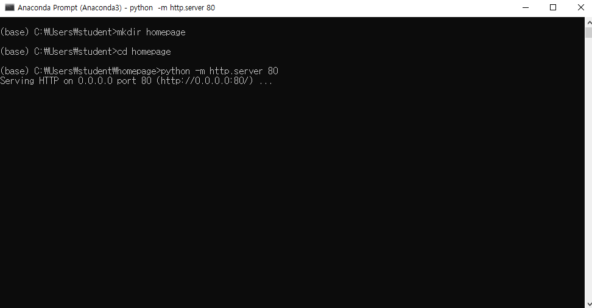

파일(homepage)을 한개 만들어 준다 -> 그 파일의 위치로 이동 한다. -> 80번 포트로 연결한다.

-> python -m http.server 80 : python 안의 http.server 모듈을 80번 포트로 실행 시키라는 의미이다.

homepage 폴더 내에서 열었으므로 root는 homepage 폴더가 된다.


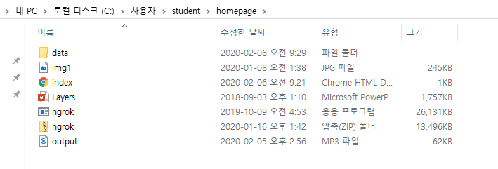

파일(homepage)에 index.html 파일을 만들어 주고 다른 파일도 넣어본다.

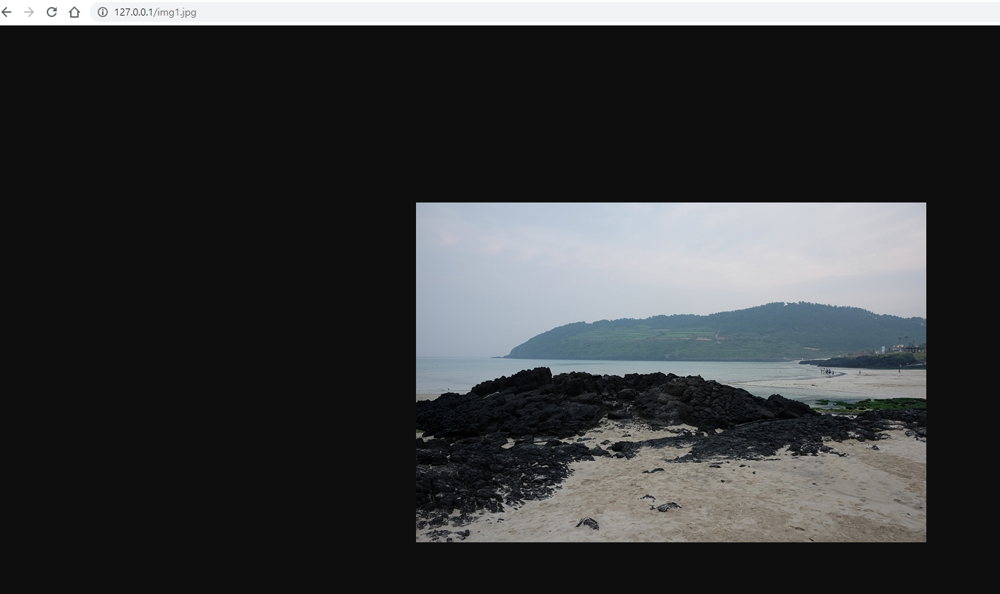

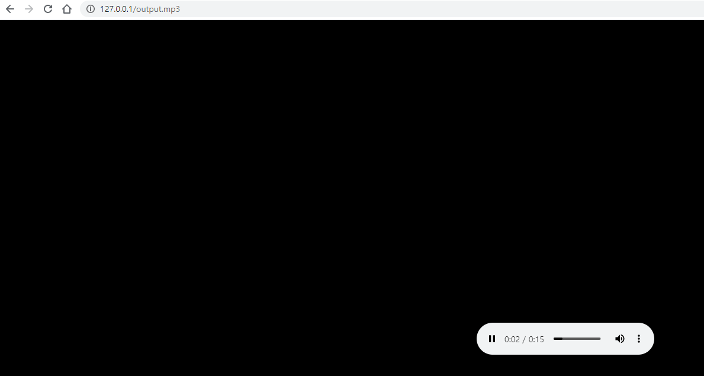


파일들을 요청하면 기본적으로 다운이 된다. 이미지, mp3의 경우에도 다운이 된 후에 화면상에 뜬것이다.

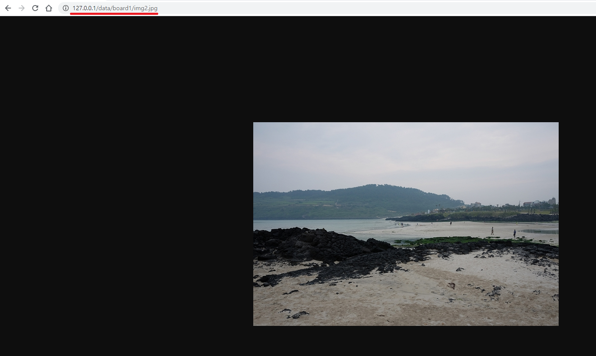

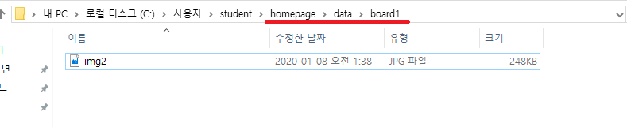

절대 경로상으로 접속해서 다운을 받을 수도 있다.


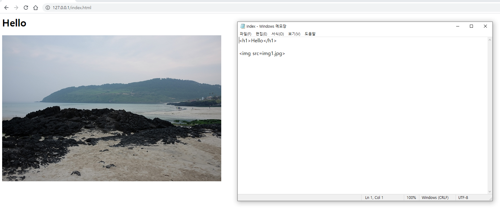

위의 경우 서버에 한번 접속 하는 것이 아니라 `<h1>`에 대해서 ``에 대해서 한번씩 총 2번 접속을 해서 다운을 받는다.

`` 는 `` 와 같은 말이다.

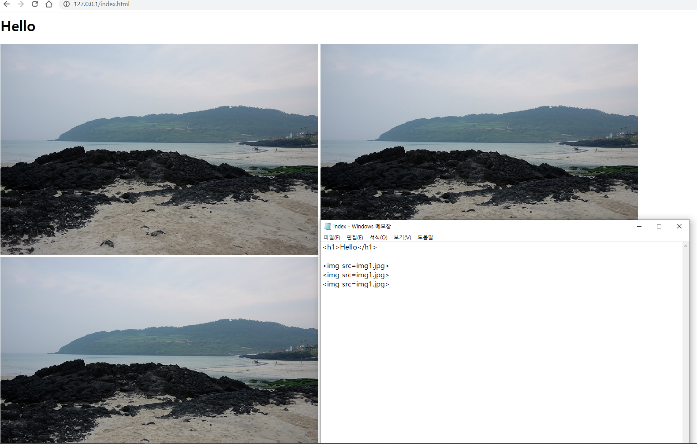

위의 경우 아파치의 경우 2번 접속을 하는게 같은 이미지에 대해서는 한번 다운 받은 후 그 이미지를 이용한다.

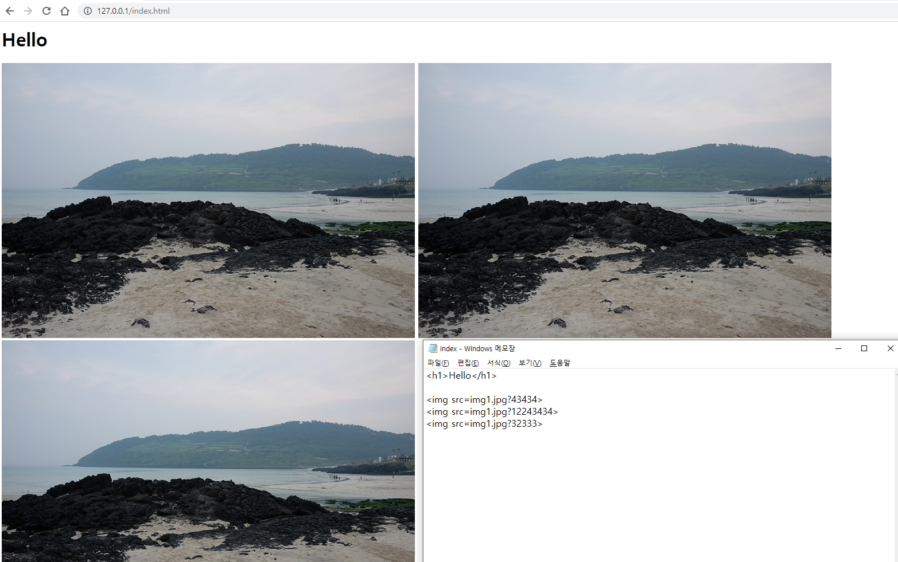

위의 경우에는 파라미터에 다른 값을 넘겨 주었으므로 총 4번 접속을 한다.


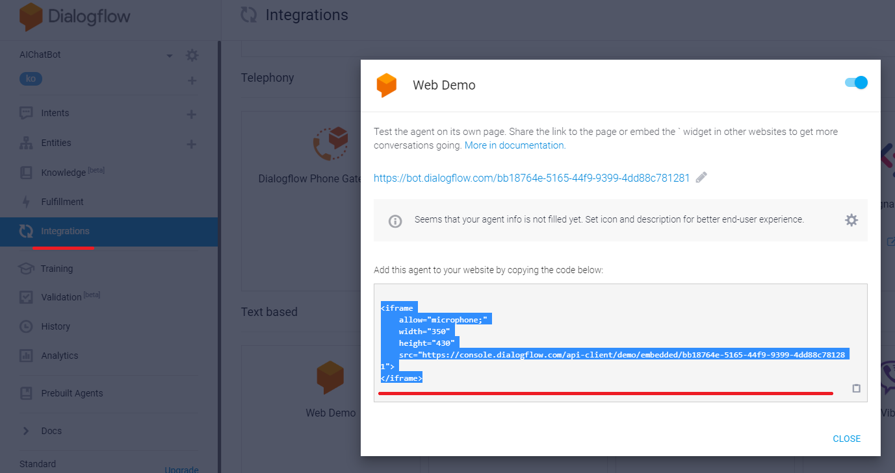

Dialogflow의 Integrations에 들어가서 코드를 복사한다.

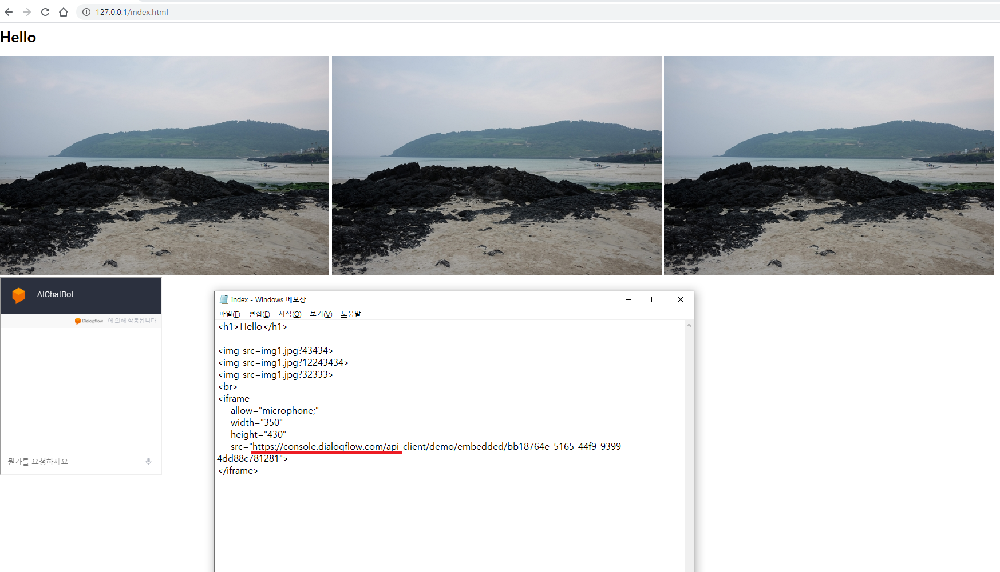

그 후 index.html에 넣어준 뒤 접속을 해보면 Dialogflow 도 화면에 출력된다.

-> 서버에서 다시 Dialogflow 에 html을 요청해서 그 정보가 화면에 출력된 것이다.


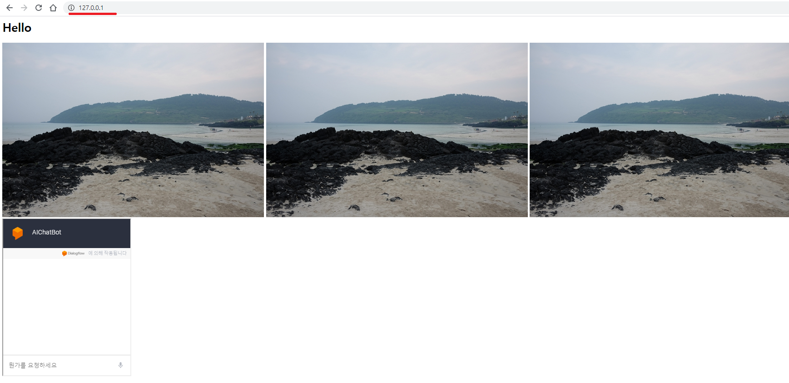

127.0.0.1/index.html로 접근을 하지 않고 127.0.0.1 로 접근을 해도 index.html에 접근을 한다.

-> default로 index.html 에 접근을 하게 되어있다.

-> 만약 index.html 파일이 없는 상태로 127.0.0.1로 접근을 하면 file not found 에러가 뜬다.


## 서버 어플리케이션

* 위의 과정은 정적인 파일들에 대한작업만 가능하다.  동적인 파일들의 작업은 불가능하다.

  * flask 이용해서 동적으로 할 수 있다.
  * flask는 웹 어플리케이션과 웹 서버가 합쳐진 개념이라 가능하다.

  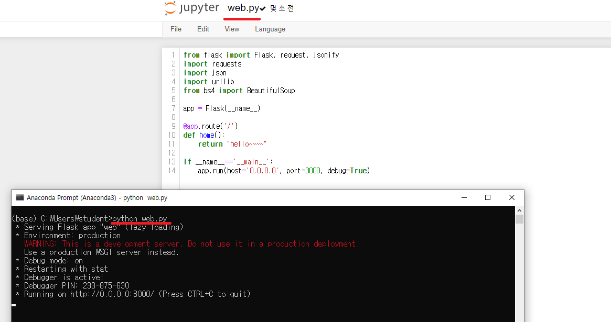

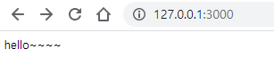

1. 새로 web.py 파일을 만들어 주고 실행시킨다.

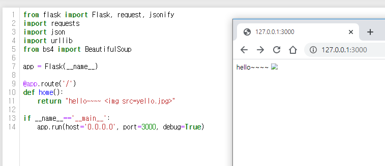

2. 정석 이미지를 띄우려고 하지만 띄어지지 않는다.

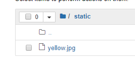

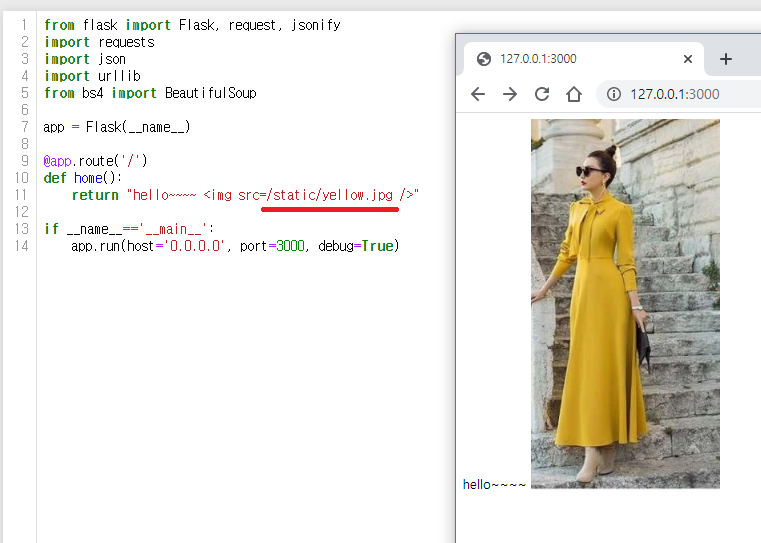

3. static 이라는 파일을 만들고, 정적 파일은 static 폴더 안에 넣어준다.(static은 default 파일이다.)

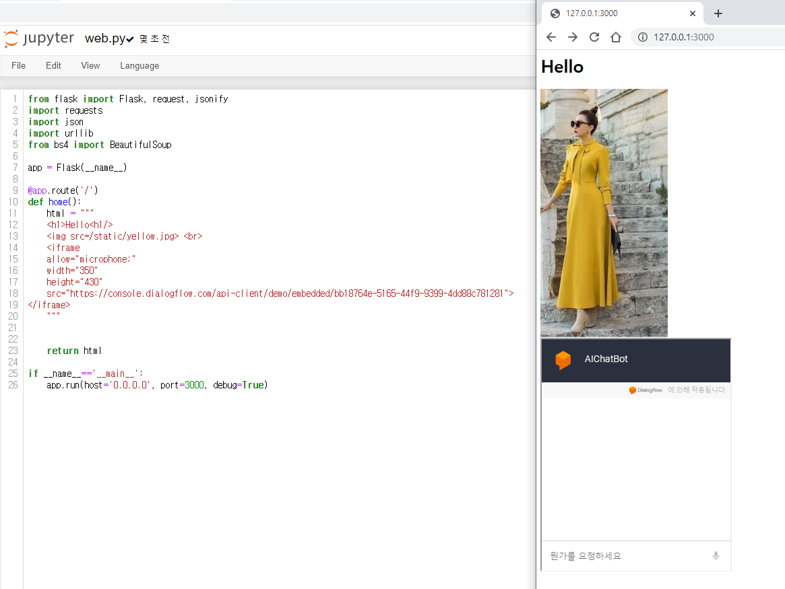


### 방문자수 출력해보기(숫자가 아닌 이미지로)

* 일단은 숫자(즉 문자)로 출력해보기

```python
cnt = 0
@app.route('/counter')
def counter():
    global cnt
    cnt += 1
    return f"{cnt}명이 방문했습니다."
```

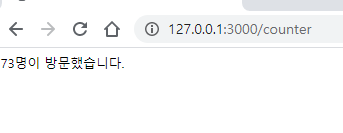

* 이미로 출력해보기(숫자 이미지 파일을 static 폴더에 넣어준다.)

```python
cnt = 0

@app.route('/counter')
def counter():
    global cnt
    cnt += 1
    html = "".join([f"" for i in str(cnt)])
    html += "명이 방문했습니다."
    return html
```

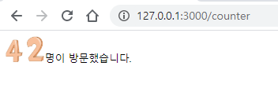


## Get vs Post

static 폴더에 form.html 파일을 만들어주고 아래의 코드를 추가한다.

```html
<form >
    <input type=text >
    <input type=submit value="날씨확인">
</form>
```

이 상태로 접속을 하고 `날씨확인`버튼을 누르면 초기화된다.

form 에 action=/weather 을 추가하면 `날씨 확인`을 누르면 weather 함수가 실행된다.

```html
<form action=/weather>
    <input type=text >
    <input type=submit value="날씨확인">
</form>
```

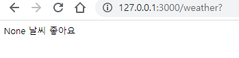

부산 을 text에 입력하고 `날씨확인`을 눌렀을 때 부산을 인식하지 못한다.

input에 name을 추가해줘서 city를 weather에게 넘겨주도록 한다.

```python
<form action=/weather>
    <input type=text name=city>
    <input type=submit value="날씨확인">
</form>
```

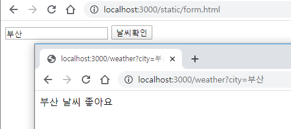


* default 는 get 방식으로 되어 있다.

* get 방식은 주소창  뒤에 `?`가 붙어서 전송된다.(`?`뒤에 정보 노출된다.)

* post 방식은 보이지 않지만 전송이 된다.
* 개발시에는 get, post 둘다 설정 한 상태로 작업을 하고 보안상 문제가 생기면 get을 제거하거나 수정을 한다.


* get 방식 코드, 출력 화면

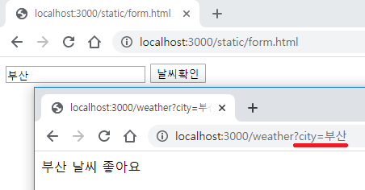

```html
<form action=/weather method=GET>
    <input type=text name=city>
    <input type=submit value="날씨확인">
</form>
```


* post방식 코드, 출력 화면

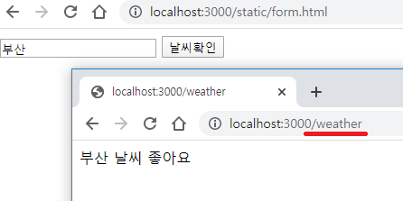

```html
<form action=/weather method=POST>
    <input type=text name=city>
    <input type=submit value="날씨확인">
</form>
```

* weather 코드

```python
@app.route('/weather', methods=['POST', 'GET'])
def weather():
    # request.args , request.form 은 dictionary 이다.
    if request.method == "GET":
        # get 방식일때 문법
        #city = request.args.get("city")
        req = request.args
    else:
        # post 방식일떄 문법
        # 값이 없을 때는 None이 아닌 "city" 뒤의 문자열이 출력되게 설정
        #city = request.form("city", "인천")
        req = request.form
    
    # 2항 연산자로 req 표현
    req = request.args if request.method == "GET" else request.form
    
    city = req.get("city")
    
    return f"{city} 날씨 좋아요"
```

---

---

---

### Dialogflow에 web.py의 dialogflow 함수 연동시키기

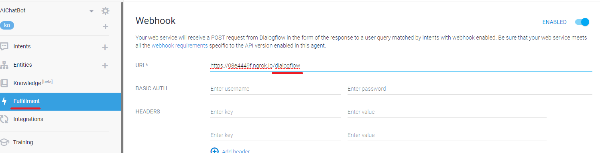

Fullfillment에 ngrok에서 받은 서버 + /dialogflow를 입력한다.

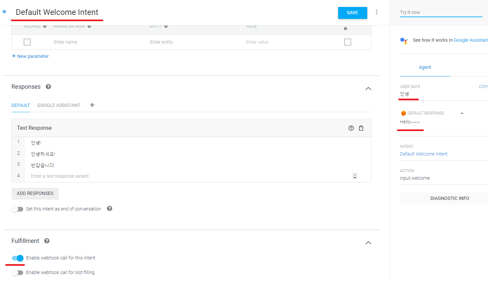

welcome intent의 fulfillment를 활성화 한다. -> text 입력하면 dialogflow함수의 return 값이 출력된다.

```python
@app.route('/dialogflow', methods=['POST', 'GET'])
def dialogflow():
    req = request.get_json(force=True)
    print(json.dumps(req, indent=4))
    res = {'fulfillmentText': 'Hello~~~'}
    return jsonify(res)
```

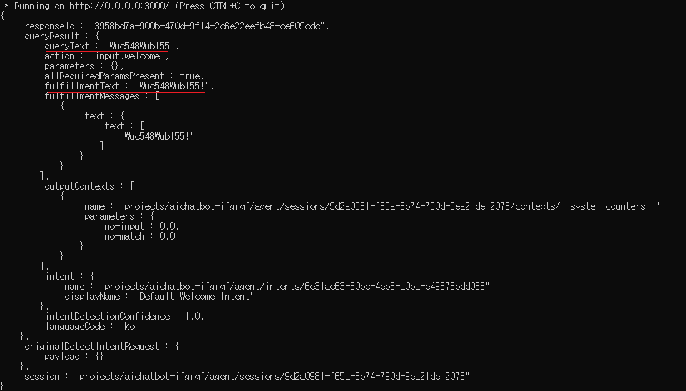

anaconda promt 창을 보면 web.py 의 dialogflow의 return 값이 출력된다.

queryText : Dialogflow 에서 입력한 text

fulfillmenText : Dialogflow의 response 문자열

한글이 꺠져서 출력되는데 이것은 `ensure_asci=False`를 추가해 주면 해결된다.

```python
@app.route('/dialogflow', methods=['POST', 'GET'])
def dialogflow():
    req = request.get_json(force=True)
    print(json.dumps(req, indent=4, ensure_ascii=False))
    res = {'fulfillmentText': 'Hello~~~'}
    return jsonify(res)
```

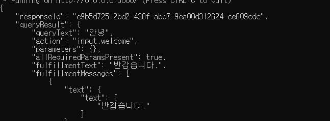


### query intent 와 연결해보기 (입력 키워드 검색결과 출력)

* 코드

```python
def getQuery(word):
    #word = "갑분싸"
    url = "https://search.naver.com/search.naver?where=kdic&query="
    url = url + urllib.parse.quote_plus(word)
    print(url)
    
    bs = BeautifulSoup(urllib.request.urlopen(url).read(), 'html.parser')
    
    output = bs.select('p.txt_box')

    return [node.text for node in output]
    # return output[0].txt
```

```python
# dialogflow 의 규칙에 맞게 return 을 해야한다. 다른 함수처럼 아무것이나 return 하면 안된다.
@app.route('/dialogflow', methods=['POST', 'GET'])
def dialogflow():
    req = request.get_json(force=True)
    print(json.dumps(req, indent=4, ensure_ascii=False))
   
    # 2020년 3월부터 Dialogflow 1.0 버전 서비스가 종료되고 2.0 서비스를 이용해야 되는데 그러면 계층 이름과 구조가 바뀐다.
    # 위의 print 결과를 보고 바꿔주면 된다.
    answer = req['queryResult']['fulfillmentText']
    intentName = req['queryResult']['intent']['displayName']
    
    if intentName == 'query':
        word = req['queryResult']['parameters']['any']
        text = getQuery(word)[0]
        res = {"fulfillmentText": text}
    else:
        res = {"fulfillmentText": answer}
    return jsonify(res)
```

* 출력결과

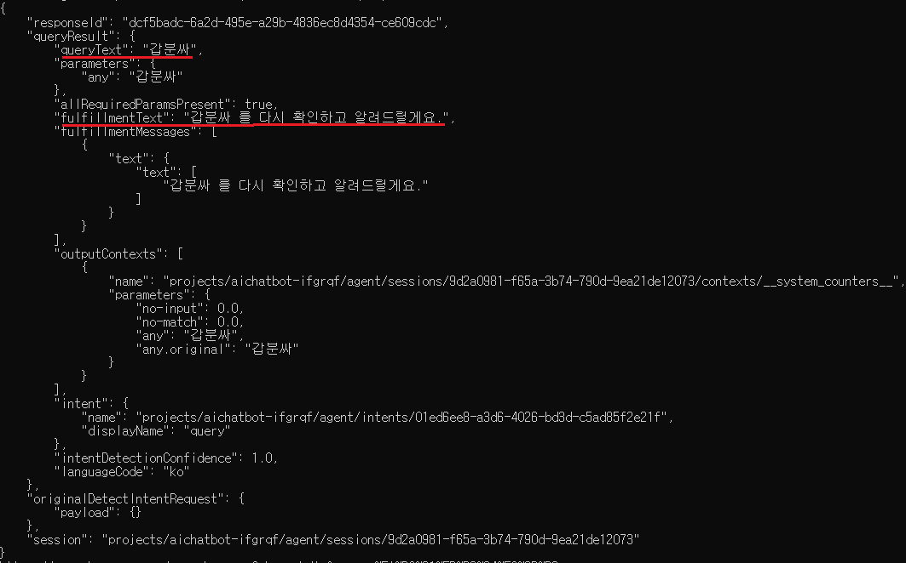

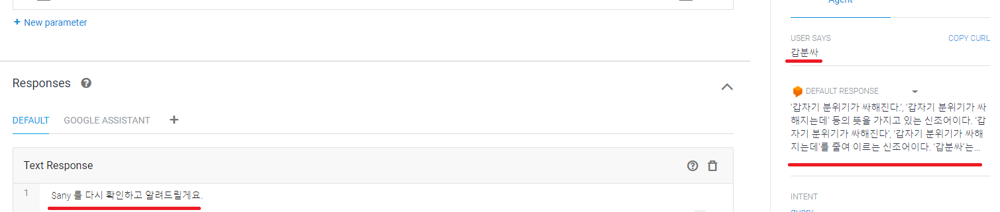

* console 환경에서는 Dialogflow 의 출력을 무조건 받아와서 `dict['result']['actionIncomplete'] == False:` 이 부분을 확인해주었어야 하는데  서버와 연결 상황에서는 slot filling 상황이 일어나면 server.py의 dialogflow가 실행되기 전에 Dialogflow 의 promt가 출력이 된다.

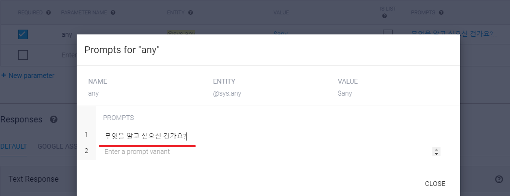


### weather, order2, query intent와 다 연결해보기

* 코드

```python
@app.route('/dialogflow', methods=['POST', 'GET'])
def dialogflow():
    req = request.get_json(force=True)
    print(json.dumps(req, indent=4, ensure_ascii=False))
   
    # 2020년 3월부터 Dialogflow 1.0 버전 서비스가 종료되고 2.0 서비스를 이용해야 되는데 그러면 계층 이름과 구조가 바뀐다.
    # 위의 print 결과를 보고 바꿔주면 된다.
    answer = req['queryResult']['fulfillmentText']
    intentName = req['queryResult']['intent']['displayName']
    
    if intentName == 'query':
        word = req['queryResult']['parameters']['any']
        text = getQuery(word)[0]
        res = {"fulfillmentText": text}
    elif intentName == 'weather':
        date = req['queryResult']['parameters']['date']
        geo_city = req['queryResult']['parameters']['geo-city']
        
        info = getWeather(geo_city)
        text = f"{geo_city} 날씨 정보 : {info['temp']}˚ / {info['desc']}"
        res = {"fulfillmentText": text}
        return res
    elif intentName == 'order2':
        price = {"짜장" : 5000, "짬뽕" : 10000, "탕수육" : 20000}
        params = req['queryResult']['parameters']['food_number']
        
        output = [food.get("number-integer", 1)*price[food["food"]] for food in params]
        text = f"총 {sum(output)}원 입니다."
        res = {"fulfillmentText": text}
        return res
    else:
        res = {"fulfillmentText": answer}
    return jsonify(res)
```


### 단위 test를 위한 코드 수정

* Dialogflow를 이용하지 않고 browser에서 get 방식으로 디버깅 등의 작업을 하기 위한 작업

* weather, query, order 에 대한 기능을 함수와 해서 dialogflow() 함수를 간결하게 바꿔준다.

```python
app.config['JSON_AS_ASCII'] = False

def processDialog(req):
    answer = req['queryResult']['fulfillmentText']
    intentName = req['queryResult']['intent']['displayName']
    
    if intentName == 'query':
        word = req['queryResult']['parameters']['any']
        text = getQuery(word)[0]
        res = {"fulfillmentText": text}
    elif intentName == 'weather':
        date = req['queryResult']['parameters']['date']
        geo_city = req['queryResult']['parameters']['geo-city']
        
        info = getWeather(geo_city)
        text = f"{geo_city} 날씨 정보 : {info['temp']}˚ / {info['desc']}"
        res = {"fulfillmentText": text}
        return res
    elif intentName == 'order2':
        price = {"짜장" : 5000, "짬뽕" : 10000, "탕수육" : 20000}
        params = req['queryResult']['parameters']['food_number']
        
        output = [food.get("number-integer", 1)*price[food["food"]] for food in params]
        text = f"총 {sum(output)}원 입니다."
        res = {"fulfillmentText": text}
        return res
    else:
        res = {"fulfillmentText": answer}
    return res


@app.route('/dialogflow', methods=['POST', 'GET'])
def dialogflow():
    
    if request.method == 'GET':
        file = request.args.get("file")
        with open(file, encoding='UTF') as json_file:
            req = json.load(json_file)
            print(json.dumps(req, indent=4, ensure_ascii=False))
    else:
        req = request.get_json(force=True)
        print(json.dumps(req, indent=4, ensure_ascii=False))
```

* 미리 테스트 할 여러 format의 json 파일(이 예제에서는 chat01.json)을 실행 위치에 만들어 놓고 get 방식으로 json 파일을 호출하면 Dialogflow 없이 processDialog() 함수를 실행 시킬 수 있다.

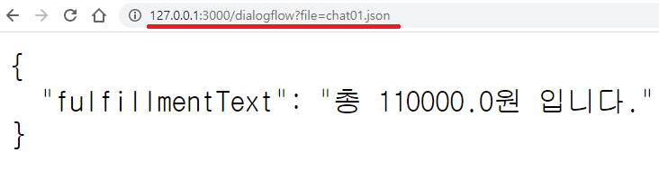

* `app.config['JSON_AS_ASCII'] = False` 이 코드를 넣어주어야 위처럼 한글이 깨지지 않고 출력된다.

* 매번 json 파일을 생성하기 번거로우면 format 형식의 json 파일을 만들어 놓고 바뀌는 부분의 dictionary만 & 뒤에 붙여서 보내는 방식을 이용할 수도 있다.

  * ex) `http://127.0.0.1:3000/dialogflow?file=chat01.json&info={
                "food_number": [
                    {
                        "number-integer": 10.0,
                        "food": "짜장"
                    },
                    {
                        "food": "탕수육",
                        "number-integer": 2.0
                    },
                    {
                        "food": "짬뽕",
                        "number-integer": 2.0
                    }
                ]
            }`

  * 예시 코드

    ```python
    @app.route('/dialogflow', methods=['POST', 'GET'])
    def dialogflow():
        
        if request.method == 'GET':
            file = request.args.get("file")
            # info는 str 형식으로 받아진다.
            info = request.args.get("info")
            # str을 dictionary 형식으로 변환 해준다.
            info = json.loads(info)
            print(info)
            with open(file, encoding='UTF') as json_file:
                req = json.load(json_file)
                print(json.dumps(req, indent=4, ensure_ascii=False))
            # 입력 parameter 부분을 수정한다.
            req["queryResult"]["parameters"] = info
        else:
            req = request.get_json(force=True)
            print(json.dumps(req, indent=4, ensure_ascii=False))
        
        return jsonify(processDialog(req))
    ```

  * 이 방법 이용시 server.py  코드에 info를 get 방식으로 받은 후 json 파일에 대입을 해줘야 한다.

  * char01.json 파일은 data,img 파일에 넣어 놓았다.

### 종합 코드

server.py

```python
from flask import Flask, request, jsonify
import requests
import json
import urllib
from bs4 import BeautifulSoup

app = Flask(__name__)
app.config['JSON_AS_ASCII'] = False

def getWeather(city):
    #city = '부산광역시'
    url = 'https://search.naver.com/search.naver?query='
    # naver에 url 요청
    url = url + urllib.parse.quote_plus(city + '날씨')
    print(url)
    bs = BeautifulSoup(urllib.request.urlopen(url).read(), 'html.parser')
    
    temp = bs.select('span.todaytemp')
    desc = bs.select('p.cast_txt')
    return {"temp" : temp[0].text, "desc" : desc[0].text}


def getQuery(word):
    #word = "갑분싸"
    url = "https://search.naver.com/search.naver?where=kdic&query="
    url = url + urllib.parse.quote_plus(word)
    print(url)
    
    bs = BeautifulSoup(urllib.request.urlopen(url).read(), 'html.parser')
    
    output = bs.select('p.txt_box')

    return [node.text for node in output]
    # return output[0].txt


def processDialog(req):
    answer = req['queryResult']['fulfillmentText']
    intentName = req['queryResult']['intent']['displayName']
    
    if intentName == 'query':
        word = req['queryResult']['parameters']['any']
        text = getQuery(word)[0]
        res = {"fulfillmentText": text}
    elif intentName == 'weather':
        date = req['queryResult']['parameters']['date']
        geo_city = req['queryResult']['parameters']['geo-city']
        
        info = getWeather(geo_city)
        text = f"{geo_city} 날씨 정보 : {info['temp']}˚ / {info['desc']}"
        res = {"fulfillmentText": text}
        return res
    elif intentName == 'order2':
        price = {"짜장" : 5000, "짬뽕" : 10000, "탕수육" : 20000}
        params = req['queryResult']['parameters']['food_number']
        
        output = [food.get("number-integer", 1)*price[food["food"]] for food in params]
        text = f"총 {sum(output)}원 입니다."
        res = {"fulfillmentText": text}
        return res
    else:
        res = {"fulfillmentText": answer}
    return res


@app.route('/dialogflow', methods=['POST', 'GET'])
def dialogflow():
    
    if request.method == 'GET':
        file = request.args.get("file")
        with open(file, encoding='UTF') as json_file:
            req = json.load(json_file)
            print(json.dumps(req, indent=4, ensure_ascii=False))
    else:
        req = request.get_json(force=True)
        print(json.dumps(req, indent=4, ensure_ascii=False))
    
    return jsonify(processDialog(req))

@app.route('/', methods=['POST'])
def home():
    res = {'fulfillmentText': 'Hello~~~world'}
    return jsonify(res)


if __name__=='__main__':
    app.run(host='0.0.0.0', port=3000, debug=True)
```


## 문제점 및 해결

* 문제점 : 지금까지 방법으로는 몇명의 유저가 서버에 접속하던지 각 유저를 구분하지 못한다.

* 방법 : session값을 부여해서 유저를 구분한다.


## Session

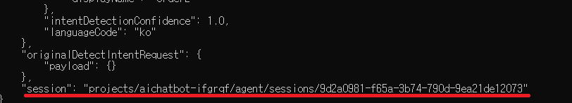

* 같은 사이트를 여러개의 chrome 창으로 띄어도 session은 같다.


* 유저별로 dictionary로 관리한다.
* 유저는 session을 key로 구분하고, 유저 정보(value)는 class로 관리한다.