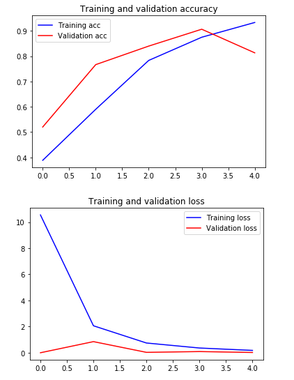

# transfer_vgg16

## Experiment 1: Freezing all layers - Same as Transfer Learning[¶](http://localhost:8888/notebooks/transfer_vgg16.ipynb#Experiment-1:-Freezing-all-layers---Same-as-Transfer-Learning)

* Create the model
* 불러온 모델의 정보는 users의 keras 폴더 안에 저장된다.

header

```python
import numpy as np
import matplotlib.pyplot as plt
%matplotlib inline
import keras
from keras.preprocessing.image import ImageDataGenerator, load_img
```

```python
train_dir = './clean-dataset/train'
validation_dir = './clean-dataset/validation'
image_size = 224
```

* layer.trainable = False
  * 입력 데이터가 적어 네트웍이 복잡한것이 좋지 않다.
* include_top = False
  * 기능이 제공되는 모델에만 쓸수 있다.
  * 불러온 모델보다 본인의 최적화된 모델의 성능이 더 좋을 수 있다.

```python
from keras.applications import VGG16

#Load the VGG model
vgg_conv = VGG16(weights='imagenet', include_top=False, input_shape=(image_size, image_size, 3))

# Freeze all the layers
# False로 하면 weight 변경되지 않는다.
for layer in vgg_conv.layers[:]:
    layer.trainable = False

# Check the trainable status of the individual layers
for layer in vgg_conv.layers:
    print(layer, layer.trainable)


from keras import models
from keras import layers
from keras import optimizers

# Create the model
model = models.Sequential()

# Add the vgg convolutional base model
# vgg_conv은 이미 sequential network 이다.
model.add(vgg_conv)

# Add new layers
model.add(layers.Flatten())
model.add(layers.Dense(1024, activation='relu'))
model.add(layers.Dropout(0.5))
model.add(layers.Dense(3, activation='softmax'))

# Show a summary of the model. Check the number of trainable parameters
model.summary()
```

```
Downloading data from https://github.com/fchollet/deep-learning-models/releases/download/v0.1/vgg16_weights_tf_dim_ordering_tf_kernels_notop.h5
58892288/58889256 [==============================] - 258s 4us/step
<keras.engine.input_layer.InputLayer object at 0x000001A7CE20E2C8> False
<keras.layers.convolutional.Conv2D object at 0x000001A7ED8DE208> False
<keras.layers.convolutional.Conv2D object at 0x000001A7ED8F61C8> False
<keras.layers.pooling.MaxPooling2D object at 0x000001A7ED91A748> False
<keras.layers.convolutional.Conv2D object at 0x000001A7ED91A148> False
<keras.layers.convolutional.Conv2D object at 0x000001A7ED929A88> False
<keras.layers.pooling.MaxPooling2D object at 0x000001A7ED92C908> False
<keras.layers.convolutional.Conv2D object at 0x000001A7ED930CC8> False
<keras.layers.convolutional.Conv2D object at 0x000001A7ED935E48> False
<keras.layers.convolutional.Conv2D object at 0x000001A7ED937AC8> False
<keras.layers.pooling.MaxPooling2D object at 0x000001A7ED93E788> False
<keras.layers.convolutional.Conv2D object at 0x000001A7ED93EFC8> False
<keras.layers.convolutional.Conv2D object at 0x000001A7EDA45A88> False
<keras.layers.convolutional.Conv2D object at 0x000001A7EDA49C48> False
<keras.layers.pooling.MaxPooling2D object at 0x000001A7EDA4BC88> False
<keras.layers.convolutional.Conv2D object at 0x000001A7EDA4FB48> False
<keras.layers.convolutional.Conv2D object at 0x000001A7EDA56608> False
<keras.layers.convolutional.Conv2D object at 0x000001A7EDA597C8> False
<keras.layers.pooling.MaxPooling2D object at 0x000001A7EDA5DE48> False
Model: "sequential_1"
_________________________________________________________________
Layer (type)                 Output Shape              Param #   
=================================================================
vgg16 (Model)                (None, 7, 7, 512)         14714688  
_________________________________________________________________
flatten_1 (Flatten)          (None, 25088)             0         
_________________________________________________________________
dense_1 (Dense)              (None, 1024)              25691136  
_________________________________________________________________
dropout_1 (Dropout)          (None, 1024)              0         
_________________________________________________________________
dense_2 (Dense)              (None, 3)                 3075      
=================================================================
Total params: 40,408,899
Trainable params: 25,694,211
Non-trainable params: 14,714,688
```

---

---

## Experiment 1

Train the mode

```python
# No Data augmentation 
train_datagen = ImageDataGenerator(rescale=1./255)
validation_datagen = ImageDataGenerator(rescale=1./255)

# Change the batchsize according to your system RAM
train_batchsize = 100
val_batchsize = 10

# Data Generator for Training data
train_generator = train_datagen.flow_from_directory(
        train_dir,
        target_size=(image_size, image_size),
        batch_size=train_batchsize,
        class_mode='categorical')

# Data Generator for Validation data
validation_generator = validation_datagen.flow_from_directory(
        validation_dir,
        target_size=(image_size, image_size),
        batch_size=val_batchsize,
        class_mode='categorical',
        shuffle=False)

# Compile the model
model.compile(loss='categorical_crossentropy',
              optimizer="adam",
              metrics=['accuracy'])
```

```
Found 600 images belonging to 3 classes.
Found 150 images belonging to 3 classes.
```

---

---

```python
# Train the Model
history = model.fit_generator(
      train_generator,
      steps_per_epoch=train_generator.samples/train_generator.batch_size ,
      epochs=5,
      validation_data=validation_generator,
      validation_steps=validation_generator.samples/validation_generator.batch_size,
      verbose=1)
```

```
Epoch 1/5
6/6 [==============================] - 57s 10s/step - loss: 10.5500 - accuracy: 0.3883 - val_loss: 4.6774e-05 - val_accuracy: 0.5200
Epoch 2/5
6/6 [==============================] - 60s 10s/step - loss: 2.0654 - accuracy: 0.5900 - val_loss: 0.8519 - val_accuracy: 0.7667
Epoch 3/5
6/6 [==============================] - 59s 10s/step - loss: 0.7458 - accuracy: 0.7833 - val_loss: 0.0305 - val_accuracy: 0.8400
Epoch 4/5
6/6 [==============================] - 59s 10s/step - loss: 0.3631 - accuracy: 0.8750 - val_loss: 0.0905 - val_accuracy: 0.9067
Epoch 5/5
6/6 [==============================] - 60s 10s/step - loss: 0.1807 - accuracy: 0.9333 - val_loss: 0.0211 - val_accuracy: 0.8133
```

---

---

```python
# Save the Model
model.save('all_freezed.h5')

# Plot the accuracy and loss curves
acc = history.history['accuracy']
val_acc = history.history['val_accuracy']
loss = history.history['loss']
val_loss = history.history['val_loss']

epochs = range(len(acc))

plt.plot(epochs, acc, 'b', label='Training acc')
plt.plot(epochs, val_acc, 'r', label='Validation acc')
plt.title('Training and validation accuracy')
plt.legend()

plt.figure()

plt.plot(epochs, loss, 'b', label='Training loss')
plt.plot(epochs, val_loss, 'r', label='Validation loss')
plt.title('Training and validation loss')
plt.legend()

plt.show()
```

