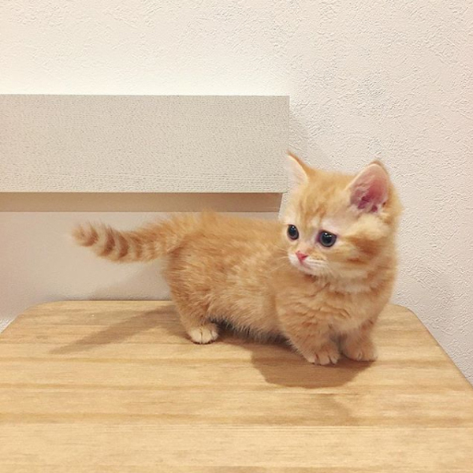

# 실습 : Shape CNN으로 학습에서 문제점 해결

## 1. Data Augmentation

* dataset 이 너무 적은 경우 overfitting 문제가 발생함
* keras에서는 dta augmentation을 통해 해결
  - Translations
  - Rotations
  - Changes in scale
  - Shearing
  - Horizontal (and in some cases, vertical) flips
* Type #1: existing dataset을 사용해 학습 dataset를 재구성함
* Type #2: In-place/on-the-fly data augmentation - keras에서 구현 batch 수 만큼 ImageDataGenerator로 실시간 생성 후 원본 제외하고 생성된 데이터 셋으로 학습


* header

```python
from keras.models import Sequential
from keras.layers import Dense
from keras.layers import Flatten
from keras.layers.convolutional import Conv2D
from keras.layers.convolutional import MaxPooling2D
from keras.layers import Activation, Dropout, Flatten, Dense
import keras
import tensorflow as tf
import numpy as np
from numpy  import expand_dims
import cv2
from matplotlib import pyplot as plt
from keras.preprocessing.image import ImageDataGenerator, array_to_img, img_to_array, load_img
np.random.seed(15)
```

```python
img = tf.keras.preprocessing.image.load_img('cat.jpg')  # 이미지 객체임
data = tf.keras.preprocessing.image.img_to_array(img)   # data 만 추출
sample = expand_dims(data,0)  
print(sample.shape)
```

```python
# opencv 사용해 이미지 loaidng
data = cv2.imread('cat.jpg')
data = cv2.cvtColor(data, cv2.COLOR_BGR2RGB)
# 4차원으로 변경
sample = expand_dims(data,0)
print(sample.shape)
```



```python
generator = tf.keras.preprocessing.image.ImageDataGenerator(    
    width_shift_range = 0.2) 
obj = generator.flow(sample, batch_size=1) 
```

```python
# 할때마다 다른 이미지 나온다. / 4차원 이미지이다.
image = obj.next()
print(image.shape)
# float형식이다. interpolation 이 진행되면서 소수점이 생기기 때문에 float type으로 된다.
print(image.dtype)
print(image[0].shape)

#  plt로 할때는 0~1사이로  혹은 타입을 uint8로 
# 값을 0~255로 할때는 밑의 방법
#plt.imshow(image[0].astype('uint8') )
# 값을 0~1로 할때는 밑의 방법
plt.imshow(image[0]/255)  #  plt로 할때는 0~1사이로  혹은 타입을 uint8로 
plt.show()
```

* 여러 방식으로 적용해보기

```python
# recale을 해주므로 밑에서 바꿔주면 않된다.
generator = tf.keras.preprocessing.image.ImageDataGenerator(    
    width_shift_range = 0.2, rescale=1./255)   # rescale 해주면 정규화하고, imshow할때 type변한 필유없다.
obj = generator.flow(sample, batch_size=1)   

image = obj.next()
plt.imshow(image[0] )
```

```python
fig = plt.figure(figsize=(20,20))
for i in range(9) :
    plt.subplot(3,3,i+1)
    image = obj.next()
    plt.imshow(image[0])   
```

```python
generator = tf.keras.preprocessing.image.ImageDataGenerator( 
    horizontal_flip = True, vertical_flip = True,
    rescale=1./255)
obj = generator.flow(sample, batch_size=1)   

fig = plt.figure(figsize=(20,20))
for i in range(9) :
    plt.subplot(3,3,i+1)
    image = obj.next()
    plt.imshow(image[0])   
```

```python
generator = tf.keras.preprocessing.image.ImageDataGenerator( 
    rotation_range=90,
    rescale=1./255)
obj = generator.flow(sample, batch_size=1)   

fig = plt.figure(figsize=(20,20))
for i in range(9) :
    plt.subplot(3,3,i+1)
    image = obj.next()
    plt.imshow(image[0])   
    
```

```python
generator = tf.keras.preprocessing.image.ImageDataGenerator( 
    brightness_range=[0.2, 1.0],       
    rescale=1./255)
obj = generator.flow(sample, batch_size=1)   

fig = plt.figure(figsize=(20,20))
for i in range(9) :
    plt.subplot(3,3,i+1)
    image = obj.next()
    plt.imshow(image[0])   
```

```python
generator = tf.keras.preprocessing.image.ImageDataGenerator( 
    zoom_range=[0.2, 1.2],   
    rescale=1./255)
obj = generator.flow(sample, batch_size=1)   

fig = plt.figure(figsize=(20,20))
for i in range(9) :
    plt.subplot(3,3,i+1)
    image = obj.next()
    plt.imshow(image[0])   
```

```python
# 한꺼번에 적용하기
generator = tf.keras.preprocessing.image.ImageDataGenerator( 
    width_shift_range = 0.2,
    zoom_range=[0.5, 1.0],   
    horizontal_flip = True, vertical_flip = True,
    rotation_range=90,
    rescale=1./255)
obj = generator.flow(sample, batch_size=1)   

fig = plt.figure(figsize=(20,20))
for i in range(9) :
    plt.subplot(3,3,i+1)
    image = obj.next()
    plt.imshow(image[0])   
```

---

---


```python
# 파일로 저장하기
obj = generator.flow(sample, batch_size=1, save_to_dir='tmp',  # 폴더는 생성되어 있어야 함
    save_prefix="image", save_format="jpg")    

for i in range(0, 5):
    obj.next()    
```

```python
# 2.  디렉토리로 부터 augmentation
#augsample/c1/2개 이미지
#augsample/c2/6개 이미지    
#augsample/c3/1개 이미지    

obj = generator.flow_from_directory(
    './shape dataset',
    target_size = (150, 150),   # 읽어드릴 이미지, 이미지 크기를 맞춰야 하기 때문에 생략시 256x256
    batch_size = 4,   # 8개 이미지 중에서 한번에 생성할 이미지 수 
    class_mode = 'binary' )  # # binary(label)  |  categorical(one-hot)

iterations = 2

for i, (img, label) in enumerate(obj):
    n_img = len(label)    # 폴더에 있는 이미지 갯수 만큼 리턴한다.
    print(label)
    print(img.shape)
    if i is iterations - 1:
        break      
# 결과를 보면 lable은 1,1,1,0 처럼 꼭 c1과 c2에서 규일하게 생성되는것은 아니다.
```

```python
# 저장하기
obj = generator.flow_from_directory(
    './shape dataset',
    target_size = (150, 150),   # 읽어드릴 이미지, 이미지 크기를 맞춰야 하기 때문에 생략시 256x256
    batch_size = 4,   # 8개 이미지 중에서 최대4개 만들어냄
    class_mode = 'binary',
    save_prefix="image", save_format="jpg",save_to_dir='tmp')

iterations = 2

for i, (img, label) in enumerate(obj):
    n_img = len(label)    # 폴더에 있는 이미지 갯수 만큼 리턴한다.
    print(label)
    print(img.shape)
    if i is iterations - 1:
        break
# aug 폴더하나에 8개이미지 출력됙다.  class별로 저정할수 없나?( 좀더 찾아바야함)
```

## 2. 도형

```python
np.random.seed(5)


# 데이터셋 불러오기
data_aug_gen = ImageDataGenerator(rescale=1./255, 
                                  rotation_range=15,
                                  width_shift_range=0.1,
                                  height_shift_range=0.1,
                                  shear_range=0.5,
                                  zoom_range=[0.8, 2.0],
                                  horizontal_flip=True,
                                  vertical_flip=True,
                                  fill_mode='nearest')
                                   
img = load_img('./shape dataset/train/triangle/triangle001.png')
x = img_to_array(img)
x = x.reshape((1,) + x.shape)
i = 0

# 이 for는 무한으로 반복되기 때문에 우리가 원하는 반복횟수를 지정하여, 지정된 반복횟수가 되면 빠져나오도록 해야합니다.
for batch in data_aug_gen.flow(x, batch_size=1, save_to_dir='./shape dataset/tmp', save_prefix='tri', save_format='png'):
    i += 1
    if i > 30: 
        break
```

* 밑은 실제 도형 해결 코드

```python
train_datagen = ImageDataGenerator(rescale=1./255, 
                                   rotation_range=10,
                                   width_shift_range=0.2,
                                   height_shift_range=0.2,
                                   shear_range=0.7,
                                   zoom_range=[0.9, 2.2],
                                   horizontal_flip=True,
                                   vertical_flip=True,
                                   fill_mode='nearest')

train_generator = train_datagen.flow_from_directory(
        './shape dataset/train',
        target_size=(24, 24),
        batch_size=3,
        class_mode='categorical')

# 폴더에서 데이터를 한번에 읽을 수 있게 해줌
test_datagen = ImageDataGenerator(rescale=1./255)

test_generator = test_datagen.flow_from_directory(
        './shape dataset/test',
        target_size=(24, 24),    
        batch_size=3,
        class_mode='categorical', shuffle=False)
```

```python
model = Sequential()
model.add(Conv2D(32, kernel_size=(3, 3),
                 activation='relu',
                 input_shape=(24,24,3)))
model.add(Conv2D(64, (3, 3), activation='relu'))
model.add(MaxPooling2D(pool_size=(2, 2)))
model.add(Flatten())
model.add(Dense(128, activation='relu'))
model.add(Dense(3, activation='softmax'))

# 모델 엮기
model.compile(loss='categorical_crossentropy', optimizer='adam', metrics=['accuracy'])
```

```python
# 모델 학습시키기
model.fit_generator(
        train_generator,
        steps_per_epoch=15 * 100,
        epochs=2, #200
        validation_data=test_generator,
        validation_steps=5)
```

```python
# 모델 예측하기
print("-- Predict --")
output = model.predict_generator( test_generator,  steps = 5)    # batch 사이즈가 3 , 15개가 생성됨
print(output)

T = test_generator.classes
print(T)
p = np.argmax(output, axis=1)
print(p)

sum((T == p)*1) / len(T)
```

```python
# 모델 평가하기
scores = model.evaluate_generator( test_generator, steps = 5)
print(scores[1])
```

* augmentation은 도형부분에서는 효과가 괜찮지만 사람이미지에 대해서는 효과가 좋지 못하다.

```python
# 확률값(output)을 그래프로 표현
plt.imshow(output, cmap='gray')
plt.show()
plt.imshow(output.T, cmap='gray')
plt.show()

labels = ['C', 'R', 'T']

idx = [0,1,2,3,4,5,6,7,8,9,10,11,12,13,14]

plt.figure(figsize=(20, 15))

cc = 3
rr = int(len(idx) / cc)+1

for k in range( len(idx) ) :
  i = idx[k]
  c =  "blue" if  p[i] == T[i]   else "red"
  plt.subplot( rr ,cc, k+1)
  plt.bar(labels, output[i], color=c)
  plt.xlabel("true:{}->  predict:{} {:2.0f}%".format(labels[int(T[  i ])], labels[p[  i ]],  100*np.max(output[i], axis=0)),  color = c )
plt.show()
```


```python
test_generator = test_datagen.flow_from_directory(
    './shape dataset/test',
    target_size=(24, 24),
    batch_size=15,
    class_mode='binary', shuffle=False)
X,T = test_generator.next()
output = model.predict(X)
p = np.argmax(output, axis=1)

labels = ['C', 'R', 'T']
# 틀린 값만 출력할때
idx = np.where(p != T)
idx = idx[0]
# 전체 다 출력할때
# idx = [0,1,2,3,4,5,6,7,8,9,10,11,12,13,14]

plt.figure(figsize=(20, 15))

cc = 3
rr = int(len(idx) / cc) + 1

for k in range(len(idx)):
    i = idx[k]
    c = "blue" if p[i] == T[i] else "red"
    plt.subplot(rr, cc, k + 1)
    #  left and right limits, and the bottom and top limits.
    plt.imshow(X[i, :, :, 0], extent=[0, 0.8, 0.5, 0.9], aspect='auto', zorder=10, cmap="gray")
    plt.ylim(0.0, 1.0)
    plt.bar(labels, output[i], color=c)
    plt.xlabel("true:{}->  predict:{} {:2.0f}%".format(labels[int(T[i])], labels[p[i]], 100 * np.max(output[i], axis=0)),
               color=c)
plt.show()

plt.savefig('fig1.png')
```

## 3. dog cat augmentatation

- https://keraskorea.github.io/posts/2018-10-24-little_data_powerful_model/
- https://www.kaggle.com/c/dogs-vs-cats/data
- 학습 데이터로 1,000장의 고양이 사진과 1,000장의 강아지 사진을 사용 (kaggle 25,000자)
- 검증 데이터로는 각각 400장 사용

```python
img = load_img('cat.jpg') 
x = img_to_array(img)
print(x.shape)   # w,h,c 인직 확인
```

```python
batch_size = 16

train_datagen = ImageDataGenerator(
        rescale=1./255,
        shear_range=0.2,
        zoom_range=0.2,
        horizontal_flip=True)

# 검증 및 테스트 이미지는 augmentation을 적용하지 않음(이미지 원본을 사용)
validation_datagen = ImageDataGenerator(rescale=1./255)
test_datagen = ImageDataGenerator(rescale=1./255)

# 이미지를 배치 단위로 불러와 줄 generator입니다.
train_generator = train_datagen.flow_from_directory(
        'smallcatdog/train', 
        target_size=(150, 150), 
        batch_size=batch_size,
        class_mode='binary') 

validation_generator = validation_datagen.flow_from_directory(
        'smallcatdog/validation',
        target_size=(150, 150),
        batch_size=batch_size,
        class_mode='binary')

test_generator = test_datagen.flow_from_directory(
        'smallcatdog/validation',
        target_size=(150, 150),
        batch_size=batch_size,
        class_mode='binary')
```

```python
model = Sequential()
model.add(Conv2D(32, (3, 3), input_shape=(150, 150,3)))
model.add(Activation('relu'))
model.add(MaxPooling2D(pool_size=(2, 2)))

model.add(Conv2D(32, (3, 3)))
model.add(Activation('relu'))
model.add(MaxPooling2D(pool_size=(2, 2)))

model.add(Conv2D(64, (3, 3)))
model.add(Activation('relu'))
model.add(MaxPooling2D(pool_size=(2, 2)))

model.add(Flatten())  # this converts our 3D feature maps to 1D feature vectors
model.add(Dense(64))
model.add(Activation('relu'))
model.add(Dropout(0.5))
model.add(Dense(1))
model.add(Activation('sigmoid'))

model.compile(loss='binary_crossentropy',
              optimizer='adam',
              metrics=['accuracy'])
```

```python
# steps_per_epoch는 한 세대마다 몇 번 생성기로부터 데이터를 얻을지를 나타내는 값
# 한 세대마다 사용되는 학습데이터의 수는 steps_per_epoch * batch_size
        
model.fit_generator(
        train_generator,
        steps_per_epoch=2000 // batch_size,    # 2000/16     한번에 125개씩 생성
        epochs=5,  # 50(5번은 테스트로 해보고 50번정도는 해야 학습률 올라간다.)
        validation_data=validation_generator,
        validation_steps=800 // batch_size)     # 800/16   한번에 50개씩 생성

# 학습을 한번에 하기 힘들 때 중간단계에서 저장할 수 있다.
# 나중에 불러와서 학습시키면 중단된 부분부터 닫시 학습된다.
model.save("smallcatdog_wa.h5")
```

```python


# 모델 평가하기
print("-- Evaluate --")
# steps : 전체이미지수 / batchsize
scores = model.evaluate_generator( test_generator,       steps = 800 / 16)
print(scores[1])
```

* 실행 결과

```
Epoch 1/5
125/125 [==============================] - 60s 478ms/step - loss: 0.7567 - accuracy: 0.5470 - val_loss: 0.6673 - val_accuracy: 0.6587
Epoch 2/5
125/125 [==============================] - 31s 251ms/step - loss: 0.6713 - accuracy: 0.5930 - val_loss: 0.6047 - val_accuracy: 0.6900
Epoch 3/5
125/125 [==============================] - 32s 254ms/step - loss: 0.6366 - accuracy: 0.6400 - val_loss: 0.5845 - val_accuracy: 0.6650
Epoch 4/5
125/125 [==============================] - 32s 258ms/step - loss: 0.6155 - accuracy: 0.6770 - val_loss: 0.3707 - val_accuracy: 0.7225
Epoch 5/5
125/125 [==============================] - 32s 252ms/step - loss: 0.6039 - accuracy: 0.6775 - val_loss: 0.5344 - val_accuracy: 0.7100
-- Evaluate --
0.699999988079071
```

* 위의 코드를 augumentation 없이 학습

```python
# augmentation 없이  학습
batch_size = 16

train_datagen = ImageDataGenerator(rescale=1./255 )
validation_datagen = ImageDataGenerator(rescale=1./255)
test_datagen = ImageDataGenerator(rescale=1./255)

# 이미지를 배치 단위로 불러와 줄 generator입니다.
train_generator = train_datagen.flow_from_directory(
        'smallcatdog/train',  # this is the target directory
        target_size=(150, 150),  # 모든 이미지의 크기가 150x150로 조정됩니다.
        batch_size=batch_size,
        class_mode='binary')  # binary_crossentropy 손실 함수를 사용하므로 binary 형태로 라벨을 불러와야 합니다.

validation_generator = validation_datagen.flow_from_directory(
        'smallcatdog/validation',
        target_size=(150, 150),
        batch_size=batch_size,
        class_mode='binary')

test_generator = test_datagen.flow_from_directory(
        'smallcatdog/validation',
        target_size=(150, 150),
        batch_size=batch_size,
        class_mode='binary')


model = Sequential()
model.add(Conv2D(32, (3, 3), input_shape=(150, 150,3)))
model.add(Activation('relu'))
model.add(MaxPooling2D(pool_size=(2, 2)))

model.add(Conv2D(32, (3, 3)))
model.add(Activation('relu'))
model.add(MaxPooling2D(pool_size=(2, 2)))

model.add(Conv2D(64, (3, 3)))
model.add(Activation('relu'))
model.add(MaxPooling2D(pool_size=(2, 2)))

model.add(Flatten())  # this converts our 3D feature maps to 1D feature vectors
model.add(Dense(64))
model.add(Activation('relu'))
model.add(Dropout(0.5))
model.add(Dense(1))
model.add(Activation('sigmoid'))

model.compile(loss='binary_crossentropy',
              optimizer='rmsprop',
              metrics=['accuracy'])

model.fit_generator(
        train_generator,
        steps_per_epoch=2000 // batch_size,
        epochs=5, # 50으로 실행한 후 학습률 비교해보자
        validation_data=validation_generator,
        validation_steps=800 // batch_size)

model.save("smallcatdog.h5")
scores = model.evaluate_generator( test_generator,       steps = 5)
print(scores[1])
```

* 위 코드 실행 결과

```
Found 2000 images belonging to 2 classes.
Found 800 images belonging to 2 classes.
Found 800 images belonging to 2 classes.
Epoch 1/5
125/125 [==============================] - 29s 230ms/step - loss: 0.7047 - accuracy: 0.5070 - val_loss: 0.6597 - val_accuracy: 0.6137
Epoch 2/5
125/125 [==============================] - 29s 230ms/step - loss: 0.6669 - accuracy: 0.6120 - val_loss: 0.5642 - val_accuracy: 0.6538
Epoch 3/5
125/125 [==============================] - 28s 227ms/step - loss: 0.6212 - accuracy: 0.6625 - val_loss: 0.6620 - val_accuracy: 0.6463
Epoch 4/5
125/125 [==============================] - 28s 227ms/step - loss: 0.5665 - accuracy: 0.7090 - val_loss: 0.6516 - val_accuracy: 0.6513
Epoch 5/5
125/125 [==============================] - 29s 232ms/step - loss: 0.5395 - accuracy: 0.7405 - val_loss: 0.4991 - val_accuracy: 0.7188
accuracy: 75.00%
```

* 네트웍 불러오기

```
from keras.models import load_model
model = load_model('smallcatdog.h5')
model.summary()


batch_size = 16
test_datagen = ImageDataGenerator(rescale=1./255)
test_generator = test_datagen.flow_from_directory(
        'smallcatdog/validation',
        target_size=(150, 150),
        batch_size=batch_size,
        class_mode='binary')

scores = model.evaluate_generator(test_generator, size = 800/16)
print(scores[1])
```

* clean_dataset으로 토마토, 수박, 호박 구분해보기

```python
from keras.models import Sequential
from keras.layers import Dense
from keras.layers import Flatten
from keras.layers.convolutional import Conv2D
from keras.layers.convolutional import MaxPooling2D
from keras.layers import Activation, Dropout, Flatten, Dense
import keras
import tensorflow as tf
import numpy as np
from numpy  import expand_dims
import cv2
from matplotlib import pyplot as plt
from keras.preprocessing.image import ImageDataGenerator, array_to_img, img_to_array, load_img
from keras.layers import BatchNormalization, Dropout
np.random.seed(15)

# augmentation 없이  학습
batch_size = 20

train_datagen = ImageDataGenerator(rescale=1./255 )
validation_datagen = ImageDataGenerator(rescale=1./255)
test_datagen = ImageDataGenerator(rescale=1./255)

# 이미지를 배치 단위로 불러와 줄 generator입니다.
train_generator = train_datagen.flow_from_directory(
        'clean-dataset/train',  # this is the target directory
        target_size=(150, 150),  # 모든 이미지의 크기가 150x150로 조정됩니다.
        batch_size=batch_size,
        class_mode='categorical')  # categorical_crossentropy 손실 함수를 사용하므로 categorical 형태로 라벨을 불러와야 합니다.

validation_generator = validation_datagen.flow_from_directory(
        'clean-dataset/validation',
        target_size=(150, 150),
        batch_size=batch_size,
        class_mode='categorical')

test_generator = test_datagen.flow_from_directory(
        'clean-dataset/validation',
        target_size=(150, 150),
        batch_size=batch_size,
        class_mode='categorical')


model = Sequential()
model.add(Conv2D(32, (3, 3), input_shape=(150, 150,3)))
model.add(Activation('relu'))
model.add(MaxPooling2D(pool_size=(2, 2)))

model.add(Conv2D(32, (3, 3)))
model.add(Activation('relu'))
model.add(MaxPooling2D(pool_size=(2, 2)))

model.add(Conv2D(64, (3, 3)))
model.add(Activation('relu'))
model.add(MaxPooling2D(pool_size=(2, 2)))

model.add(Flatten())  # this converts our 3D feature maps to 1D feature vectors
model.add(Dense(64))
model.add(Activation('relu'))
model.add(Dropout(0.5))
model.add(Dense(3))	# 3개의 class로 구분하므로 출력이 3이어야 한다.
model.add(Activation('sigmoid'))

model.compile(loss='categorical_crossentropy',
              optimizer='adam',
              metrics=['accuracy'])

model.fit_generator(
        train_generator,
        steps_per_epoch=600 // batch_size,
        epochs=5, # 50
        validation_data=validation_generator,
        validation_steps=150 // batch_size)

model.save("smallcatdog.h5")
scores = model.evaluate_generator( test_generator,       steps = 600/20)
print(scores[1])
```

## 4. imagenet에서 검색해서 다운하기

```python
from bs4 import BeautifulSoup
import numpy as np
import requests
import cv2
import PIL.Image
import urllib
```

```python
page = requests.get("http://www.image-net.org/api/text/imagenet.synset.geturls?wnid=n04194289") #ship synset  wnetid
soup = BeautifulSoup(page.content, 'html.parser')
str_soup=str(soup)
split_urls=str_soup.split('\r\n')
print(len(split_urls))
```

```python
bikes_page = requests.get("http://www.image-net.org/api/text/imagenet.synset.geturls?wnid=n02834778")#bicycle synset
bikes_soup = BeautifulSoup(bikes_page.content, 'html.parser')
bikes_str_soup=str(bikes_soup)
bikes_split_urls=bikes_str_soup.split('\r\n')
print(len(bikes_split_urls))
```

```python
def url_downalod(urls, path, prefix) :    
    idx = 0
    for url in urls :
        try:
            resp = urllib.request.urlopen(url)
            image = np.asarray(bytearray(resp.read()), dtype="uint8")
            image = cv2.imdecode(image, cv2.IMREAD_COLOR)
            if ( len(image.shape)) == 3 :
                print(url)
                idx += 1
                save_path = path + '/' + prefix + str(idx)+'.jpg'
                cv2.imwrite(save_path,image)
        except :
            None

```

```python
url_downalod(split_urls, 'imagenet/aa', 'ship') # aa 폴더에 ship1 부터 저장
```

```python
url_downalod(bikes_split_urls, 'imagenet/bikes', 'bike')
```

```python
train_datagen  = ImageDataGenerator()
test_datagen = ImageDataGenerator()
    
train_generator = train_datagen.flow_from_directory(
        'imagenet/train/',
        target_size=(32, 32),
        batch_size=32,
        class_mode='categorical')
validation_generator = test_datagen.flow_from_directory(
        'imagenet/validation/',
        target_size=(32, 32),
        batch_size=32,
        class_mode='categorical')
```

```
Found 64 images belonging to 2 classes.
Found 70 images belonging to 2 classes.
```

---


```python
model2 =  Sequential()
model2.add(Conv2D(4, kernel_size=(3, 3), activation='relu', input_shape=(32,32,3))) 
model2.add(Conv2D(8, (3, 3), activation='relu'))
model2.add(MaxPooling2D(pool_size=(2, 2)))
model2.add(Dropout(0.25))


model2.add(Flatten())
model2.add(Dense(16, activation='relu'))
model2.add(Dropout(0.5))
model2.add(Dense(2, activation='softmax'))

model2.compile(loss='categorical_crossentropy', optimizer="adam", metrics=['accuracy'])
model2.fit_generator(
        train_generator,
        steps_per_epoch=100, # 2000
        epochs=2, validation_data=validation_generator   #65
        )
```

```
Epoch 1/2
100/100 [==============================] - 19s 187ms/step - loss: 0.8775 - accuracy: 0.9328 - val_loss: 2.6246 - val_accuracy: 0.4714
Epoch 2/2
100/100 [==============================] - 18s 178ms/step - loss: 0.0873 - accuracy: 0.9375 - val_loss: 15.1905 - val_accuracy: 0.4714
<keras.callbacks.callbacks.History at 0x20fcf4f7320>
```

---


```python
img_path = 'imagenet/ship.jpg'
img = load_img(img_path, target_size=(32, 32))
x = img_to_array(img)
print(x.shape)
x = np.expand_dims(x, axis=0)
print(x.shape)
preds = model2.predict(x)

print(preds)
print('Probability that the image is a Bicycle:', preds[0,0])
print('Probability that the image is a Ship:', preds[0,1])
```

```
(32, 32, 3)
(1, 32, 32, 3)
[[1.0669018e-10 1.0000000e+00]]
Probability that the image is a Bicycle: 1.0669018e-10
Probability that the image is a Ship: 1.0
```

---


## 5. 네트웍 저장 및 복구

```python
model2.save('bicycleship.h5')
```

```python
from keras.models import load_model
model2 = load_model('bicycleship.h5')


img_path = 'imagenet/ship.jpg'
img = load_img(img_path, target_size=(32, 32))
x = img_to_array(img)
print(x.shape)
x = np.expand_dims(x, axis=0)
print(x.shape)
preds = model2.predict(x)

print(preds)
print('Probability that the image is a Bicycle:', preds[0,0])
print('Probability that the image is a Ship:', preds[0,1])
```

```
(32, 32, 3)
(1, 32, 32, 3)
[[1.0669018e-10 1.0000000e+00]]
Probability that the image is a Bicycle: 1.0669018e-10
Probability that the image is a Ship: 1.0
```

---


```python
model_json = model2.to_json()
with open("bicycleship.json", "w") as json_file : 
    json_file.write(model_json)   
model2.save_weights("bicycleship_w.h5")
```

```python
from keras.models import model_from_json 

json_file = open("bicycleship.json", "r") 
loaded_model_json = json_file.read() 
json_file.close() 
model3 = model_from_json(loaded_model_json)
model3.load_weights("bicycleship_w.h5")

img_path = 'imagenet/ship.jpg'
img = load_img(img_path, target_size=(32, 32))
x = img_to_array(img)
print(x.shape)
x = np.expand_dims(x, axis=0)
print(x.shape)
preds = model3.predict(x)

print(preds)
print('Probability that the image is a Bicycle:', preds[0,0])
print('Probability that the image is a Ship:', preds[0,1])
```

```
(32, 32, 3)
(1, 32, 32, 3)
[[1.0669018e-10 1.0000000e+00]]
Probability that the image is a Bicycle: 1.0669018e-10
Probability that the image is a Ship: 1.0
```

