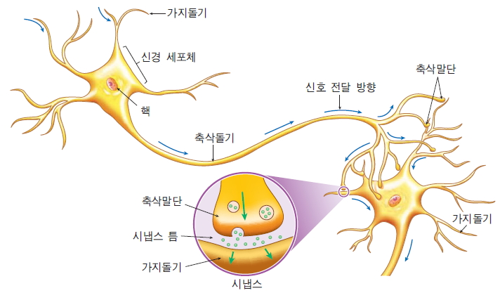

# 연습문제

## 1. 기계학습과 딥러닝의 차이점은?

포함관계 : AI > 기계학습 > 딥러닝

* 공통점 : h(x) = W*b + b 등의 가설을 이용해 데이터를 이용해 결과를 예측한다.
* 차이점
  * 딥러닝 : 신경망(다층 네트웍)을 통한 학습
  * 기계학습: closed 방법(ex) SVM)을 이용한 학습 > 다층 구조라는 개념이 없다.

## 2. 가충치는 신경망의 어디에 해당하는가?



* 가중치 : 신경 말단(시냅스)에서 분비되는 신경전달물질의 양 - > 입력에 따라 신경전달물질(가중치)의 양이 다르다.
* W*x의 합이 역치(y절변 -> b)보다 크면 신경망 활성화 한다.*
  * *W*x의 합 - b > 0 이면 활성화
  * 차원을 한개 늘려서 W*x - b 를 W*x로 표현하기도 한다.
    * W*x + b -> W*x + b*1 -> [W,b][x,1] -> W*x

## 3. y 절편(역치, b)는 왜 필요한가?

예를 들어 2차원 평면에서 y절편이 없는 W*x 식은 무조건 원점을 지나야 한다. -> hard한 제약조건이 된다.


### 실습. 1차 연립방정식을 이용한 데이터 학습

| x    | y    |
| ---- | ---- |
| 1    | 2    |
| 2    | 4    |
| 3    | 6.4  |


```python
import numpy as np
import numpy.linalg as lin

##################################################################################################
# 2개짜리 곱

a = np.array([[1,1],[2,1]])
print(a)
print(a.shape)
#a의 역행렬
a_ = lin.inv(a)
print(a_)

y = np.array([2,4])
print(y.shape)
# numpy 에서는 행렬곱과 산술곱을 구분한다.
# 이 경우는 산술곱이다.(y가 broadcasting 된 후에 산술곱)
w = a_ * y

#numpy에서의 행렬곱이다.
# a는 행렬이 맞지만 y는 1 lank의 벡터이다.
# 밑의 코드는 행렬곱이 되지만 오류가 없으려면 y를 행렬(여기서는 column vector : 한줄짜리 행렬)로 바꿔주어야 한다.
w = np.matmul(a_,y)


y_1 = np.array([[2,4]])
# 방법1 : column vector로 표현한 y
y_2 = np.array([[[2],[4]]])
# 방법2 : column vector로 표현한 y
y = np.array([2,4]).reshape(2,1)
print(y_1.shape)
print(y_2.shape)
print(y)

# 행렬 곱
w = np.matmul(a_,y)
print(w)


###########################################################################################
# 3개짜리 곱
a = np.array([[1,1],[2,1],[3,1]])
a_ = lin.pinv(a)
print(a_)
y = np.array([2,4,6.4]).reshape(3,1)
# W,b값이 (2,1)행렬로 w에 return
w = np.matmul(a_, y)
print(w)

# x가 1일 때 y값
prid = w[0,0] * np.array([1]) + w[1,0] * np.array([1])
# print 해보면 원래 2.2의 값과 오차가 있다.
print(prid)
#여러개의 x값에 대해 한번에 y갑 계산
# prid = w[0,0] * np.array([1-3,-2,-1,0,1,2,3]) + w[1,0] * np.array([1])
# print(prid)
```


### 실습. XOR

```python
from keras.models import Sequential
from keras.layers.core import Dense, Dropout, Activation
from keras.optimizers import SGD
from keras.optimizers import Adam
import numpy as np
import matplotlib.pyplot as plt
import matplotlib.image as mpimg
import pandas as pd
from keras.callbacks import LambdaCallback
from keras.callbacks import EarlyStopping
from keras.layers import LeakyReLU

X = np.array([[0,0],[0,1],[1,0],[1,1]])
y = np.array([[0],[1],[1],[0]])

# sequential 모델 사용
model = Sequential()

# 새로운 layer
# Dense(2) : layer에서 사용할 뉴런개수
# input_dim : 뉴런당 input 개수
model.add(Dense(10, input_dim=2))
#sigmoid 함수 적용
model.add(Activation('sigmoid'))

# 층이 깊어지면 더 잘 나올거 같지만, 깊어질 수록 더 잘 나오지 않는다.
model.add(Dense(5))
model.add(Activation('sigmoid'))

model.add(Dense(5))
model.add(Activation('sigmoid'))

model.add(Dense(1))
model.add(Activation('sigmoid'))

model.summary()

model.compile(loss='binary_crossentropy', optimizer='adam')

# 실제 학습 함수
# batch_size : 한번 경사하강법을 할 때 참고할 데이터 갯수
# epochs : 학습 횟수
model.fit(X, y, batch_size=4, epochs=3000, verbose=0)
print(model.predict(X))  # 행렬은 4x1이다.  smaple 수 x 클래스수이미르

p = model.predict(X)
print((p > 0.5)*1)

# np.mgrid[0:1:0.02, 0:1:0.02] : 0~1사이를 0.02간격으로 xx,yy에 2차원 데이터로 저장한다.
# flatten : 2차원 데이터 1차원으로 핀다.
xx, yy = np.mgrid[0:1:0.02, 0:1:0.02]
grid = np.c_[xx.flatten(), yy.flatten()]
print(grid.shape)
# h에는 0~1사이의 확률값이 들어가 있다.
h = model.predict_proba(grid)

print(type(h))
print(h.shape)

colors = ["red"  if i>  0.5  else  "blue"  for i  in h  ]
plt.scatter(xx.flatten(), yy.flatten(), color = colors, alpha=0.2)
plt.savefig('xor.png')
```

### 실습. sklearn.datasets의 make_moons

```python
from keras.models import Sequential
from keras.layers.core import Dense, Dropout, Activation
from keras.optimizers import SGD
from keras.optimizers import Adam
import numpy as np
import matplotlib.pyplot as plt
import matplotlib.image as mpimg
import pandas as pd
from keras.callbacks import LambdaCallback
from keras.callbacks import EarlyStopping
from keras.layers import LeakyReLU


def lambdaf_(epoch, logs, step):
    if epoch % step == 0: print(f"{epoch} => {logs}")


def printepoch(step):
    return LambdaCallback(on_epoch_end=lambda epoch, logs: lambdaf_(epoch, logs, step))

from sklearn.datasets import make_moons


x_data, y_data = make_moons(n_samples=500, noise=0.15)   #  x 는 2차원   y는 레이블    0   1

colors = ["red"  if i == 1  else   "blue"    for i  in y_data  ]

plt.scatter(x_data[:,0], x_data[:,1], color = colors, alpha=1.0)
print(y_data.shape)


# model = Sequential([
#     Dense(5, activation='sigmoid',input_dim=2),
#     Dense(5, activation='sigmoid'),
#     Dense(10, activation='sigmoid'),
#     Dense(10, activation='sigmoid'),
#     Dense(10, activation='sigmoid'),
#     Dense(10, activation='sigmoid'),
#     Dense(1, activation='sigmoid'),
# ])

model = Sequential([
    Dense(5, activation=LeakyReLU(alpha=0.1),input_dim=2),
    Dense(10, activation=LeakyReLU(alpha=0.1)),
    Dense(10, activation=LeakyReLU(alpha=0.1)),
    Dense(10, activation=LeakyReLU(alpha=0.1)),
    Dense(10, activation=LeakyReLU(alpha=0.1)),
    Dense(10, activation=LeakyReLU(alpha=0.1)),
    Dense(1, activation='sigmoid'),
])

# model.compile(loss='binary_crossentropy', optimizer=Adam(0.01), metrics=['accuracy'])
model.compile(loss='binary_crossentropy', optimizer="adam", metrics=['accuracy'])
# verbose : 로그를 보여줄지 말지(0 이면 숨기고 1이면 보여준다.)
# 전체 입력 x가 500개이고 batch_size가 100개이면, 모든 데이터에 대해서 학습해야 되므로 총 5번이고 epochs가 3000번이므로 총 15000번 경사하강을 한다.
# callbacks : 로그 출력을 제어할 수 있다. 넘긴 수의 epochs 마다 로그 출력한다.
# 로그 출력에서 val_loss 는 오류값이다.
# model.compile에서 metrics에 accuracy를 주어서 val_loss와 accuracy값을 가지고 정확도 판단한다.
model.fit(x_data, y_data, batch_size=100, epochs=3000, verbose=0,
          validation_data=(x_data, y_data),
          callbacks=[printepoch(500)]
          )

colors = ["red"  if i == 1  else   "blue"    for i  in y_data  ]
plt.scatter(x_data[:,0], x_data[:,1], color = colors, alpha=1.0)
xx, yy = np.mgrid[-1.5:2.5:0.05, -1:1.5:0.05]
grid = np.c_[xx.ravel(), yy.ravel()]
h = model.predict_proba(grid)
colors = ["red"  if i>  0.5  else  "blue"  for i  in h  ]
plt.scatter(xx.flatten(), yy.flatten(), color = colors, alpha=0.2)
plt.savefig('xor.png')
```


#### 여러 개층 함수로 간단히 표현하기

```python
def createModel(layers, activation, input_dim) :    
    model = Sequential()        
    d = layers.pop(0)
    model.add(Dense(d, activation=activation,input_dim =input_dim))
    for l in layers :
        model.add(Dense(l, activation=activation))
    model.add(Dense(1, activation='sigmoid'))    
    return model

    
model = createModel([5,5,5,5,5,5,5,5,5,5,5,5,5,5,5,5,5,5,5], LeakyReLU(alpha=0.1), 2) 
```

