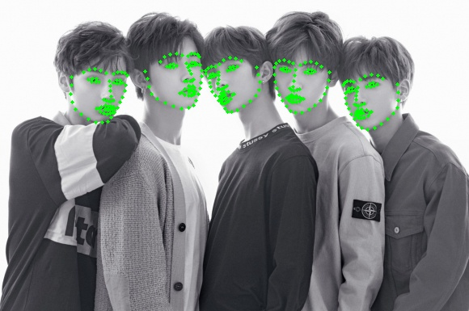
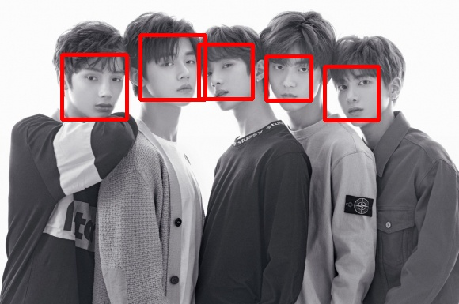
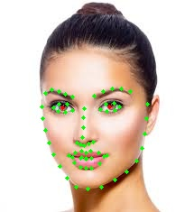
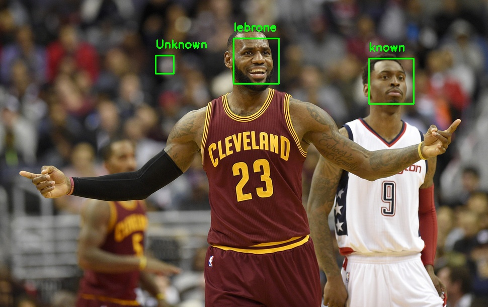

# Face

구글 비전 : 검색해서 제공하는 유료 및 무료 서비스 이용해보기

## 사람 구분하기

* header

```python
from imutils import face_utils
import numpy as np
import imutils
# 검출 기반의 라이브러리
import dlib
import cv2
import matplotlib.pyplot as plt
import face_recognition
import os
from imutils import paths
```

* shape keypoint 추출

```python
# http://dlib.net/files/shape_predictor_68_face_landmarks.dat.bz2
predictor = dlib.shape_predictor("shape_predictor_68_face_landmarks.dat")
detector = dlib.get_frontal_face_detector()
```

```python
frame = cv2.imread("face2.jpg")
gray = cv2.cvtColor(frame, cv2.COLOR_BGR2GRAY)
rects = detector(gray, 0)  
print("Number of faces detected: {}".format(len(rects)))
for r in rects :
    print(r)

    
```

```python
for k, d in enumerate(rects):
        print("Detection {}: Left: {} Top: {} Right: {} Bottom: {}".format(
            k, d.left(), d.top(), d.right(), d.bottom()))
        shape = predictor(gray, d)
        shape = face_utils.shape_to_np(shape)
        for (x, y) in shape:
          cv2.circle(frame, (x, y), 2, (0, 255, 0), -1)
```

```python
cv2.imwrite("out.jpg", frame)
```



face2


face


* face recognition

```python
img2 = cv2.imread("face2.jpg")

#face_locations = face_recognition. face_locations(img) # HOG algorithm
# model='cnn' : 이것을 쓰면 CNN 방식으로 돌아간다. 쓰지 않으면 HOG 방식으로 돌아간다.
face_location = face_recognition.face_locations(img, model='cnn')
print("I found {} face(s) in this photograph.").format(len(face_locations))

for face_location in face_locations:
    top, right, bottom, left = face_location
    cv2.rectangle(img, (left, top), (right,bottom), (0,0,255), 3)
    
imshow("", img)
```




* face.jpg 의 눈의 중간위치 점으로 찍어보기

```python
# 36~31

eyel = np.mean(shape[36:42], axis=0)
eyer = np.mean(shape[42:48], axis=0)
cv2.circle(frame, (int(eyel[0]), int(eyel[1])), 2, (255, 255, 0), -1)
cv2.circle(frame, (int(eyer[0]), int(eyer[1])), 2, (255, 255, 0), -1)

cv2.imwrite("out3.jpg", frame)
```




```python
img = face_recognition.load_image_file("face.jpg")
face_encoding = face_recognition.face_encodings(img)
# 이미지의 얼굴에 대한 ? 정보 출력, 얼굴 갯수만큼의 정보생긴다. / face.jpg에는 얼굴이 한개이므로 한개에 대한 정보만 출력된다.
print(face_encoding)
# 얼굴 크기에 관계없이 각각 128개에 대한 정보 나온다.
print(face_encoding[0].shape)
```

---

---


* 서로 다른 이미지의 같은 인물 찾아보기
  * known이란 폴더를 생성하고 이미지를 넣어준다.

```python
files = os.listdir("known")

known_face_encodings = []
known_face_names = []

for filename in files:
    name, ext = os.path.splitext(filename)
    if ext == '.jpg':
        known_face_names.append(name)
        pathname = os.path.join("known", filename)
        img = face_recognition.load_image_file(pathname)
        face_encoding = face_recognition.face_encodings(img)[0]
        known_face_encodings.append(face_encoding)

print(known_face_names)
```

```
['face', 'jordon', 'lebrone&cerry', 'lebrone', 'lebrone2', 'lena']
```

```python
test = face_recognition.load_image_file("test.jpg")

face_locations = face_recognition.face_locations(test)
face_encodings = face_recognition.face_encodings(test, face_locations)

face_names = []
# 이미지의 얼굴갯수에 따라 loop문의 실행 횟수 정해진다. 한개 있으면 한번만 loop 돈다.
for face_encoding in face_encodings:
    
    distances = face_recognition.face_distance(known_face_encodings, face_encoding)
    print(distances)
    min_value = min(distances)
    
    name = "Unknown"
    if min_value < 0.6:
        index = np.argmin(distances)
        name = known_face_names[index]
        
print(name)
```

```
[1.00454    0.59040099 0.84882323 0.         0.41524257 0.99905681]
lebrone
```

* 이미지 파일 정보를 encoding 한 후에 바이너리 형식으로 pickle로 저장

```python
imagePaths = list(paths.list_images("known"))
 
knownEncodings = []
knownNames = []

for (i, imagePath) in enumerate(imagePaths):    
    name = imagePath.split(os.path.sep)[-2]
    print(f"{name}   -   {imagePath}") 
    image = cv2.imread(imagePath)
    boxes = face_recognition.face_locations(image)
    encodings = face_recognition.face_encodings(image, boxes) 

    for encoding in encodings:        
        knownEncodings.append(encoding)
        knownNames.append(name)
        
import pickle
# dictionary, binary data를 한번에 저장
data = {"encodings": knownEncodings, "names": knownNames}
f = open("known.bin", "wb")
f.write(pickle.dumps(data))
f.close()        
```

```
known   -   known\face.jpg
known   -   known\lebrone&cerry.jpg
known   -   known\lena.jpg
jordon   -   known\jordon\jordon.jpg
lebrone   -   known\lebrone\lebrone.jpg
lebrone   -   known\lebrone\lebrone2.jpg
```

```python
# 인코딩된 데이터
print(data["encodings"])
# 레이블에 해당하는 이름
print(data["names"])
```

---

---

```python
# dictionary
a = {}
# dictionary 안에 name이라는 key 값이 있으면 key 값의 value를 retrn 하고 없으면 0 return 한다.
a.get("name", 0)


a = [1,2,3,4]
b = ['a','b','c','d']

for i in zip(a,b):
    print(i)

# 밑의 알고리즘에서 쓰인다.
```

---

---

```python
data = pickle.loads(open("known.bin", "rb").read())
 
image = cv2.imread("letest.jpg")

boxes = face_recognition.face_locations(image)
encodings = face_recognition.face_encodings(image, boxes)
 
names = []
for encoding in encodings:
    matches = face_recognition.compare_faces(data["encodings"], encoding)
    print(matches)
    name = "Unknown"
    if True in matches:
        matchedIdxs = [i for (i, b) in enumerate(matches) if b]
        counts = {} 
        for i in matchedIdxs:
            name = data["names"][i]
            # name을 key로 가지고 있으면 1증가 시키고 없으면 새로 만들어서 1증가 시킨다.
            counts[name] = counts.get(name, 0) + 1 
        # 가장 많이 count된 key값의 name을 최종 선택한다. 
        name = max(counts, key=counts.get)
    names.append(name)                             
for ((top, right, bottom, left), name) in zip(boxes, names):
    cv2.rectangle(image, (left, top), (right, bottom), (0, 255, 0), 2)
    y = top - 15 if top - 15 > 15 else top + 15
    cv2.putText(image, name, (left, y), cv2.FONT_HERSHEY_SIMPLEX,  0.75, (0, 255, 0), 2)
 
cv2.imwrite("out4.jpg", image)
```



```python
feature = np.array(data["encodings"])
print(feature.shape)
```

```
(7, 128)
```

* 간단하게 레이블과 이름 묶는 방법

```python
import pandas as pd
c = pd.factorize(data["names"])

label = c[0]
print(label)
label_name = c[1]
print(label_name)
```

```
[0 0 0 0 1 2 2]
['known' 'jordon' 'lebrone']
```

* 위의 방식은 가장 많이 겹치는 label을 최종 라벨로 선택한다
  * 다른 label로 검출하는 경우가 발생한다.
  * DNN을 통해 확률값의 thresh를 정한 후 그 이상의 확률값을 갖지 않으면 선택하지 않게 해서 정확도를 높힐 수도 있다.


## 성별 구분하기

* header

```python
import cv2 as cv
import math
import time
import argparse
```

```
Gender Net : https://www.dropbox.com/s/iyv483wz7ztr9gh/gender_net.caffemodel?dl=0"

Age Net : https://www.dropbox.com/s/xfb20y596869vbb/age_net.caffemodel?dl=0"
```

```python
def getFaceBox(net, frame, conf_threshold=0.7):
    frameOpencvDnn = frame.copy()
    frameHeight = frameOpencvDnn.shape[0]
    frameWidth = frameOpencvDnn.shape[1]
    blob = cv.dnn.blobFromImage(frameOpencvDnn, 1.0, (300, 300), [104, 117, 123], True, False)

    net.setInput(blob)
    detections = net.forward()
    bboxes = []
    for i in range(detections.shape[2]):
        confidence = detections[0, 0, i, 2]
        if confidence > conf_threshold:
            x1 = int(detections[0, 0, i, 3] * frameWidth)
            y1 = int(detections[0, 0, i, 4] * frameHeight)
            x2 = int(detections[0, 0, i, 5] * frameWidth)
            y2 = int(detections[0, 0, i, 6] * frameHeight)
            bboxes.append([x1, y1, x2, y2])
            cv.rectangle(frameOpencvDnn, (x1, y1), (x2, y2), (0, 255, 0), int(round(frameHeight/150)), 8)
    return frameOpencvDnn, bboxes
```

```python
_input= ""

faceProto = "opencv_face_detector.pbtxt"
faceModel = "opencv_face_detector_uint8.pb"

ageProto = "age_deploy.prototxt"
ageModel = "age_net.caffemodel"         # 받아야함
 
genderProto = "gender_deploy.prototxt"
genderModel = "gender_net.caffemodel"  # 받아야함

MODEL_MEAN_VALUES = (78.4263377603, 87.7689143744, 114.895847746)
ageList = ['(0-2)', '(4-6)', '(8-12)', '(15-20)', '(25-32)', '(38-43)', '(48-53)', '(60-100)']
genderList = ['Male', 'Female']

# Load network
ageNet = cv.dnn.readNet(ageModel, ageProto)
genderNet = cv.dnn.readNet(genderModel, genderProto)
faceNet = cv.dnn.readNet(faceModel, faceProto)

# Open a video file or an image file or a camera stream
cap = cv.VideoCapture("sample1.jpg")
padding = 20
hasFrame, frame = cap.read()

frameFace, bboxes = getFaceBox(faceNet, frame)

for bbox in bboxes:
        # print(bbox)
        face = frame[max(0,bbox[1]-padding):min(bbox[3]+padding,frame.shape[0]-1),max(0,bbox[0]-padding):min(bbox[2]+padding, frame.shape[1]-1)]

        blob = cv.dnn.blobFromImage(face, 1.0, (227, 227), MODEL_MEAN_VALUES, swapRB=False)
        genderNet.setInput(blob)
        genderPreds = genderNet.forward()
        gender = genderList[genderPreds[0].argmax()]
        # print("Gender Output : {}".format(genderPreds))
        print("Gender : {}, conf = {:.3f}".format(gender, genderPreds[0].max()))

        ageNet.setInput(blob)
        agePreds = ageNet.forward()
        age = ageList[agePreds[0].argmax()]
        print("Age Output : {}".format(agePreds))
        print("Age : {}, conf = {:.3f}".format(age, agePreds[0].max()))

        label = "{},{}".format(gender, age)
        cv.putText(frameFace, label, (bbox[0], bbox[1]-10), cv.FONT_HERSHEY_SIMPLEX, 0.8, (0, 255, 255), 2, cv.LINE_AA)
cv.imwrite("out.jpg", frameFace)
```

