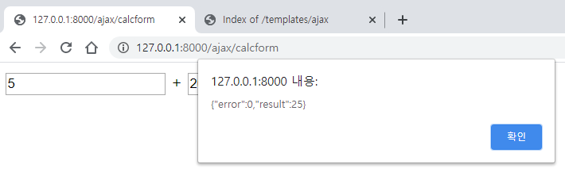

# day4(AJAX)

* AJAX 는 서버와 데이터를 교환하는 기술의 하나

* 기존에는 server side redering 방식 이었다. -> AJAX 방식은 rendering을 client 가 한다.
* jQuery를 사용하면 좀 더 쉽게 Ajax를 사용할 수 있다.


## Django & Ajax

* `python manage.py startapp ajax` 명령어로 `ajax` 어플리케이션 생성한다


* 서버 실행한다.


* `mysite` 폴더의 `urls.py`에 `path('ajax/', include('ajax.urls')),`를 추가해 준다.

/mysite/urls.py

```python
from django.contrib import admin
from django.urls import path
from django.urls import include

urlpatterns = [
    path('', include('myapp.urls')),
    path('ajax/', include('ajax.urls')),
    path('admin/', admin.site.urls),
]
```


* `ajax` 폴더에 `urls.py` 파일 만들어 준다.

/ajax/urls.py

```python
from django.urls import path
from . import views

urlpatterns = [
    path('', views.index),
]
```


* `ajax`의 `views.py` 에 `index` 함수를 만들어 준다.

/ajax/views.py

```python
from django.shortcuts import render
from django.http import HttpResponse

# Create your views here.

def index(request):
    return HttpResponse("Hello Django!!")
```


* 실행 화면


### 기능1 . 계산기

* `ajax` 폴더에 `urls.py`에 calcform 을 추가해준다.

/ajax/urls.py

```python
from django.urls import path
from . import views

urlpatterns = [
    path('', views.index),
    path('calcform', views.calcForm),
]
```


* `ajax`폴더에 `views.py` 에 calcForm 함수 만들어 준다.
  * `templates` 폴더가 default 이기 때문에 다른 app의 html 과 겹치지 않게 `templates`폴더에 `ajax` 폴더를 만들어서 `ajax` 어플리케이션의 html을 관리한다.

/ajax/views.py

```python
from django.shortcuts import render
from django.http import HttpResponse

# Create your views here.

def index(request):
    return HttpResponse("Hello Django!!")


def calcForm(request):
    return render(request, "ajax/calc.html")
```


* `templates` 폴더에 `ajax` 폴더 생성한다.


* `templates/ajax/` 에 `calc.html` 을 만들어 준다.
  * `<form action="calc">` : html 파일 이므로 ajax 폴더 기준으로  calc 를 실행한다.
    * `<form action="calc">` 을 쓰지 않으면 페이지가 변경되지 않는다.
  * `name=op1` : name 을 써야 name value에 데이터가 서버로 넘어간다.

templates/ajax/calc.html

```html
<form action="calc">
<input type=text name=op1 id="op1"> + <input type=text name=op2 id="op2">
<button id="btnCalc">=</button> <input type=text name="result" id= "result">
</form>
```


* `ajax/views.py`에 calc 함수 추가해준다.

```python
from django.shortcuts import render
from django.http import HttpResponse

# Create your views here.

def index(request):
    return HttpResponse("Hello Django!!")


def calcForm(request):
    return render(request, "ajax/calc.html")

def calc(request):
    op1 = int(request.GET["op1"])
    op2 = int(request.GET["op2"])
    result = op1 + op2
    return HttpResponse(f"result = {result}")
```


* `ajax/urls.py`에 calc 함수 추가해준다.

/ajax/urls.py

```python
from django.urls import path
from . import views

urlpatterns = [
    path('', views.index),
    path('calcform', views.calcForm),
    path('calc', views.calc),
]
```


#### jQuery 사용해서 데이터 다루기


* jQuery 전에 javascript 로 데이터 다뤄보기
  * `<input type=text name=op1 id="op1" value="5">`의 value로 default 값 줄 수 있다.
  * 하지만 script 에서 `op1.value = 20;`을 하면 20으로 바뀌어 뜬다.

```javascript
<meta charset="utf-8">
<form  action="calc" >
<input type=text name=op1 id="op1" value="5">  + <input type=text name=op2 id="op2">
<button id="btnCalc">=</button> <input type=text name="result" id="result">
</form>

<script>

    op1 = document.getElementById("op1");
    op1.value = 20;
    alert(op1.value);
</script>
```


* javascript alert를 jQuery로 표현하기
  * ` op1.value = 20; alert(op1.value);` ->  `$("#op1").val(40); alert( $("#op1").val() );`
  * `$("#op1")` 에서 `"#op1"`는 `id`  를 의미한다.
  * jQuery 사용위해서는 `<script src="http://code.jquery.com/jquery-1.11.3.min.js"></script>`, `<script src="http://code.jquery.com/jquery-migrate-1.2.1.min.js"></script>` 가 맨 위에 포함 되어 있어야 한다.

```html
<meta charset="utf-8">
<script src="http://code.jquery.com/jquery-1.11.3.min.js"></script>
<script src="http://code.jquery.com/jquery-migrate-1.2.1.min.js"></script>


<form  action="calc" >
<input type=text name=op1 id="op1" value="5">  + <input type=text name=op2 id="op2">
<button id="btnCalc">=</button> <input type=text name="result" id="result">
</form>

<script>
    op1 = document.getElementById("op1");
    op1.value = 20;
    alert(op1.value);

    $("#op1").val(40);
    alert( $("#op1").val() );
</script>
```


* jQuery 사용해서 서버를 이동하지 않고 현재 페이지에서 계산된 결과값 출력하기
  * `$("btnCalc").click( function() { });` 에서 `function(){}` 은 익명 함수이다.
  * python 에서 lamda 함수와 비슷하다.

```html
<meta charset="utf-8">
<script src="http://code.jquery.com/jquery-1.11.3.min.js"></script>
<script src="http://code.jquery.com/jquery-migrate-1.2.1.min.js"></script>


<input type=text name=op1 id="op1" value="5">  + <input type=text name=op2 id="op2">
<button id="btnCalc">=</button> <input type=text name="result" id="result">

<script>


    $("#btnCalc").click( function() { 
        op1 = parseInt($("#op1").val());
        op2 = parseInt($("#op2").val());
        $("#result").val(op1+op2);
    });
</script>
```


* JQuery 사용해서 페이지 이동하지 않고 서버에 데이터 보내고 데이터 돌려받기
  * `$.get("calc", param, function(data){ $("#result").val(data) });` 
    * get 방식으로 서버에 데이터 보낸다.
    * 첫번재 파라미터 :  /ajax/calc 가 실행된다.
  * `var param = {op1:$("op1").val(), op2:$("#op2").val();`
    * ex) 5,2 입력하고 `btnCalc' 버튼 누르면  `/cal?op1=5&op2=2` 이렇게 서버에 데이터 전송된다.

```html
<meta charset="utf-8">
<script src="http://code.jquery.com/jquery-1.11.3.min.js"></script>
<script src="http://code.jquery.com/jquery-migrate-1.2.1.min.js"></script>


<input type=text name=op1 id="op1" value="5">  + <input type=text name=op2 id="op2">
<button id="btnCalc">=</button> <input type=text name="result" id="result">

<script>


    $("#btnCalc").click( function() { 
 
        var param = {op1:$("#op1").val(), op2:$("#op2").val()};
        $.get("calc", param, function(data){ $("#result").val(data); });
    });
</script>
```


##### jQuery 특징

* 페이지 cal 방식이 아니라 함수 cal 방식이다.
* html 전송 하지 않고, 데이터 전송한다.
* 비동기 방식이다.
* 아래의 코드 실행시 "bbbb"가 먼저 출력되지 않고 "aaaa" 가 먼저 출력된다.

```html
 $("#btnCalc").click( function() { 
 
        var param = {op1:$("#op1").val(), op2:$("#op2").val()};
        $.get("calc", param, function(data){ $("#result").val(data); });
		alert("bbbb");
    });
	alert("aaaa");
```


##### result 에 결과 값만 출력하기

* `/ajax/views.py` 의 calc 함수의 return 을 json 형식으로 바꿔준다.
  * `JsonResponse({'error': 0, 'result': result})` : dictionary 를 json으로 바꿔준다.
* `/templates/ajax/cal.html` 의 jQuery에서 json 데이터에서 결과값만 추출한다.
  * ` $("#result").val(data);` -> ` $("#result").val(data.result);`
  * `alert(JSON.stringify(data));` 으로 받은 정보 확인할 수 있다.

/ajax/views/py

```python
from django.shortcuts import render
from django.http import HttpResponse
from django.http import JsonResponse

# Create your views here.

def index(request):
    return HttpResponse("Hello Django!!")


def calcForm(request):
    return render(request, "ajax/calc.html")

def calc(request):
    op1 = int(request.GET["op1"])
    op2 = int(request.GET["op2"])
    result = op1 + op2
    return JsonResponse({'error' : 0, 'result' : result})
```

/templates/ajax/cal.html

```html
<meta charset="utf-8">
<script src="http://code.jquery.com/jquery-1.11.3.min.js"></script>
<script src="http://code.jquery.com/jquery-migrate-1.2.1.min.js"></script>


<input type=text name=op1 id="op1" value="5">  + <input type=text name=op2 id="op2">
<button id="btnCalc">=</button> <input type=text name="result" id="result">

<script>


    $("#btnCalc").click( function() { 
 
        var param = {op1:$("#op1").val(), op2:$("#op2").val()};
        $.get("calc", param, function(data){ 
            alert(JSON.stringify(data));
            $("#result").val(data.result); });
    });
</script>
```




##### login

* 서버에서는 로그인 확인 결과 데이터만 돌려주고 성공/실패 에 따라 어느 서비스 제공해 주어야 되는 지 신경 쓰지 않는다.
* `ajax`폴더의 `views.py`에 login, loginForm 함수 만들어준다.
* `ajax`폴더의 `urls.py`에 login, loginForm 함수의 url 추가한다.

/ajax/views.py

```python
from django.shortcuts import render
from django.http import HttpResponse
from django.http import JsonResponse

# Create your views here.

def index(request):
    return HttpResponse("Hello Django!!")


def calcForm(request):
    return render(request, "ajax/calc.html")

def calc(request):
    op1 = int(request.GET["op1"])
    op2 = int(request.GET["op2"])
    result = op1 + op2
    return JsonResponse({'error' : 0, 'result' : result})

def loginForm(request):
    return render(request, "ajax/login.html")

def login(request):
    id = request.GET['id']
    pwd = request.GET['pwd']
    if id == pwd:
        request.session["user"] =  id
        return JsonResponse({'error' : 0})
    return JsonResponse({'error' : -1, 'message' : "id/pwd를 확인해주세요."})
```

/ajax/urls.py

```python
from django.urls import path
from . import views

urlpatterns = [
    path('', views.index),
    path('calcform', views.calcForm),
    path('calc', views.calc),
    path('login', views.login),
    path('loginform', views.loginForm),
]
```


* `templates/ajax/`에 `login.html` 을 만든다.
  * `if (data.error == 0) location.href = "/ajax"` : 로그인 성공시 index 페이지 실행
  * `$("#id").focus();` : 로그인 실패했을 때 id에 커서를 놓는다.
  * `$("#id").val("");` , `$("#pwd").val("");` : 로그인 실패시 id,pwd 칸을 `""` 으로 한다.

```html
<meta charset="utf-8">
<script src="http://code.jquery.com/jquery-1.11.3.min.js"></script>
<script src="http://code.jquery.com/jquery-migrate-1.2.1.min.js"></script>


아이디 <input type=text name=id id="id"> <br>
비밀번호 <input type=text name=pwd id="pwd"> <br>
<button id="btnCalc"> 로그인 </button>

<script>


    $("#btnCalc").click( function() { 
 
        var param = {id:$("#id").val(), pwd:$("#pwd").val()};
        $.get("/ajax/login", param, function(data){ 
            console.log(JSON.stringify(data));
            if (data.error == 0) location.href = "/ajax"
            else {
                $("#id").focus();
                $("#id").val("");
                $("#pwd").val("");
                alert(data.message);
            }
         });
    });
</script>
```

* 로그인 성공 화면


* 로그인 실패 화면


* `console.log(JSON.stringify(data));` : get 방식으로 받은 정보 `F12` 눌러서 `console 창에서 확인 할 수 있다.
  * 단 로그인 성공시에는 페이지가 변경되므로 로그인 페이지의 console 창을 볼 수는 없다.
  * 로그인 실패시에는 확인 가능한다.


###### 장점

* 지금 방법이 day3에서의 방법보다 더 가벼운 방법이다.
  * 매번 html 정보를 다 보내지 않고 필요한 정보만 주고 받는다.


##### upload

* `/ajax/views.py` 에 `upload`, `uploadForm` 함수 만들어준다.
* `/ajax/urls.py`에  `upload`, `uploadForm` url 추가해준다.
* `/templates/ajax`에 `upload.html` 만들어준다.
  * `$('.bar');` :  `bar`를 이름으로하는 class를 의미한다..
  * `$('#status');` : `status` 를 이름으로 가지는 id를 의미한다.
  * `complete: function(xhr) { status.html(xhr.responseText)}` : `xhr.responseText` 를 이용해서 `/ajax/views.py`의 `upload`함수에서 return 한 값을 가져올 수 있다.
  * 파일 전송에는 POST 방식을 이용한다.
    * 그런데 이 때 아무 설정을 해주지 않으면 CSRF error 발생한다.
    * ` ` 을 추가해주면 된다.
  * login의 경우 `form` tag 이용하지 않아 action이 되지 않아 페이지 이동이 일어나지 않는다.
    * 하지만 upload의 경우에는 `form` tag를 이용해서 action을 한다.
    * 하지만 스크립트 코드에서 `$('form').ajaxForm` 이 부분에서 페이지 이동을 막는 부분이 일어나서 페이지 이동이 일어나지 않는다.
    * form 을 이용했을 때 script 코드에서 설정을 통해서 페이지 이동을 막을 수 있다.

/ajax/views.py

```python
from django.shortcuts import render
from django.http import HttpResponse
from django.http import JsonResponse
from mysite import settings

# Create your views here.

def index(request):
    return HttpResponse("Hello Django!!")


def calcForm(request):
    return render(request, "ajax/calc.html")

def calc(request):
    op1 = int(request.GET["op1"])
    op2 = int(request.GET["op2"])
    result = op1 + op2
    return JsonResponse({'error' : 0, 'result' : result})

def loginForm(request):
    return render(request, "ajax/login.html")

def login(request):
    id = request.GET['id']
    pwd = request.GET['pwd']
    if id == pwd:
        request.session["user"] =  id
        return JsonResponse({'error' : 0})
    return JsonResponse({'error' : -1, 'message' : "id/pwd를 확인해주세요."})


def uploadForm(request) :
    return render(request, "ajax/upload.html")

def upload(request) :
    file = request.FILES['file1']
    filename = file._name
    fp = open(settings.BASE_DIR + "/static/" + filename, "wb")
    for chunk in file.chunks() :
        fp.write(chunk)
    fp.close()
    return HttpResponse("upload~")
```


/ajax/urls/py

```python
from django.urls import path
from . import views

urlpatterns = [
    path('', views.index),
    path('calcform', views.calcForm),
    path('calc', views.calc),

    path('login', views.login),
    path('loginform', views.loginForm),

    path('uploadform', views.uploadForm),
    path('upload', views.upload),
]
```


/templates/ajax/upload.html

```html

<html>
<head>
  <meta charset="utf-8">
  <meta name="viewport" content="width=device-width, initial-scale=1.0">
</head>

<style>
  .progress { position:relative; width:400px; border: 1px solid #ddd; padding: 1px; border-radius: 3px; }
  .bar { background-color: #B4F5B4; width:0%; height:20px; border-radius: 3px; }
  .percent { position:absolute; display:inline-block; top:3px; left:48%; }
</style>

<script src="https://code.jquery.com/jquery-3.3.1.min.js"></script>
<script src="http://malsup.github.com/jquery.form.js"></script>


<form action="upload" enctype="multipart/form-data" method="POST">
    
      <input name="title" value="테스트1"/>
      <input name="contents" value="테스트 자료입니다."/>
      <input type="file" name="file1"/>
      <input type="submit" value="upload">
</form>


<div class="progress">
    <div class="bar"></div>
    <div class="percent">0%</div>
</div>
<div id="status"></div>


<script>
$(function() {
    var bar = $('.bar');
    var percent = $('.percent');
    var status = $('#status');
    $('form').ajaxForm({
        beforeSend: function() {
            status.empty();
            var percentVal = '0%';
            bar.width(percentVal);
            percent.html(percentVal);
        },
        uploadProgress: function(event, position, total, percentComplete) {
            var percentVal = percentComplete + '%';
            bar.width(percentVal);
            percent.html(percentVal);
        },
        complete: function(xhr) {
           status.html(xhr.responseText)
        },
       error:function(e){
          status.html("실패")
       }

    });
});

 </script>
```


##### runpython

* jupyter notebook 과 같이 python 코드 실행 기능 만들기

/ajax/views.py

```python
from django.shortcuts import render
from django.http import HttpResponse
from django.http import JsonResponse
from mysite import settings

# Create your views here.

def index(request):
    return HttpResponse("Hello Django!!")


def calcForm(request):
    return render(request, "ajax/calc.html")

def calc(request):
    op1 = int(request.GET["op1"])
    op2 = int(request.GET["op2"])
    result = op1 + op2
    return JsonResponse({'error' : 0, 'result' : result})

def loginForm(request):
    return render(request, "ajax/login.html")

def login(request):
    id = request.GET['id']
    pwd = request.GET['pwd']
    if id == pwd:
        request.session["user"] =  id
        return JsonResponse({'error' : 0})
    return JsonResponse({'error' : -1, 'message' : "id/pwd를 확인해주세요."})


def uploadForm(request) :
    return render(request, "ajax/upload.html")

def upload(request) :
    file = request.FILES['file1']
    filename = file._name
    fp = open(settings.BASE_DIR + "/static/" + filename, "wb")
    for chunk in file.chunks() :
        fp.write(chunk)
    fp.close()
    return HttpResponse("upload~")


def runpythonForm(request):
    return render(request, "ajax/runpython.html")

def runpython(request):
    code = request.GET['code']
    exec(code)
    return HttpResponse("code 실행됨")
```


/ajax/urls/py

```python
from django.urls import path
from . import views

urlpatterns = [
    path('', views.index),
    path('calcform', views.calcForm),
    path('calc', views.calc),

    path('login', views.login),
    path('loginform', views.loginForm),

    path('uploadform', views.uploadForm),
    path('upload', views.upload),

    path('runpythonform', views.runpythonForm),
    path('runpython', views.runpython),
]
```


/templates/ajax/runpython.html

```python

<script src="http://code.jquery.com/jquery-1.11.3.min.js"></script>
<script src="http://code.jquery.com/jquery-migrate-1.2.1.min.js"></script>

<div>
<textarea rows="10" cols="40" id="code"> </textarea>
<button id="btnRun">실행</button>
<div id="result"> result </div>
</div>

<script>
     $("#btnRun").click( function() {
           var param = {code:$("#code").val()};
           $.get("/ajax/runpython", param, function(data) {
              $("#result").html(data)
           });
     });
</script>
```


* 현재 상태로는 /ajax/views.py 에서 파이썬 코드를 받고 `exec()` 함수를 이용해서 코드를 실행시킬수는 있지만 실행 결과를 받아 올수가 없다.
  * `exec()` 함수는 실행 결과를 return 하지 않는다.
  * 코드 실행의 표준 출력 위치를 모르기 때문에 표준출력 위치를 조정한다.

```python
import sys
from io import StringIO

original_stdout = sys.stdout
sys.stdout = StringIO()

exec("print('hello')")

contents = sys.stdout.getvalue()
sys.stdout = original_stdout

print(contents)
```


* 변경된 /ajax/views.py

```python
from django.shortcuts import render
from django.http import HttpResponse
from django.http import JsonResponse
from mysite import settings
import sys
from io import StringIO

# Create your views here.

def index(request):
    return HttpResponse("Hello Django!!")


def calcForm(request):
    return render(request, "ajax/calc.html")

def calc(request):
    op1 = int(request.GET["op1"])
    op2 = int(request.GET["op2"])
    result = op1 + op2
    return JsonResponse({'error' : 0, 'result' : result})

def loginForm(request):
    return render(request, "ajax/login.html")

def login(request):
    id = request.GET['id']
    pwd = request.GET['pwd']
    if id == pwd:
        request.session["user"] =  id
        return JsonResponse({'error' : 0})
    return JsonResponse({'error' : -1, 'message' : "id/pwd를 확인해주세요."})


def uploadForm(request) :
    return render(request, "ajax/upload.html")

def upload(request) :
    file = request.FILES['file1']
    filename = file._name
    fp = open(settings.BASE_DIR + "/static/" + filename, "wb")
    for chunk in file.chunks() :
        fp.write(chunk)
    fp.close()
    return HttpResponse("upload~")


def runpythonForm(request):
    return render(request, "ajax/runpython.html")

def runpython(request):
    code = request.GET['code']
    original_stdout = sys.stdout
    sys.stdout = StringIO()
    exec(code)
    contents = sys.stdout.getvalue()
    sys.stdout = original_stdout

    contents = contents.replace("\n", "<br>") 
    contents = "<font color=red>result</font><br>" + contents   

    return HttpResponse(contents)
```


###### 문제점

* 위에서 실행한 코드를 지우고 `print(a)`를 했을 때 jupyter notebook 처럼 실행 되지 않고 error 발생한다.
* 변수를 따로 저장하지 않아서 그렇다.


###### 해결

* 지역변수와 전역변수 만들어 준다.

  * `/ajax/views.py` 에 `glo = {}`,`loc={}`를 추가 해주고 `runpython` 함수의 `exec(code)`를

    `exec(code, glo, loc)` 로 바꿔준다.

/ajax/views.py

```python
from django.shortcuts import render
from django.http import HttpResponse
from django.http import JsonResponse
from mysite import settings
import sys
from io import StringIO

# Create your views here.

def index(request):
    return HttpResponse("Hello Django!!")


def calcForm(request):
    return render(request, "ajax/calc.html")

def calc(request):
    op1 = int(request.GET["op1"])
    op2 = int(request.GET["op2"])
    result = op1 + op2
    return JsonResponse({'error' : 0, 'result' : result})

def loginForm(request):
    return render(request, "ajax/login.html")

def login(request):
    id = request.GET['id']
    pwd = request.GET['pwd']
    if id == pwd:
        request.session["user"] =  id
        return JsonResponse({'error' : 0})
    return JsonResponse({'error' : -1, 'message' : "id/pwd를 확인해주세요."})


def uploadForm(request) :
    return render(request, "ajax/upload.html")

def upload(request) :
    file = request.FILES['file1']
    filename = file._name
    fp = open(settings.BASE_DIR + "/static/" + filename, "wb")
    for chunk in file.chunks() :
        fp.write(chunk)
    fp.close()
    return HttpResponse("upload~")


def runpythonForm(request):
    return render(request, "ajax/runpython.html")

glo = {}
loc = {}

def runpython(request):
    code = request.GET['code']
    original_stdout = sys.stdout
    sys.stdout = StringIO()
    exec(code, glo, loc)
    contents = sys.stdout.getvalue()
    sys.stdout = original_stdout

    contents = contents.replace("\n", "<br>") 
    contents = "<font color=red>result</font><br>" + contents   

    return HttpResponse(contents)
```


