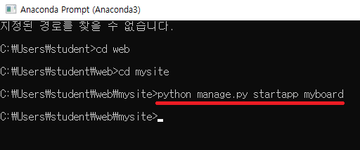
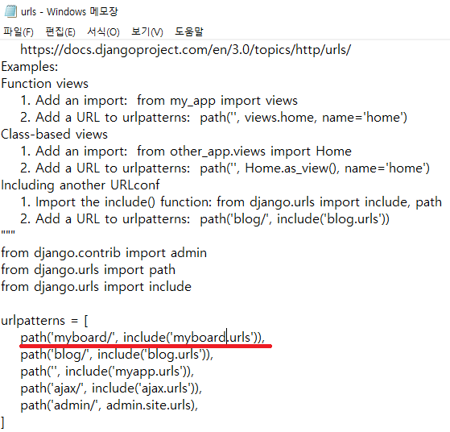
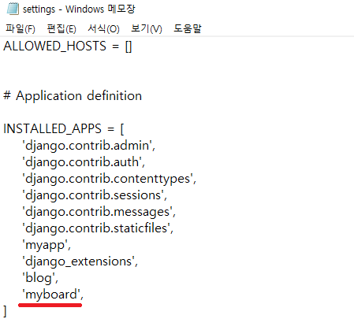
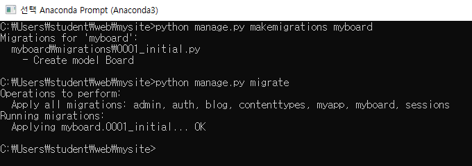
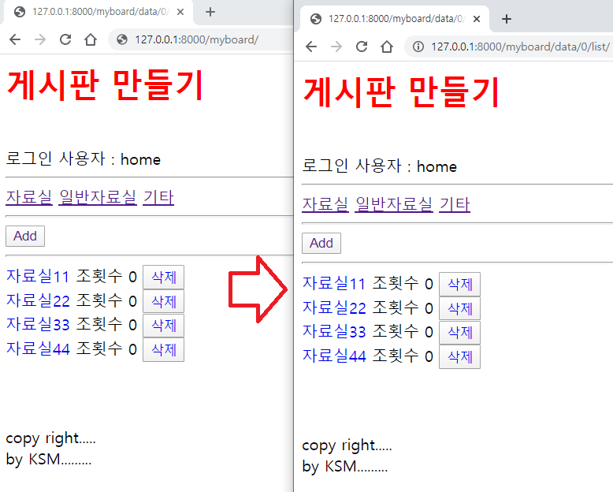
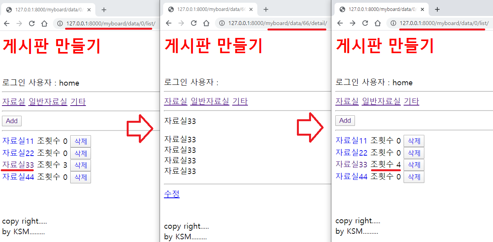
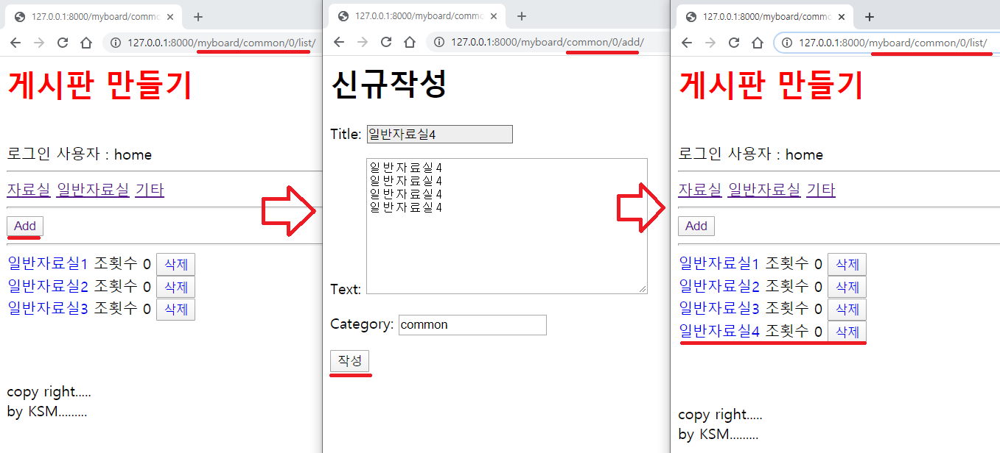
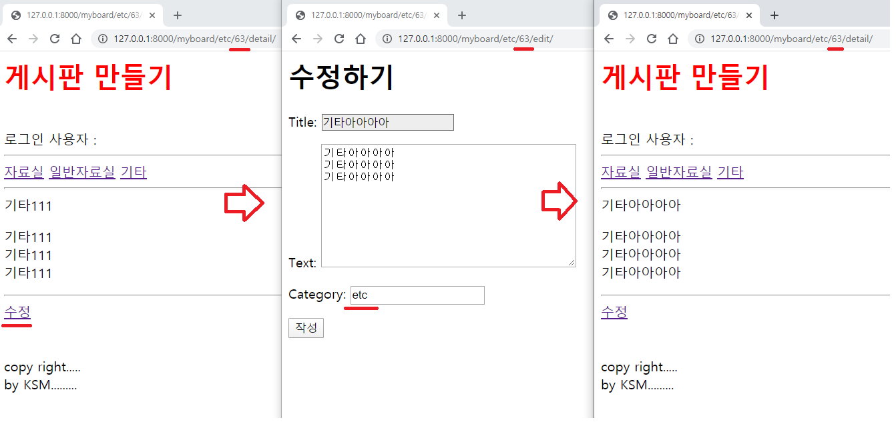
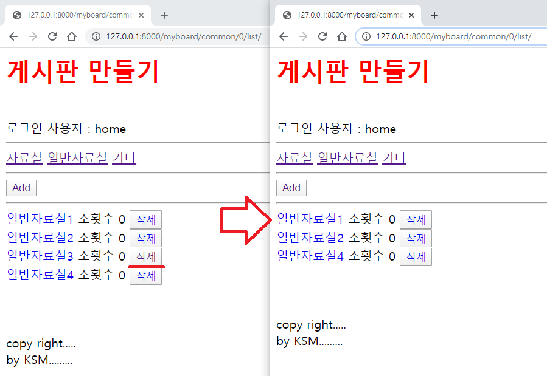

# day3

## 게시판 app 만들기

* `/mysite/blog` 를 이용해서 게시판 app을 만든다.

### .py 수정

* `python manage.py startapp myboard` 명령어로 `myboard` app 만든다.




* `/mysite/mysite/urls.py`, `/mysite/mysite/settings.py`를 수정해준다.

/mysite/mysite/urls.py




/mysite/mysite/settings.py




* `/mysite/blog/`의 `models.py`, `admin.py`, `forms.py`, `urls.py`, `views.py` 를 `/mysite/myboard` 에 복사해준다.

* `/mysite/templates/` 에 `myboard` 파일을 생성한다.
  * `/mysite/templates/blog`의 모든 html 파일들을 복사해준다.


* `/mysite/myboard/models.py`를 수정해준다.
  * 기존의 `published_date` 를 제거하고 `cnt`, `image`, `category`를 추가해 준다.
  * `cnt`는 조회수를 위한 변수로 default 를 0으로 해준다.
  * `category` 는 글 분류를 위한 변수이다.

```python
from django.db import models
from django.utils import timezone


# Create your models here.

class Board(models.Model):
    author = models.ForeignKey('auth.User', on_delete=models.CASCADE)
    title = models.CharField(max_length=200)
    text = models.TextField()  # 글자수에 제한 없는 텍스트
    created_date = models.DateTimeField(
        default=timezone.now)  # 날짜와 시간
    cnt = models.IntegerField(default=0) # 죄회수
    image = models.CharField(max_length=200, null=True, blank=True) # 이미지
    category = models.CharField(max_length=10, default='common') # 게시판 분류 / default 를 'common'으로 해준다.

    def __str__(self):
        return self.title

```

* `/mysite/myboard/admin.py` 을 수정해준다.

```python
from django.contrib import admin
from . import models

# Register your models here.

admin.site.register(models.Board)
```


* `/mysite/myboard/forms.py` 을 수정해준다.
  * `fields`에 `category`를 추가해준다.
  * `image` 는 나중에 따로 추가해주는 방법 이용할 것이다.

```python
from django.forms import ValidationError
from django import forms
from . import models


def validator(value) :
    if len(value) < 5 : raise  ValidationError("길이가 너무 짧아요");

class BoardForm(forms.ModelForm):
    class Meta:
        model = models.Board
        fields = ['title', 'text', 'category']

    def __init__(self, *args, **kwargs):
        super(BoardForm, self).__init__(*args, **kwargs)
        self.fields['title'].validators = [validator]
```


* `/mysite/myboard/urls.py` 을 수정해준다.
  * `name`은 본인만의 체계를 가지고 작성하는 것이 좋다.
    * 다른 앱의 `name`  과 겹치는 경우 원치 않는 상황 발생 가능한다.
  * `lambda`를 이용해 루트경로인 `127.0.0.1:8000/myboard`로 접속했을 떄`127.0.0.1:8000/myboard/data/0/list` 로 접속한다.
    * 첫번째 파라미터인 `myboard` 는 `name='myboard'` 에 접속하기 위해 `name` 값을 입력해 주었다.
  * 게시글의 category 구분을 위해 3개의 값을 입력 받도록 경로를 입력하였다.

```python
from django.urls import path
from . import views
from django.shortcuts import redirect

urlpatterns = [
    path('<category>/<int:pk>/<mode>/', views.BoardView.as_view(), name="myboard"),
    path('', lambda request: redirect('myboard', 'data', 0, 'list')),
]
```


* `/mysite/myboard/views.py` 을 수정해준다.
  * 게시물의 category를 구분하기 위해서 `def get`, `def post` 함수의 파라미터에 category를 추가한다.
  * login 기능을 제거 했기 때문에 , `username = request.session["username"]` 이 부분이 정상 작동 안한다.
    * 임의로 `username`을 입력한다. -> `username = 'home'`
  * 조회수는 글의 제목을 클릭하여 `datail` 에 들어 갔을 때 조정해 준다.

```python
from django.shortcuts import render, get_object_or_404,redirect
from django.http import HttpResponse
from django.views.generic import View
from django.contrib.auth.models import User
from django.forms import CharField, Textarea, ValidationError
from . import forms
from . import models

class BoardView(View) :
    def get(self, request, category, pk, mode):
        
        if mode == 'add':
            form = forms.BoardForm(initial={'category': category})
        elif mode == 'list':
            username = request.session["username"]
            user = User.objects.get(username=username)
            data = models.Board.objects.all().filter(author=user, category=category)
            context = {"data":data, "username":username, "category":category}
            return render(request, "myboard/list.html", context)
        elif mode == 'detail':
            p = get_object_or_404(models.Board, pk=pk)
            p.cnt += 1
            p.save()
            return render(request, "myboard/detail.html", {"d":p, "category": category})
        elif mode == 'edit' :
            board = get_object_or_404(models.Board, pk=pk)
            form = forms.BoardForm(instance=board)
        elif mode == 'del':
            board = get_object_or_404(models.Board, pk=pk)
            board.delete()
            return redirect("myboard", category, 0, "list")
        else:
            return HttpResponse("error")
        return render(request, "myboard/edit.html", {"form":form})

    def post(self, request, category, pk, mode):

        username = request.session["username"]
        user = User.objects.get(username=username)

        if pk == 0:
            form = forms.BoardForm(request.POST)
        else:
            board = get_object_or_404(models.Board, pk=pk)
            form = forms.BoardForm(request.POST, instance=board)

        if form.is_valid():
            board = form.save(commit=False)
            if pk == 0:
                board.author = user
                board.category = category
            board.save()
            return redirect("myboard", category, 0, "list")
        return render(request, "myboard/edit.html", {"form": form})
```


* `python manage.py makemigrations myboard`, `python manage.py migrate` 명령어로 db 최신화 한다.




### .html 수정

* category
  * 자료실 : data
  * 일반자료실 : common
  * 기타 : etc


* `/mysite/templates/myboard/base.html` 수정한다.
  * `name = myboard` 에 접속하기 위해서는 `url` 칸에 3개의 파라미터를 넘겨주어야 정상 작동한다.
    * ex) `<a href=>`

```html
<font color="red"><h1> 게시판 만들기 </h1></font> <br>
로그인 사용자 : {{username}}<hr>

<a href=>자료실</a>
<a href=>일반자료실</a>
<a href=>기타</a>
<hr>



<br><br><br>
copy right..... <br>
by KSM.........
```


* `/mysite/templates/myboard/detail.html` 수정한다.

```html


게시물 보기 <br>



    {{d.title}} <br>
    {{d.text | linebreaks}}
    <hr>

<a href=""> 수정 </a>


```


* `/mysite/templates/myboard/list.html` 수정한다.
  * `style="text-decoration:none` : 하이퍼링크의 밑줄을 없애는 코드이다.
  * `Add` button 을 만들어 준다.

```html




<button type="button"><a href="" style="text-decoration:none">Add </a></button> <hr>



<a href="" style="text-decoration:none"> {{d.title}} </a> 조횟수 {{d.cnt}}
<button type="button"><a href="" style="text-decoration:none"> 삭제 </a></button> <br>



```


* `/mysite/templates/myboard/edit.html` 수정한다.

````html
<script src="http://code.jquery.com/jquery-1.11.3.min.js"></script>
<script src="http://code.jquery.com/jquery-migrate-1.2.1.min.js"></script>

 <style>
      .bg { background-color: #eeeeee; }
      .bd { border: 1px solid #666666; }
 </style>


<h1>  수정하기 </h1>

<h1>  신규작성</h1>


<form action="" method=post>
    

    {{ form.as_p }}

    <input type="submit" value="작성" >

</form>

<script>
   $("#id_title").addClass('bg bd');
</script>
````


### 실행화면

* 기본 접속

* `127.0.0.1:8000/myboard` 로 접속하면 `127.0.0.1:8000/myboard/data/0/list` 로 접속한다.
  * 자료실의 category가 `data` 이다.




* 게시글 조회
  * 게시글을 선택하면 `/myboard/<category>/<pk>/detail` 로 접속한다.
  * 다시 `/myboard/<category>/0/list` 에 접속하면 조회수가 올라가 있다.




* 게시물 추가
  * `add` 버튼을 누른다.
    * `/myboard/<category>/0/add` 로 이동한다.
  * 작성 후 `작성` 버튼을 누른다.
    * `/myboard/<category>/0/list` 로 이동한다.
    * 제목 길이가 5 미만이면 `길이가 짧아요.` 라는 문구가 뜬다.
  * 새 게시글이 추가되있다.




* 게시글 수정
  * 게시글을 선택한 후 수정을 누른다.
    * `/myboard/<category>/<pk>/edit` 로 이동한다.
  * 게시글 수정후 `작성`을 누른다.




* 게시글 삭제




### 종속성 줄이기 위한 코드

* `/mysite/myboard/views.py` 코드를 종속성을 줄이기 위한 코드이다.
  * `from . import apps` 를 import 한다.
    * app 이름인 `myboard`를 `apps.APP` 으로 대체 할 수 있다.

```python
from django.shortcuts import render, get_object_or_404,redirect
from django.http import HttpResponse
from django.views.generic import View
from django.contrib.auth.models import User
from django.core.paginator import Paginator

from . import forms
from . import models
from . import apps

class BoardView(View) :
    def get(self, request, category, pk, mode):
        if  mode == 'add' :
            form = forms.BoardForm()
        elif mode == 'list' :
            username = request.session["username"]
            user = User.objects.get(username=username)
            data = models.Board.objects.all().filter(category=category)
            
            context = {"data": data, "username": username, "category": category}
            return render(request, apps.APP + "/list2.html", context)
        elif mode ==  "detail" :
            p = get_object_or_404(models.Board, pk=pk)
            p.cnt += 1
            p.save()
            return render(request, apps.APP +"/detail.html", {"d": p,"category":category})
        elif mode == "edit" :
            post = get_object_or_404(models.Board, pk=pk)
            form = forms.BoardForm(instance=post)
        else :
            return HttpResponse("error page")

        return render(request, apps.APP +"/edit.html", {"form":form})

    def post(self, request, category, pk, mode):

        username = request.session["username"]
        user = User.objects.get(username=username)

        if pk == 0:
            form = forms.BoardForm(request.POST)
        else:
            post = get_object_or_404(models.Board, pk=pk)
            form = forms.BoardForm(request.POST, instance=post)

        if form.is_valid():
            post = form.save(commit=False)
            if pk == 0:
                post.author = user
            post.category = category
            post.save()
            return redirect("myboard", category, 0, 'list')
        return render(request, apps.APP + "/edit.html", {"form": form})
```

