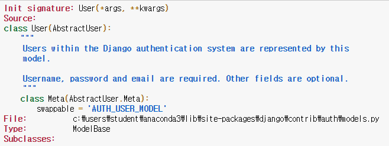
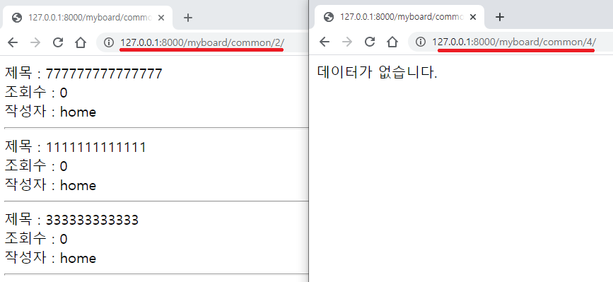
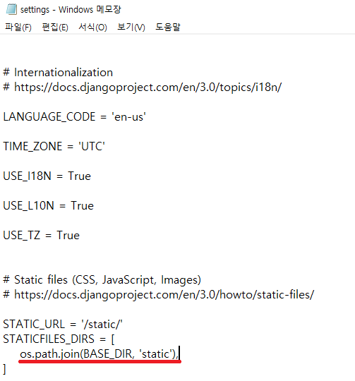
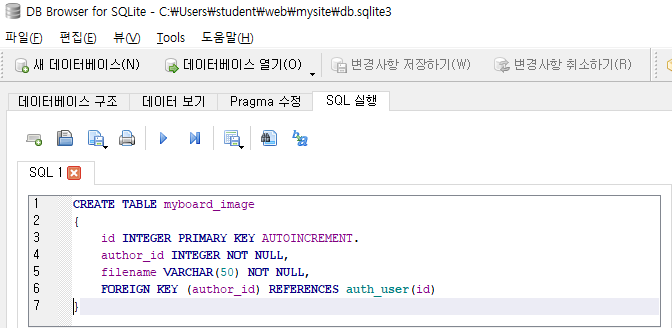
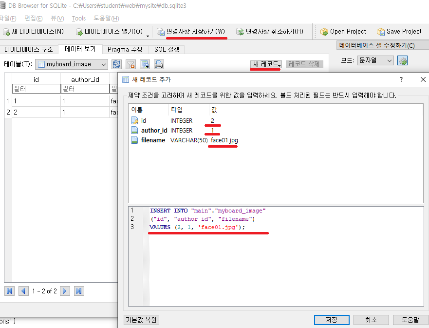
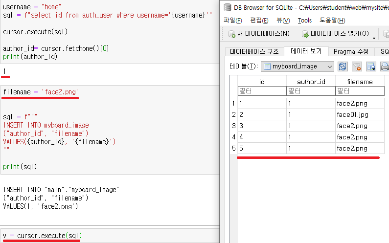

# day5(db)

* 지금까지는 `django`의 `model`을 이용해서 db 를 이용하였다.
* 하지만 실제 현업에서는 회사 자체 db 등을 이용하는 경우가 있어 `django`의 `model`을 이용하지 못하는 경우가 많다.
* `cursor` 객체를 이용해서  db 를 이용하는 것이 일반적이다.


* `python manage.py shell_plus --notebook` 명렁어로 `jupyter notebook`을 이용해서 서버를 실행시키지 않고도 db 정보를 이용할 수 있다.

## cursor

### 기본설정

* header
  * `from django.db import connection` : `cursor` 사용을 위해 import 해야된다.
  * `from django.contrib.auth.models import User` : `author_id`를 이용하기 위해 import 한다.
  * `cursor`를 이용하므로 `from myboard import models` 는 import 하지 않아도 된다.

```python
from django.db import connection
from django.contrib.auth.models import User
from myboard import models
```

* import 한 `User`의 구조를 알고 싶을 때는 `??` 를 이용한다.

```python
User??
```

실행화면




* 실행했던 `sql` 을 보고 싶을 때는 `connection.queries[-1]` 을 이용한다.
  * `User.objects.all()` : `django` 를 이용해서 db 정보를 가져오는 방법이지 내부적으로는 `sql` 을 보내서 정보를 받는다.
  * `connection.queries[-1]` : `data = User.objects.all()` 에 대한 `sql` 정보가 들어 있다.

```python
data = User.objects.all()
# 실행시켰던 sql 기록을 가지고 있다.
# data = User.objects.all() 에 대한 기록을 가지고 있다.
connection.queries[-1]
```

출력

```
{'sql': "select title, cnt, username\nfrom myboard_board as b, auth_user as u\nwhere b.author_id = u.id and username = 'home' and category= 'common'",
 'time': '0.000'}
```


### cursor 객체 생성

* `connection.cursor()` 을 이용해 cursor 객체를 생성한다.
* `cursor.execute()` 을 이용해 `sql` 문을 실행시킨다.
  * 파라미터에 실행시킬 `sq`l 문을 삽입한다.
* `cursor.fetchone()` : 가져온 데이터중 한개만 가져온다.
  * cursor의 위치는 두번째(만약 가져온 데이터가 한개라면 끝) 위치로 이동한다.

```python
# cursor 객체를 가져온다
# 처음 한번만 가져오면 된다.
cursor = connection.cursor()
cursor.execute('SELECT max(age) from myapp_user')
max_value = cursor.fetchone()

print(max_value)
```

출력

```
(2000,)
```


* `cursor.fetchall()` : cursor의 위치로부터 남은 데이터를 가지고 온다.
  * `cursor.fetchall()`  이전에 `cursor.fetchone()` 를 호출 했다면 첫번째 정보를 제외한 나머지 정보를 가져오게 된다.
  * 모든 정보 가져온 상태에서 `cursor.fetchall()` 을 호출하면 빈 list가 return 된다.

```python
cursor.execute("""
select id, title, cnt
from myboard_board
where author_id=(
select id
from auth_user
where username = 'home')
""")

# 한개의 데이터를 가져온다.
# 다시 호출하면 다음번 데이터를 가져온다.
r = cursor.fetchone()
print(r)

r = cursor.fetchone()
print(r)

# fetall() 전에 fetch 를 한 적이 있다면 cursor 기준으로 남은 데이터 가져온다.
# curosr 위치 기준으로 남은 데이터 가져오는 것이다.
r = cursor.fetchall()
print(r)

r = cursor.fetchall()
print(r)
```

출력

```
(58, '자료실11', 0)

(59, '자료실22', 0)

[(63, '기타아아아아', 3), (64, '기타222', 0), (65, '기타333', 0), (66, '자료실33', 5), (67, '자료실44', 0), (83, '22222', 0), (84, '4444444', 0), (85, '666666666666', 0), (86, '777777777777777', 0), (87, '1111111111111', 0), (88, '333333333333', 0), (89, '88888888888', 0), (90, '9999999999999', 0)]

[]
```


### dictionary 화

* `cursor.fetchall()`, `ursor.fetch()` 명령어로는 데이터의 속성값을 알지 못한다.
* `cursor.description` 명령어를이용해서 데이터의 속성값을 알 수 있다.

```python
# 요청한 데이터의 cursor 에 대한 정보
cursor.description
```

출력

```
(('id', None, None, None, None, None, None),
 ('title', None, None, None, None, None, None),
 ('cnt', None, None, None, None, None, None),
 ('username', None, None, None, None, None, None))
```


* 두 종류의 명령어를 이용해서 데이터를 dictionary 화 할 수 있다.
  * `zip`, `dict` 명령어를 이용한다.

ex) ` d = dict(zip(['a','b'], (1,2)))` -> `{'a': 1, 'b': 2}`

dictionaryify 함수화

```python
def dicfetchall(cursor):
    desc = cursor.description
    return [
        dict(zip([col[0] for col in desc], row))
        for row in cursor.fetchall()
    ]
```


### 기본설정 + cursor 객체 생성 + dictionary화

* 위의 3개의 작업 종합 코드

```python
from django.db import connection
from django.contrib.auth.models import User

def dicfetchall(cursor):
    desc = cursor.description
    return [
        dict(zip([col[0] for col in desc], row))
        for row in cursor.fetchall()
    ]
    
cursor = connection.cursor()
cursor.execute('SELECT * from myboard_board')
d = dicfetchall(cursor)
print(d[0]['title'])
```


### cursor 을 이용해서 category, page, username 입력받았을 때 해당하는 게시글 띄우기


* category, page 는 url 로 입력받는다
* username 은 `username = request.session["username"]` 을 이용한다.
* cursor 을 이용해서 sql 문을 날려 데이터를 받아온다.
* slicing 을 이용해서 입력받은 페이지에 대한 데이터 띄운다.


* `/mysite/myboard/views.py` 에 `listsql` 함수를 만들어 준다.
  * 페이지 범위를 넘어가 slicing 결과로 빈 리스트를 전달하게 될때에는 error 를 0 으로 해서 보내준다.
    * list3.html에서 error 가 0 이면 '데이터가 없습니다.' 를 출력하게 된다.

/mysite/myboard/views.py

```python
from django.shortcuts import render, get_object_or_404,redirect
from django.http import HttpResponse, JsonResponse
from django.views.generic import View
from django.forms import CharField, Textarea, ValidationError
from . import forms
from . import models
from django.conf import settings

from django.core.paginator import Paginator


from django.db import connection
from django.contrib.auth.models import User
from myboard import models

def listsql(request, category, page):
    username = request.session["username"]
    cursor = connection.cursor()
    sql = f"""select title, cnt, username
    from myboard_board as b, auth_user as u
    where b.author_id = u.id and username = '{username}' and category= '{category}'"""
    cursor.execute(sql)
    datas = dicfetchall(cursor)
    subs = datas[(page-1)*3:(page)*3]
    if len(subs) == 0:
        datas = {"datas": subs, "error": 0}
    else:
        datas = {"datas": subs, "error": 1}
    return render(request, "myboard/list3.html", datas)
```


* `/mysite/myboard/urls.py` 에 `listsql` 함수에 대한 url 을 추가해준다.
  *  `categroy`, `page` 를 url 에 포함 시킨다.
  * 서버 접속은 `127.0.0.1:8000/myboard/<category>/<page>/` 를 이용해서 한다.
    * ex) `127.0.0.1:8000/myboard/common/2/`

/mysite/myboard/urls.py

```
from django.urls import path
from . import views
from django.shortcuts import redirect

urlpatterns = [
    #path('', views.page),
    path('ajaxdel', views.ajaxdel),
    path('ajaxget', views.ajaxget),

    path('<category>/<int:page>/', views.listsql),

    path('<category>/<int:pk>/<mode>/', views.BoardView.as_view(), name="myboard"),
    path('', lambda request: redirect('myboard', 'data', 0, 'list')),
]
```


* `/mysite/templates/myboard` 에 `list3.html` 을 만든다.
  * 게시글을 띄우기 위한 `html`파일

/mysite/templates/myboard/list3.html

```html



   제목 : {{data.title}}  <br>
   조회수 : {{data.cnt}} <br>
   작성자 : {{data.username}} <hr>



데이터가 없습니다.

```

* 실행화면




### cursor을 이용한 데이터 show

* `static` 데이터를 다루기 때문에 `/mysite/static` 파일을 이용해서 작업을 한다.
  * `/mysite/mysite/settings.py`의 `STATICFILES_DIRS` 이 `os.path.join(BASE_DIR, 'static')` 이처럼 `static`으로 설정 되어 있어야한다.
* `user` 별로 데이터 관리하기 위해 `/mysite/static` 에 `/faces/home` 파일 생성해 준다.
  * 생성한 `/mysite/static/faces/home` 파일에 이미지 파일을 추가해준다.



#### table 생성

* sql을 이용해서 `myboard_image` 테이블을 생성한다.

```sql
CREATE TABLE myboard_image
(
	id INTEGER PRIMARY KEY AUTOINCREMENT,
	author_id INTEGER NOT NULL,
	filename VARCHAR(50) NOT NULL,
	FOREIGN KEY (author_id) REFERENCES auth_user(id)
)
```



#### table 에 데이터 추가

* `myboard_image` 테이블 생성후 데이터를 추가한다.
  * `myboard_image` 테이블을 불러온다.
  * `새 레코드` 를 누르고 `값` 칸에 데이터를 입력한다.
  * `저장` 으로 데이터를 생성한다.
  * 데이터 생성 후에는 `변경사항 저장하기` 를 눌러줘야 db에 반영이 된다.




* `jupyter notebook` 창에서도 데이를 추가 할 수 있다.
  *  `auth_user` 을 이용해서 `username` 에 해당하는 `id` 값을 불러온다.
  * `filename` 을 정해준뒤 `cursor.execute()` 함수를 이용해 데이터를 생성한다.

```python
username = "home"
sql = f"select id from auth_user where username='{username}'"

cursor.execute(sql)

author_id= cursor.fetchone()[0]
print(author_id)
```

```python
filename = 'face2.png'


sql = f"""
INSERT INTO myboard_image
("author_id", "filename")
VALUES({author_id}, '{filename}')
"""

print(sql)
```

```python
v = cursor.execute(sql)
```

* 실행화면
  * 밑의 화면에는 `filename` 이 `face2.png`, `face01.png`....형식으로 되어 있다.
  * 하지만 밑의 실습을 위해 `f1.jpg`,`f2.jpg`..... 형식으로 `filename` 을 수정해 주자.




#### 데이터 show

* `jupyter notebook` 을 이용해서 작업을 실시한 후에 전체 코드를 구성해보자

##### filename 정보 불러오기

* `filename` 데이터 불러오기
  * `filename` 데이터를 `cursor` 를 이용해 불러온다.
  * 위에서 만들었던 `dicfetchall` 함수를 이용해 dictionary 화 한다.

```python
sql = f"""
select filename
from myboard_image
where author_id = ( select id from auth_user where username = '{username}')
"""


cursor = connection.cursor()
cursor.execute(sql)

data = dicfetchall(cursor)
context = {"data": data}
print(context)
```

출력

```
{'data': [{'filename': 'f1.jpg'}, {'filename': 'f2.jpg'}, {'filename': 'f3.jpg'}, {'filename': 'f4.jpg'}, {'filename': 'f5.jpg'}]}
```


##### myboard 에 적용하기

* `/mysite/myboard/views.py` 에 `photolist` 함수를 만들어 준다.

```python
def photolist(request):
    username = request.session["username"]
    sql = f"""
    select filename
    from myboard_image
    where author_id = ( select id from auth_user where username = '{username}')
    """

    cursor = connection.cursor()
    cursor.execute(sql)
    data = dicfetchall(cursor)
    context = {"data": data, "username":username}
    return render(request, "myboard/photolist.html", context)
```


* `/mysite/myboard/urls.py` 에 `photolist` 함수에 대한 url 추가해준다.

```python
from django.urls import path
from . import views
from django.shortcuts import redirect

urlpatterns = [
    #path('', views.page),
    path('ajaxdel', views.ajaxdel),
    path('ajaxget', views.ajaxget),

    path('<category>/<int:page>/', views.listsql),
    path('photolist', views.photolist, name="photolist"),

    path('<category>/<int:pk>/<mode>/', views.BoardView.as_view(), name="myboard"),
    path('', lambda request: redirect('myboard', 'data', 0, 'list')),
]
```


* `/mysite/templates/myboard` 에 `photolist.html` 을 만들어준다.

```html
{{ username}} <hr>

<form action='upload' method='post' enctype='multipart/form-data'>
    
    <input type='file' name='filename'>
    <input type='submit' value='사진전송'>
    <input type='hidden' name="username" value="{{username}}">
</form>



    

```

* 실행화면


### cursor을 이용한 데이터 upload

* `jupyter notebook` 을 이용해서 작업을 실시한 후에 전체 코드를 구성해보자


* `browser` 파일 보내는 작업을 `jupyter notebook`을 이용해서 실험 해 볼 수 있다.
  * `static/" + fn` 의 경로에 있는 `img` 파일을 읽어 온다.
  * 읽어온 `img` 파일 이름을 `dog2.jpg` 로 한다.

```python
from django.test import RequestFactory
rt = RequestFactory()
url = ''
request = rt.get(url)

# jupyter notebook 에서 연습하기 위해 브라우저에서 img 보내는 작업을 흉내낸 코드
from django.core.files.uploadedfile import SimpleUploadedFile
fn = "lena.jpg"
f = open("static/" + fn, "rb")

file_upload = SimpleUploadedFile('dog2.jpg', f.read(), content_type='image/jpeg')

data = {'filename': file_upload, "username": "home"}

request = rt.post("/myboard/upload", data = data, format='multipart')
```

* 불러온 파일 저장

```python
# 받은 파일 저장
file = request.FILES['filename']
username = request.POST["username"]
filename = file._name
print(filename)
fp = open(settings.BASE_DIR + "/static/faces/" + username + "/" + filename, "wb")
for chunk in file.chunks() :
    fp.write(chunk)
fp.close()

sql = f"select id from auth_user where username='{username}'"
cursor.execute(sql)
author_id= cursor.fetchone()[0]

sql = f"""
INSERT INTO myboard_image
("author_id", "filename")
VALUES({author_id}, '{filename}')
"""

cursor.execute(sql)
```


#### mybrowser 에 적용하기

* `/mysite/myboard/views.py` 에 `upload` 함수 만들어 준다.
  * browser 에서 받은 파일을 db와 `/mysite/static/faces/home` 폴더에 저장해주고 `photolist`로 redirect 한다.

```python
from django.shortcuts import render, get_object_or_404,redirect
from django.http import HttpResponse, JsonResponse
from django.views.generic import View
from django.forms import CharField, Textarea, ValidationError
from . import forms
from . import models
from django.conf import settings

from django.core.paginator import Paginator


from django.db import connection
from django.contrib.auth.models import User
from myboard import models


def upload(request):
    cursor = connection.cursor()
    # 받은 파일 저장
    file = request.FILES['filename']
    username = request.POST["username"]
    filename = file._name
    print(filename)
    fp = open(settings.BASE_DIR + "/static/faces/" + username + "/" + filename, "wb")
    for chunk in file.chunks() :
        fp.write(chunk)
    fp.close()

    sql = f"select id from auth_user where username='{username}'"
    cursor.execute(sql)
    author_id= cursor.fetchone()[0]

    sql = f"""
    INSERT INTO myboard_image
    ("author_id", "filename")
    VALUES({author_id}, '{filename}')
    """

    cursor.execute(sql)

    return redirect("photolist")
```


* `/mysite/myboard/urls.py` 에 `upload` 함수에 대한 url을 추가한다.

```python
from django.urls import path
from . import views
from django.shortcuts import redirect

urlpatterns = [
    #path('', views.page),
    path('ajaxdel', views.ajaxdel),
    path('ajaxget', views.ajaxget),

    path('<category>/<int:page>/', views.listsql),
    path('photolist', views.photolist, name="photolist"),
    path('upload', views.upload, name="upload"),

    path('<category>/<int:pk>/<mode>/', views.BoardView.as_view(), name="myboard"),
    path('', lambda request: redirect('myboard', 'data', 0, 'list')),
]
```

* 실행화면


## ??

??`User.objects.raw('SELECT max(age ) FROM myapp_user')` 

`document ready function` 찾아보기