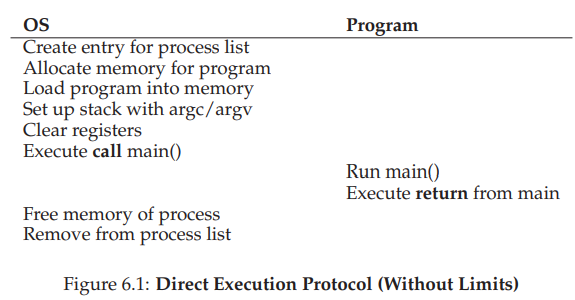

# 1. Program Execution

* By **time sharing** the CPU, **OS** virtualize the CPU. And there are a few challenges, however, in building such virtualization machinery.
  * **performance** - how can we implement virtualization without adding excessive overhead to the system?
  * **control** - how can we run processes efficiently while retaining control over the CPU?

# 2. Limited Direct Execution

## 2-1. Direct Execution

* One way to achieve **performance** is **direct execution**: : just run the program directly on the CPU.
* But **direct execution** invoked two problems.
  * Running process could do restricted operations(access to disk, allocate memory, etc).
  * **OS** could not stop running process from running and switch to another process.
* Below is protocol of direct executed process.

## 2-2. Problem1(Restricted Operations)

* Problem
  * **Direct execution** let user process do **restricted operations**. So, user process could do operations which we don’t want it to do.

* Solution(**user mode** & **kernel mode** & **system call**)
  * **user mode**
    * Process, running in **user mode** , is restricted in what it can do. For example, a process can’t issue I/O requests; doing so would result in the processor raising an exception.
  * **kernel mode**
    * In **kernel mode**, which the operating system (or kernel) runs in, code that runs can do what it likes, including privileged operations such as issuing I/O requests and executing all types of restricted instructions.
  * **system call**
    * When **user process** wishes to perform some kind of privileged operation, **user process** use **system call**.
    * **System calls** allow the **kernel** to carefully expose certain key pieces of functionality to user programs.
    * To execute a **system call**, a program must execute a special **trap** instruction.
    *  When required work finished, the **OS** calls a special **return-from-trap** instruction, which returns into the calling **user program** while simultaneously reducing the privilege level back to user mode.
  * **trap table**
    * When trap called, the calling process can’t **specify** an address to jump to.
    * The kernel set up a **trap table** at boot time in **kernel mode**.
    * The **OS** informs hardware of locations of **trap handlers**(code what to run when certain exceptional events occur).
  *  **system call number**
    * To specify the exact **system call**, a **system-call number** is usually assigned to each **system call**.
    * The user code is thus responsible for placing the desired system-call number in a register or at a specified location on the stack.
      *  The **OS**, when handling the system call inside the trap handler, examines this number, ensures it is valid, and, if it is, executes the corresponding code.
  * protocol of calling **system call**

## 2-3. Problem2(Switching Between Processes)

* Problem
  * **OS** could not stop running process from running and switch to another process.

* Solution
  * Cooperative Approach
    * The OS trust the processes of the system to call **system call**, because most processes frequently make **system calls**.
    * But this approach have problem, if a process (whether malicious, or just full of bugs) ends up in an infinite loop, and never makes a **system call**.
  *  Non-Cooperative Approach(preemptive way)
    * With **timer interrupt** solved *cooperative approach** problem.
    * During the boot sequence, the OS start the timer, which is of course a privileged operation.
    * A timer device is programmed to raise an interrupt every so many milliseconds.
    * When the interrupt is raised, the currently running process is halted, and a pre-configured **interrupt handler** in the OS runs.
  * context switch
    * When the decision is made  to switch currently-running process to soon-to-be-executing process, saving **context** of currently-running process and restoring **context** of soon-to-be-executing process is called **context switch**

# 3. Concurrency problem