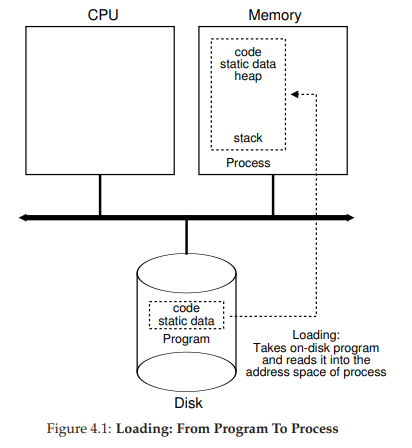
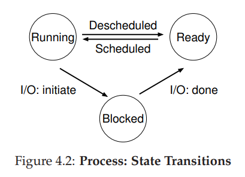

# 1. Process

* `process` is running program

## 1-1. time sharing

* A typical system may be seemingly running tens or even hundreds of processes at the same time.
* The `OS` creates this illusion by `virtualizing` the CPU.
* Basic technique, by running one process, then stopping it and running another,  known as `time sharing` of the CPU,  allows users to run as many concurrent processes as they would like.

## 1-2. mechanisms & policies

* To implement virtualization of the CPU, and to implement it well, the `OS` will need both some low-level machinery and some high-level intelligence.
* low-level machinery(mechanism)

  * The `mechanism` provides the answer to a `how` question about a system
    * ex) how does an operating system perform a context switch?
* high-level intelligence(policy)

  * The `policy` provides the answer to a `which` question
    * ex) which process should the operating system run right now?

## 1-3. machine state

* To understand what constitutes a process, we thus have to understand its `machine state`: what a program can read or update when it is running.
* memory
  * Instructions lie in memory; the data that the running program reads and writes sits in memory as well
* register
  * program counter (PC) - which instruction of the program will execute next
  * stack pointer, frame pointer - used to manage the stack for function parameters, local variables, and return addresses.
* storage devices
  * programs often access persistent storage devices 

# 2. Process creation

* process of process creation(how does the OS get a program up and running?)
  1. The OS loads program code and any static data (e.g., initialized variables) from disk into memory, into the address space of the process.
  2. Allocate memory for the program’s stack(user stack)
     *  fill in the parameters to the main() function(`argc`, `argv`)
  3. Allocate memory for the program’s heap
     * dynamically-allocated data reside in heap
  4. The OS will also do some other initialization tasks, particularly as related to input/output (I/O).

# 3. Process States

* Running
  * In the running state, a process is running on a processor. This means it is executing instructions.
* Ready
  *  In the ready state, a process is ready to run but for some reason the OS has chosen not to run it at this given moment.
* Blocked
  * : In the blocked state, a process has performed some kind of operation that makes it not ready to run until some other event (ex)  I/O request to a disk) takes place.
* initial & final
  * initial
    *  The process is in `initial state` when it is being created.
  * final
    * process could be placed in a `final state` where it has exited but has not yet been cleaned up.
    * This `final state` can be useful as it allows other processes (usually the parent that created the process) to examine the return code of the process and see if the just-finished process executed successfully.

# 4. Process API