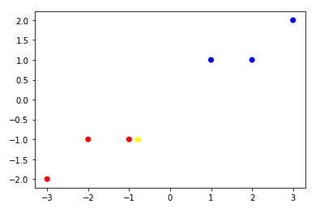
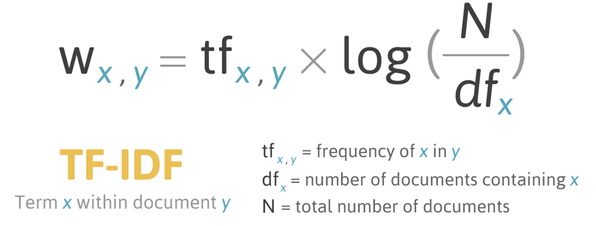

# 자연어 처리(NLP)

* header

```python
import numpy as np
from sklearn.naive_bayes import GaussianNB
from sklearn.metrics import accuracy_score
from sklearn.feature_extraction.text import CountVectorizer
from sklearn.feature_extraction.text import TfidfVectorizer
from sklearn.metrics.pairwise import cosine_similarity
from sklearn.linear_model import SGDClassifier
from sklearn.svm import LinearSVC
from tensorflow.keras.datasets import imdb
from konlpy.tag import Twitter
from konlpy.tag import Okt
from konlpy.tag import Kkma 
from konlpy.tag import Twitter
from pprint import pprint
import nltk
from nltk.classify.scikitlearn import SklearnClassifier
from wordcloud import WordCloud, STOPWORDS
from gensim import corpora, models
import numpy  as np
from PIL import Image
from wordcloud import ImageColorGenerator
import glob
import re
import matplotlib.pyplot as plt
from tensorflow.keras.preprocessing.text import Tokenizer
from tensorflow.keras.preprocessing.sequence import pad_sequences
%matplotlib inline
```

* 위 라이브러리 중 추가적으로 jupyter notebook 기준 설치 해야할 라이브러리

  * pip install genism

  * pip install wordcloud

  * pip install konlpy --user

    (권한 error 발생 할 수 있으므로 --user 붙여준다. 설치 후 코드에서 실행시에 문제 있을 수도 있다.)

  * conda install -c conda-forge jpype1


## 1. char 코드 기반 자연어 처리

### 문장이 어느 나라 언어인지 판단하는 예제

```python
ko_str = '이것은 한국어 문장입니다.'
ja_str = 'これは日本語の文章です。'
en_str = 'This is English Sentences.'
ch_str = '统一码'

# ko_str[0] : ko_str 문장중 첫번째 문자이다.
# ord(ko_str[0]) : '이' 에대한 아스키 코드 값을 가져온다.
print(ord(ko_str[0]))
print(ord(ja_str[0]))
print(ord(en_str[0]))
print(ord(ch_str[0]))
```

```
51060
12371
84
32479
```

```python
# Unicode 코드 포인트로 출현 빈도 판정하기 --- (*1)
def count_codePoint(str):
    # Unicode 코드 포인트를 저장할 배열 준비하기 --- (*2)
    counter = np.zeros(65535)
    for i in range(len(str)):
        # 각 문자를 Unicode 코드 포인트로 변환하기 --- (*3)
        code_point = ord(str[i])
        if code_point > 65535 :
            continue
        # 출현 횟수 세기 --- (*4)
        counter[code_point] += 1

    # 각 요소를 문자 수로 나눠 정규화하기 --- (*5)
    counter = counter/len(str)
    return counter
```

```python
# 학습 전용 데이터 준비하기
ko_str = '이것은 한국어 문장입니다.'
ja_str = 'これは日本語の文章です。'
en_str = 'This is English Sentences.'

x_train = [count_codePoint(ko_str),count_codePoint(ja_str),count_codePoint(en_str)]
y_train = ['ko','ja','en']
```

```python
print(x_train[0])
# 0보다 큰 값 가지는 index 출력
print(np.where(x_train[0] > 0))

data = x_train[0]
# 문자의 정규화된 빈도수 출력
print(data[[32, 46, 44163]])
# 출현 횟수 0보다 큰 문자의 정규화된 빈도수 출력
print(data[np.where(x_train[0] > 0)])
```

```
[0. 0. 0. ... 0. 0. 0.]
(array([   32,    46, 44163, 44397, 45768, 45796, 47928, 50612, 51008,
       51060, 51077, 51109, 54620], dtype=int64),)
[0.14285714 0.07142857 0.07142857]
[0.14285714 0.07142857 0.07142857 0.07142857 0.07142857 0.07142857
 0.07142857 0.07142857 0.07142857 0.07142857 0.07142857 0.07142857
 0.07142857]
```

* 간단한 data로 scatter 예제

```python
# data scatter 해보기 예제
#X = np.array([[-1, -1], [3, 2]])
#Y = np.array([1,  2])

X = np.array([[-1, -1], [-2, -1], [-3, -2], [1, 1], [2, 1], [3, 2]])
Y = np.array(['r', 'r', 'r', 'b', 'b', 'b'])


color = [ 'red' if y == 'r' else 'b' for y in Y]

plt.scatter(X[:, 0], X[:, 1], color=color)

t = np.array([[-0.8, -1]])

plt.scatter(t[:,0], t[:,1], color='yellow')
```



```python
clf = GaussianNB()
clf.fit(X, Y)
# 확률값으로 [-.8,-1]이 'r' 인지 'b' 인지 출력한다.
print(clf.predict([[-0.8, -1]]))
print(clf.predict([[2.5, 1.3]]))
print(clf.predict([[0, 0]]))
```

```
['r']
['b']
['b']
```

* 위의 가우시안은 선형에 대해서는 적당히 작동을 하지만 XOR 같은 비선형 문제는 성능이 나오지 않는다.

```python
clf.fit([[0,0], [0,1], [1,0], [1,1]], [0,1,1,0])
print(clf.predict([[0, 1]]))
print(clf.predict([[0, 0]]))
```

```
[0]
[0]
```

* 학습해보기

```python
# 학습하기 --- (*6)
clf = GaussianNB() 
clf.fit(x_train, y_train)

y_pred = clf.predict([count_codePoint('안녕. 어디야')])
print(y_pred)
y_pred = clf.predict([count_codePoint('こんにちは')])
print(y_pred)
y_pred = clf.predict([count_codePoint('Hello')])
print(y_pred)
```

```
['ko']
['ja']
['en']
```

* 빈칸을 넣은 경우 한국어로 인식이 되는데 위에서 한국어에 빈칸 빈도가 제일 많아서 그렇다.

```python
y_pred = clf.predict([count_codePoint(' ')])
print(y_pred)
```

```
['ko']
```

* test set 만들어 실행해보기

```python
# 평가 전용 데이터 준비하기
en_test_str = 'Hello'
ja_test_str = 'こんにちは'
ko_test_str = '안녕. 어디야'
x_test = [count_codePoint(en_test_str),count_codePoint(ja_test_str),count_codePoint(ko_test_str)]
y_test = ['en', 'ja', 'ko']

# 평가하기 --- (*7)
y_pred = clf.predict(x_test)
print(y_pred)
# accuracy_score는 header에 import 되어 있다.
print("정답률 = " , accuracy_score(y_test, y_pred))
```

```
['en' 'ja' 'ko']
정답률 =  1.0
```

* 위 코드에 한국어를  `ko_test_str = '안녕'`로 넣어주면 일본어로 인식이 되는데 test case의 수가 적어서 발생한 현상이다.

### 문자셋이 동일한 경우

* 예를 들어 언어는 다르지만 문자를 영어로 쓰는 경우이다.
  * 문자의 발생 빈도수가 언어마다 다르다는 것으로 판단 할 수도 있다.

* 이미 만들어진 언어 training 데이터를 사용한다.
  * data, img 파일의 language.zip 파일 이용
* 언어별로 training을 시켜 각 언어별 문자 빈도수를 학습시킨다.

```python
# 학습 데이터 준비하기 --- (*1)
x_train = []
y_train = []
for file in glob.glob('./train/*.txt'):
    # 언어 정보를 추출하고 레이블로 지정하기 --- (*2)
    print(file)
    y_train.append(file[8:10])
    
    # 파일 내부의 문자열을 모두 추출한 뒤 빈도 배열로 변환한 뒤 입력 데이터로 사용하기 --- (*3)
    file_str = ''
    for line in open(file, 'r', encoding='UTF8'):
        file_str = file_str + line
    x_train.append(count_codePoint(file_str))
```

```
./train\de_cat.txt
./train\de_dog.txt
./train\de_elephant.txt
./train\en_cat.txt
./train\en_dog.txt
./train\en_elephant.txt
./train\es_cat.txt
./train\es_dog.txt
./train\es_elephant.txt
```

```python
clf = GaussianNB() 
clf.fit(x_train, y_train)
```

```python
y_pred = clf.predict([count_codePoint('hello. my name is ')])
print(y_pred)
```

```
# 영어로 나와야 하는데 잘못 나왔다.
['de']
```

```python
# 평가 데이터 준비하기 --- (*4)
x_test = []
y_test = []
for file in glob.glob('./test/*.txt'):
    # 언어 정보를 추출하고 레이블로 지정하기
    y_test.append(file[7:9])
    
    # 파일 내부의 문자열을 모두 추출한 뒤 빈도 배열로 변환한 뒤 입력 데이터로 사용하기
    file_str = ''
    for line in open(file, 'r', encoding='UTF8'):
        file_str = file_str + line
    x_test.append(count_codePoint(file_str)) 

# 평가하기
y_pred = clf.predict(x_test)
print(y_pred)
print("정답률 = " , accuracy_score(y_test, y_pred))  
```

```
['de' 'en' 'es']
정답률 =  1.0
```


## 2. 단어 빈도수 기반 자연어 처리

```python
corpus = [
    'you know I want your love',
    'I like you',
    'what should I do',
    'what should',
    'should what',
]
```

```python
str = " ".join(corpus)
print(str)
# " "을 기준으로 element 구분
words = str.split(" ")
print(words)

freq = {}
for w in words:
    # freq[w] = freq.get(w, 0) + 1
    if w in freq:
        freq[w] += 1
    else:
        freq[w] = 1

print(freq)
```

```
you know I want your love I like you what should I do what
['you', 'know', 'I', 'want', 'your', 'love', 'I', 'like', 'you', 'what', 'should', 'I', 'do', 'what']
{'you': 2, 'know': 1, 'I': 3, 'want': 1, 'your': 1, 'love': 1, 'like': 1, 'what': 2, 'should': 1, 'do': 1}
```

```python
# CountVectorizer() : 문장안에 단어가 있는지 없는지 one-hot encoding 을 해준다. 단어의 출현 빈도에 관계없이 있으면 1이다.
# 계산을 할때 단어의 길이가 1인 단어는 제외한다. corpus에서는 'I' 를 제외한다.
# 문장에서의 단어의 순서에 상관없이 같은 단어를 가지고 있는 문장이라면 vector 값이 같아진다.
vector = CountVectorizer()
tf = vector.fit_transform(corpus)
# 배열에서 1인, 즉 단어가 존재하는 index를 출력한다.
print(tf)
print(tf.toarray())
```

```
  (0, 7)	1
  (0, 1)	1
  (0, 5)	1
  (0, 8)	1
  (0, 3)	1
  (1, 7)	1
  (1, 2)	1
  (2, 6)	1
  (2, 4)	1
  (2, 0)	1
  (3, 6)	1
  (3, 4)	1
  (4, 6)	1
  (4, 4)	1
[[0 1 0 1 0 1 0 1 1]
 [0 0 1 0 0 0 0 1 0]
 [1 0 0 0 1 0 1 0 0]
 [0 0 0 0 1 0 1 0 0]
 [0 0 0 0 1 0 1 0 0]]
```

```python
# vocabulary 내에서 모든 단어의 index를 출력한다.
print(vector.vocabulary_)
```

```
{'you': 7, 'know': 1, 'want': 5, 'your': 8, 'love': 3, 'like': 2, 'what': 6, 'should': 4, 'do': 0}
```

```python
print(vector.vocabulary_['you'])
print(vector.vocabulary_.get('you'))
```

```
7
7
```

```python
# 단어 집합
words = vector.get_feature_names()
for word in words: print(word)

for key in vector.vocabulary_:
    print(key, vector.vocabulary_[key])
```

```
do
know
like
love
should
want
what
you
your
you 7
know 1
want 5
your 8
love 3
like 2
what 6
should 4
do 0
```


### TF-IDF ( Term Frequency - Inverse Document Frequency)

* TF : 현재 문서에서 단어 A가 나타난 횟수
* DF : 단어가 나타난 문서의 수
* 특정 단어의 상대적인 빈도를 나타내주는 값
* 값이 클 수록 내 문서에만 많이 언급되는 단어(=다른 문서에서는 잘 언급 안됨)
* 값이 작을수록 다른 문서에 잘 언급하는 단어를 의미(=현재 문서와 관련 없음)




* tf-idf 값이 높을 때는 해당단어가 내 문장에서만 빈도수가 높가 다른 문장에서는 발생 빈도가 낮아야 된다.


```python
sent = ["오늘 휴일", 
        "휴일 오늘", 
        "휴일 인 오늘 도 서쪽 을 중심 으로 폭염 이 이어졌는데요, 내일 은 반가운 비 소식 이 있습니다.", 
        "폭염 을 피해서 휴일 에 놀러왔다가 갑작스런 비 로 인해 망연자실 하고 있습니 다.", 
        " 내일 은 반가운 비 소식 이 있습니다."] 

# 단어수 1개인 단어는 계산에서 제외 시킨다.
tfidf_vectorizer = TfidfVectorizer()
tfidf_matrix = tfidf_vectorizer.fit_transform(sent) #문장 벡터화 진행
print(tfidf_matrix)
print(type(tfidf_matrix))
```

```
  (0, 17)	0.6437444595062429
  (0, 7)	0.7652405313723362
  (1, 17)	0.6437444595062429
  (1, 7)	0.7652405313723362
  (2, 12)	0.28487998702172107
  (2, 6)	0.28487998702172107
  (2, 4)	0.28487998702172107
  (2, 1)	0.28487998702172107
  (2, 9)	0.35310140100264525
  (2, 14)	0.28487998702172107
  (2, 8)	0.35310140100264525
  (2, 13)	0.35310140100264525
  (2, 5)	0.35310140100264525
  (2, 17)	0.19893117008503197
  (2, 7)	0.23647612349029334
  (3, 11)	0.3542556015420614
  (3, 16)	0.3542556015420614
  (3, 3)	0.3542556015420614
  (3, 10)	0.3542556015420614
  (3, 0)	0.3542556015420614
  (3, 2)	0.3542556015420614
  (3, 15)	0.3542556015420614
  (3, 14)	0.28581118874948447
  (3, 17)	0.1995814265359179
  (4, 12)	0.5
  (4, 6)	0.5
  (4, 4)	0.5
  (4, 1)	0.5
<class 'scipy.sparse.csr.csr_matrix'>
```

```python
print(tfidf_matrix.toarray().shape)
print(tfidf_matrix.toarray())
```

```
(5, 18)
[[0.         0.         0.         0.         0.         0.
  0.         0.76524053 0.         0.         0.         0.
  0.         0.         0.         0.         0.         0.64374446]
 [0.         0.         0.         0.         0.         0.
  0.         0.76524053 0.         0.         0.         0.
  0.         0.         0.         0.         0.         0.64374446]
 [0.         0.28487999 0.         0.         0.28487999 0.3531014
  0.28487999 0.23647612 0.3531014  0.3531014  0.         0.
  0.28487999 0.3531014  0.28487999 0.         0.         0.19893117]
 [0.3542556  0.         0.3542556  0.3542556  0.         0.
  0.         0.         0.         0.         0.3542556  0.3542556
  0.         0.         0.28581119 0.3542556  0.3542556  0.19958143]
 [0.         0.5        0.         0.         0.5        0.
  0.5        0.         0.         0.         0.         0.
  0.5        0.         0.         0.         0.         0.        ]]
```

```python
features = tfidf_vectorizer.get_feature_names()
print(features)
```

```
['갑작스런', '내일', '놀러왔다가', '망연자실', '반가운', '서쪽', '소식', '오늘', '으로', '이어졌는데요', '인해', '있습니', '있습니다', '중심', '폭염', '피해서', '하고', '휴일']
```

```python
# 각 단어의 index 출력
print(tfidf_vectorizer.vocabulary_)
```

```
{'오늘': 7, '휴일': 17, '서쪽': 5, '중심': 13, '으로': 8, '폭염': 14, '이어졌는데요': 9, '내일': 1, '반가운': 4, '소식': 6, '있습니다': 12, '피해서': 15, '놀러왔다가': 2, '갑작스런': 0, '인해': 10, '망연자실': 3, '하고': 16, '있습니': 11}
```

* '오늘', '휴일' 에 대해서 각 문장별 일정 이상 tf-idf 값 가지는 문장 출력하기

```python
mat = np.asarray(tfidf_matrix.toarray())
srch=['오늘', '휴일']
# 각 문장에서 '오늘', '휴일' 에 대한 tf-idf 값만 추출하기
srch_dta = mat[ :, [tfidf_vectorizer.vocabulary_.get(i) for i in srch]]

print(srch_dta)
```

```
[[0.76524053 0.64374446]
 [0.76524053 0.64374446]
 [0.23647612 0.19893117]
 [0.         0.19958143]
 [0.         0.        ]]
```

```python
score = srch_dta.sum(axis=1)
print(score)

for i in range(len(score)):
    if score[i] > 0:
        print('{} / score : {}'.format(sent[i], score[i]))
```

```
[1.40898499 1.40898499 0.43540729 0.19958143 0.        ]
오늘 휴일 / score : 1.408984990878579
휴일 오늘 / score : 1.408984990878579
휴일 인 오늘 도 서쪽 을 중심 으로 폭염 이 이어졌는데요, 내일 은 반가운 비 소식 이 있습니다. / score : 0.4354072935753253
폭염 을 피해서 휴일 에 놀러왔다가 갑작스런 비 로 인해 망연자실 하고 있습니 다. / score : 0.1995814265359179
```

* '오늘', '폭염' 에 대해서 위의 작업을 하면 실제로는 '오늘 휴일', '휴일 오늘' 외의 다른 문장에서 '오늘', '폭염' 2 단어가 다 포함되는 경우가 있지만 tf-idf 의 합의 값은 더 작게 나온다.
  * '오늘 휴일' 에서 '오늘' 이라는 단어의 비중값이 크기 때문에 일어나는 현상이다.

### 문제점

자연어 처리에서 새로운 단어 추가되면 새로 다시 학습을 시켜야 되는데 현실적으로 힘들다.

* 학습을 통해 가장 겹치는 문장 찾기

```python
sentences = ['This is the first document.',
              'This is the second document.',
              'And the third one.',
              'Is this the first document?']
vect = TfidfVectorizer()
X = vect.fit_transform(sentences)
```

```pyth
y = [1,2,3,4]
model =  SGDClassifier(loss='perceptron')  
model.fit(X, y)
```

```python
X_pred = vect.transform(['My new document third'])
y_pred = model.predict(X_pred)
print(y_pred)
```

```
[3]
```


## 3. 한글 형태소분석

## 4. 단어 시각화

## 5. Naver 영화 후기 분석

