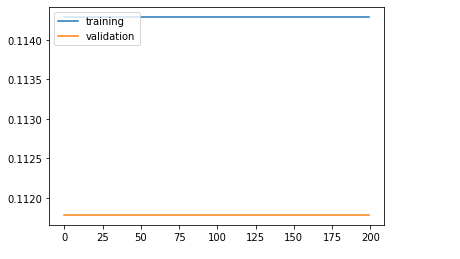
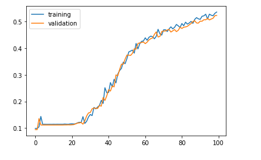
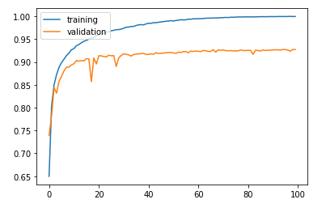
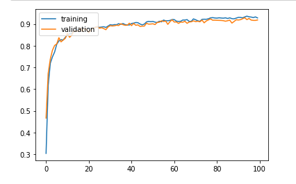
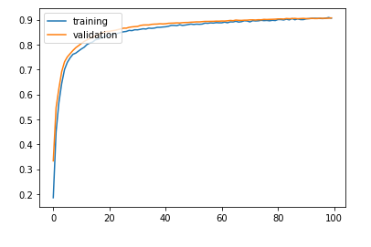
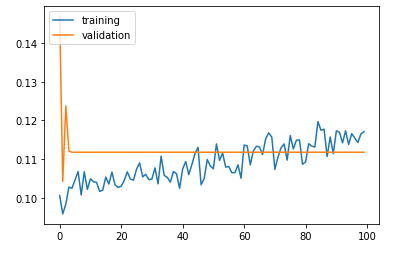

# MLP 실습

* 일반적으로 다운받은 데이터는 users의 keras 폴더의 datasets 폴더에 다운받아진다.

## Advanced MLP

- Advanced techniques for training neural networks
  - Weight Initialization
  - Nonlinearity (Activation function)
  - Optimizers
  - Batch Normalization
  - Dropout (Regularization)
  - Model Ensemble

`header`

```python
import matplotlib.pyplot as plt
from sklearn.model_selection import train_test_split
from keras.datasets import mnist
from keras.models import Sequential
from keras.utils.np_utils import to_categorical
from keras.models import Sequential
from keras.layers import Activation, Dense
from keras import optimizers
from keras.layers import Dropout
import numpy as np
from keras.wrappers.scikit_learn import KerasClassifier
from sklearn.ensemble import VotingClassifier
from sklearn.metrics import accuracy_score
from keras.layers import BatchNormalization
```

## Load Dataset

- MNIST dataset

```python
(X_train, y_train), (X_test, y_test) = mnist.load_data()

print(X_train.shape)
print(y_train.shape)

# X_train은 color 이미지, bianry 이미지가 아니라 gray 이미지이다.
plt.imshow(X_train[0], cmap='gray')    # show first number in the dataset
plt.show()
print('Label: ', y_train[0])

plt.imshow(X_test[0])    # show first number in the dataset
plt.show()
print('Label: ', y_test[0])

# reshaping X data: (n, 28, 28) => (n, 784)
# -1 : 한개의 차원을 내린다. -> 60000만개(X_train.shape[0])의 데이터를 2차원(28,28)에서 (784 : 28*28) 1차원으로 바꾼다.
X_train = X_train.reshape((X_train.shape[0], -1))
X_test = X_test.reshape((X_test.shape[0], -1))

# use only 33% of training data to expedite the training process
# test_size를 0.67로 설정해서 X_train에는 입력 데이터중 약 33%데이터가 들어가고 _에 나머지 67%데이터가 들어간다.
# 첫번째 파라미터 : 입력 데이터
# X_train, _ , y_train, _ : tuple 형식이다.
X_train, _ , y_train, _ = train_test_split(X_train, y_train, test_size = 0.67, random_state = 7)


# converting y data into categorical (one-hot encoding)
y_train = to_categorical(y_train)
y_test = to_categorical(y_test)
print(y_test.shape) #(10000, 10) : 10은 class의 갯수이다.(숫자가 0~9까지이다.)
```


## Basic MLP model

값이 커도 sigmoid로 인해 값이 1이 되어 뒤로 갈수록 학습이 되지 않는다.

```python
model = Sequential()

# binary일 때는 마지막에 sigmoid를 썻다
# multi class일 때는 softmax를 쓴다. -> 확률값이 나온다.
# 입력 layer
model.add(Dense(50, input_shape = (784, )))
model.add(Activation('sigmoid'))

model.add(Dense(50))
model.add(Activation('sigmoid'))

model.add(Dense(50))
model.add(Activation('sigmoid'))

model.add(Dense(50))
model.add(Activation('sigmoid'))
# 출력 layer
model.add(Dense(10))
model.add(Activation('softmax'))

sgd = optimizers.SGD(lr = 0.001) #Adam하면 금방 올라감
model.compile(optimizer = sgd, loss = 'categorical_crossentropy', metrics = ['accuracy'])

# validation_split : 0.3 -> 테스트 데이터를 입력 데이터 중 70%만 사용, 30%는 validation 데이터로 사용
history = model.fit(X_train, y_train, batch_size = 256, validation_split = 0.3, epochs = 200, verbose = 0)


# 학습률보다 test률이 높을 수는 없다.
plt.plot(history.history['accuracy'])
plt.plot(history.history['val_accuracy'])
plt.legend(['training', 'validation'], loc = 'upper left')
plt.show()

results = model.evaluate(X_test, y_test)

print('Test accuracy: ', results[1])
```



## 1. Weight Initialization

- Xavier
- Uniform distribution : sqrt( 6 / (fan_in + fan_out))
- Normal distribution : N(0, sqrt(2. / (fan_in + fan_out)))
- HE
- Uniform distribution : limit is sqrt( 6 / fan_in)
- Normal distribution : N(0, sqrt(2 / fan_in))
- 좋은 지점에서 출발하고자 하는 방법(출발 지점이 좋다고 인식률이 좋은것은 아니다.)

```python
# from now on, create a function to generate (return) models
def mlp_model():
    model = Sequential()
    
    model.add(Dense(50, input_shape = (784, ), kernel_initializer='he_normal'))     # use he_normal initializer
    model.add(Activation('sigmoid'))    
    model.add(Dense(50, kernel_initializer='he_normal'))                            # use he_normal initializer
    model.add(Activation('sigmoid'))    
    model.add(Dense(50, kernel_initializer='he_normal'))                            # use he_normal initializer
    model.add(Activation('sigmoid'))    
    model.add(Dense(50, kernel_initializer='he_normal'))                            # use he_normal initializer
    model.add(Activation('sigmoid'))    
    model.add(Dense(10, kernel_initializer='he_normal'))                            # use he_normal initializer
    model.add(Activation('softmax'))
    
    sgd = optimizers.SGD(lr = 0.001)
    model.compile(optimizer = sgd, loss = 'categorical_crossentropy', metrics = ['accuracy'])
    
    return model


model = mlp_model()
history = model.fit(X_train, y_train, validation_split = 0.3, epochs = 100, verbose = 0)

plt.plot(history.history['accuracy'])
plt.plot(history.history['val_accuracy'])
plt.legend(['training', 'validation'], loc = 'upper left')
plt.show()
```



## 2. Nonlinearity (Activation function)

* relu만 적용시켜보기

```python
def mlp_model():
    model = Sequential()
    
    model.add(Dense(50, input_shape = (784, )))
    model.add(Activation('relu'))    # use relu
    model.add(Dense(50))
    model.add(Activation('relu'))    # use relu
    model.add(Dense(50))
    model.add(Activation('relu'))    # use relu
    model.add(Dense(50))
    model.add(Activation('relu'))    # use relu
    model.add(Dense(10))
    model.add(Activation('softmax'))
    
    sgd = optimizers.SGD(lr = 0.001)
    model.compile(optimizer = sgd, loss = 'categorical_crossentropy', metrics = ['accuracy'])
    
    return model

model = mlp_model()
history = model.fit(X_train, y_train, validation_split = 0.3, epochs = 100, verbose = 0)

plt.plot(history.history['accuracy'])
plt.plot(history.history['val_accuracy'])
plt.legend(['training', 'validation'], loc = 'upper left')
plt.show()

results = model.evaluate(X_test, y_test)

# result[0] : loss 함수 값
# result[1] : 인식률
print('Test accuracy: ', results[1])
```



## 3. Optimizers

* learning rate를 조정하는 방법
* 출발지점이 좋은 방법은 아니다.
* 경사하강법이 아닌 adam은 learning rate를 adaptive하게 바꾼다
* adam : 모멘텀을 이용한 수렴 속도 개선 방식을 이용한다.

```python
def mlp_model():
    model = Sequential()
    
    model.add(Dense(50, input_shape = (784, )))
    model.add(Activation('sigmoid'))    
    model.add(Dense(50))
    model.add(Activation('sigmoid'))  
    model.add(Dense(50))
    model.add(Activation('sigmoid'))    
    model.add(Dense(50))
    model.add(Activation('sigmoid'))    
    model.add(Dense(10))
    model.add(Activation('softmax'))
    
    adam = optimizers.Adam(lr = 0.001)                     # use Adam optimizer
    model.compile(optimizer = adam, loss = 'categorical_crossentropy', metrics = ['accuracy'])
    
    return model

model = mlp_model()
history = model.fit(X_train, y_train, validation_split = 0.3, epochs = 100, verbose = 0)

plt.plot(history.history['accuracy'])
plt.plot(history.history['val_accuracy'])
plt.legend(['training', 'validation'], loc = 'upper left')
plt.show()

results = model.evaluate(X_test, y_test)

print('Test accuracy: ', results[1])
```



## 4. Batch Normalization

* 좋지 않은 초기화 방법 그리고 sigmoid를 이용했음에도 학습률이 높게 나온다
  * BatchNormalization 때문이다.
    * 데이터를 normalization 시킨다.
    * sigmoid는 비선형 작업이므로 비선형 변환 전에 BatchNormalization을 추가해야 된다.
    * 즉 activation 전에 한다.
    * 데이터를 normalize하기 위해 scale, 이동 등의 작업을 했으므로 나중에 다시 복원을 해준다.

```python
def mlp_model():
    model = Sequential()
    
    model.add(Dense(50, input_shape = (784, )))
    model.add(BatchNormalization())       
    model.add(Activation('sigmoid'))    
    model.add(Dense(50))
    model.add(BatchNormalization())       
    model.add(Activation('sigmoid'))    
    model.add(Dense(50))
    model.add(BatchNormalization())       
    model.add(Activation('sigmoid'))    
    model.add(Dense(50))
    model.add(BatchNormalization())       
    model.add(Activation('sigmoid'))    
    model.add(Dense(10))
    model.add(Activation('softmax'))
    
    sgd = optimizers.SGD(lr = 0.001)
    model.compile(optimizer = sgd, loss = 'categorical_crossentropy', metrics = ['accuracy'])
    
    return model

model = mlp_model()
history = model.fit(X_train, y_train, validation_split = 0.3, epochs = 100, verbose = 0)

plt.plot(history.history['accuracy'])
plt.plot(history.history['val_accuracy'])
plt.legend(['training', 'validation'], loc = 'upper left')
plt.show()

results = model.evaluate(X_test, y_test)

print('Test accuracy: ', results[1])
```



## 5. Dropout (Regularization)

* dropout은 BatchNormalization과 다르게 activation 이후에 이루어 진다.
* 몇개의 network을 끊는 작업이다. -> 정확히는 weight를 0으로 만드는 것이다.

```python
def mlp_model():
    model = Sequential()
    
    model.add(Dense(50, input_shape = (784, )))
    model.add(Activation('sigmoid'))    
    model.add(Dropout(0.2))                        # Dropout layer after Activation
    model.add(Dense(50))
    model.add(Activation('sigmoid'))
    model.add(Dropout(0.2))                        # Dropout layer after Activation
    model.add(Dense(50))
    model.add(Activation('sigmoid'))    
    model.add(Dropout(0.2))                        # Dropout layer after Activation
    model.add(Dense(50))
    model.add(Activation('sigmoid'))    
    model.add(Dropout(0.2))                         # Dropout layer after Activation
    model.add(Dense(10))
    model.add(Activation('softmax'))
    
    sgd = optimizers.SGD(lr = 0.001)
    model.compile(optimizer = sgd, loss = 'categorical_crossentropy', metrics = ['accuracy'])
    
    return model

model = mlp_model()
history = model.fit(X_train, y_train, validation_split = 0.3, epochs = 100, verbose = 0)

plt.plot(history.history['accuracy'])
plt.plot(history.history['val_accuracy'])
plt.legend(['training', 'validation'], loc = 'upper left')
plt.show()

results = model.evaluate(X_test, y_test)

print('Test accuracy: ', results[1])
```



## 6. Model Ensemble

* scikit-learn 버전에 따라 안돌아 갈수 있습니다.(scikit-learn 버전 0.21.3에서 돌아갑니다.)

```python
##최대값 찾아주는 함수
#np.max([1,2,3,4,1,8,2.4])
##최대값의 index를 찾아주는 함수
#np.argmax([1,2,3,4,1,8,2.4])

#label = [0,0,2,1]

#x = np.array([[1,0,0],[1,0,0],[0,0,1],[0,1,0]])
#print(np.argmax(x, axis=1))

# label된 데이터로 사용
y_train = np.argmax(y_train, axis = 1)
y_test = np.argmax(y_test, axis = 1)

def mlp_model():
    model = Sequential()
    
    model.add(Dense(50, input_shape = (784, )))
    model.add(Activation('sigmoid'))    
    model.add(Dense(50))
    model.add(Activation('sigmoid'))    
    model.add(Dense(50))
    model.add(Activation('sigmoid'))    
    model.add(Dense(50))
    model.add(Activation('sigmoid'))    
    model.add(Dense(10))
    model.add(Activation('softmax'))
    
    sgd = optimizers.SGD(lr = 0.001)
    model.compile(optimizer = sgd, loss = 'categorical_crossentropy', metrics = ['accuracy'])
    
    return model

model1 = KerasClassifier(build_fn = mlp_model, epochs = 100, verbose = 0)
model2 = KerasClassifier(build_fn = mlp_model, epochs = 100, verbose = 0)
model3 = KerasClassifier(build_fn = mlp_model, epochs = 100, verbose = 0)

ensemble_clf = VotingClassifier(estimators = [('model1', model1), ('model2', model2), ('model3', model3)], voting = 'soft')

ensemble_clf.fit(X_train, y_train)

y_pred = ensemble_clf.predict(X_test)

print('Test accuracy:', accuracy_score(y_pred, y_test))
```

# Advanced MLP - 2

* More training set
* Weight Initialization scheme
* Nonlinearity (Activation function)
* Optimizers: adaptive
* Dropout(Regularization)
* Model Ensemble

```python
(X_train, y_train), (X_test, y_test) = mnist.load_data()
# reshaping X data: (n, 28, 28) => (n, 784)
X_train = X_train.reshape((X_train.shape[0], X_train.shape[1] * X_train.shape[2]))
X_test = X_test.reshape((X_test.shape[0], X_test.shape[1] * X_test.shape[2]))
# We use all training data and validate on all test data
print(X_train.shape)
print(X_test.shape)
print(y_train.shape)
print(y_test.shape)

def mlp_model():
    model = Sequential()
    
    model.add(Dense(50, input_shape = (784, ), kernel_initializer='he_normal'))
    model.add(BatchNormalization())
    model.add(Activation('relu'))
    model.add(Dropout(0.2))
    model.add(Dense(50, kernel_initializer='he_normal'))
    model.add(BatchNormalization())
    model.add(Activation('relu'))    
    model.add(Dropout(0.2))
    model.add(Dense(50, kernel_initializer='he_normal'))
    model.add(BatchNormalization())
    model.add(Activation('relu'))
    model.add(Dropout(0.2))
    model.add(Dense(50, kernel_initializer='he_normal'))
    model.add(BatchNormalization())
    model.add(Activation('relu'))
    model.add(Dropout(0.2))
    model.add(Dense(10, kernel_initializer='he_normal'))
    model.add(Activation('softmax'))
    
    adam = optimizers.Adam(lr = 0.001)
    model.compile(optimizer = adam, loss = 'categorical_crossentropy', metrics = ['accuracy'])
    
    return model

# create 5 models to ensemble
from keras.callbacks import LambdaCallback
from keras.callbacks import EarlyStopping
from keras.layers import LeakyReLU


def lambdaf_(epoch, logs, step) : 
    if epoch % step == 0 : print(f"{epoch} => {logs}")                
        
def printepoch(step) :   
    return LambdaCallback(on_epoch_end=lambda epoch, logs: lambdaf_(epoch, logs, step)  )

model1 = KerasClassifier(build_fn = mlp_model, epochs = 3, callbacks=[])
model2 = KerasClassifier(build_fn = mlp_model, epochs = 3, callbacks=[])
model3 = KerasClassifier(build_fn = mlp_model, epochs = 3)
model4 = KerasClassifier(build_fn = mlp_model, epochs = 3)
model5 = KerasClassifier(build_fn = mlp_model, epochs = 3)

#ensemble_clf = VotingClassifier(estimators = [('model1', model1), ('model2', model2), ('model3', model3), ('model4', model4), ('model5', model5)], voting = 'soft')
ensemble_clf = VotingClassifier(estimators = [('model1', model1), ('model2', model2)], voting = 'soft')

ensemble_clf.fit(X_train, y_train)

y_pred = ensemble_clf.predict(X_test)

print('Acc: ', accuracy_score(y_pred, y_test))
```

