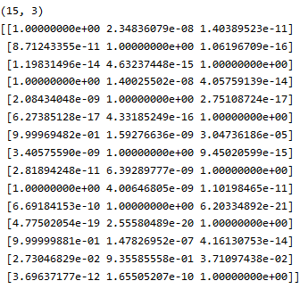

# 실습 : shape를 CNN으로 학습해보기

* header

```python
import numpy as np
import tensorflow as tf
from matplotlib import pyplot as plt
from keras.models import Sequential
from keras.layers import Dense
from keras.layers import Flatten
from keras.layers.convolutional import Conv2D
from keras.layers.convolutional import MaxPooling2D
from keras.models import Sequential
from keras.layers import Activation, Dense
from keras import optimizers
from keras.layers import BatchNormalization
from keras.layers import Dropout
from keras.utils.np_utils import to_categorical
from keras.layers import BatchNormalization, Dropout
import cv2

```


* shape이미지 불러오는 코드(강사님)

```python
X_train = np.zeros((15*3, 24,24))
y_train = np.zeros(15*3)

for i in range(15) :    
    img = cv2.imread('hard_handwriting_shape/train/circle/circle{0:03d}.png'.format(i+1), 0)        
    X_train[i,:,:] = img
    y_train[i] = 0
    
for i in range(15) :    
    img = cv2.imread('hard_handwriting_shape/train/rectangle/rectangle{0:03d}.png'.format(i+1), 0)        
    X_train[15+i,:,:] = img
    y_train[15+i] = 1
    
for i in range(15) :    
    img = cv2.imread('hard_handwriting_shape/train/triangle/triangle{0:03d}.png'.format(i+1), 0)        
    X_train[30+i,:,:] = img
    y_train[30+i] = 2     
    

X_test = np.zeros((5*3, 24,24))
y_test = np.zeros(5*3)

for i in range(5) :    
    img = cv2.imread('hard_handwriting_shape/test/circle/circle{0:03d}.png'.format(i+16), 0)        
    X_test[i,:,:] = img
    y_test[i] = 0
    
for i in range(5) :    
    img = cv2.imread('hard_handwriting_shape/test/rectangle/rectangle{0:03d}.png'.format(i+16), 0)        
    X_test[5+i,:,:] = img
    y_test[5+i] = 1
    
for i in range(5) :    
    img = cv2.imread('hard_handwriting_shape/test/triangle/triangle{0:03d}.png'.format(i+16), 0)        
    X_test[10+i,:,:] = img
    y_test[10+i] = 2
```

* shape이미지 불러오는 코드(self)

```python
X_test = []
y_test = []
for i in range(5):
    X_test.append(cv2.imread(f"./test_easy/circle/circle0{str(16+i)}.png", 0))
    y_test.append(0)
    X_test.append(cv2.imread(f"./test_easy/rectangle/rectangle0{str(16 + i)}.png", 0))
    y_test.append(1)
    X_test.append(cv2.imread(f"./test_easy/triangle/triangle0{str(16 + i)}.png", 0))
    y_test.append(2)

X_test = np.array(X_test)
y_test = np.array(y_test)
print(X_test.shape)
print(y_test.shape)

X_train = []
y_train = []
for i in range(15):
    if i < 9:
        X_train.append(cv2.imread(f"./train/circle/circle00{str(1 + i)}.png", 0))
        y_train.append(0)
        X_train.append(cv2.imread(f"./train/rectangle/rectangle00{str(1 + i)}.png", 0))
        y_train.append(1)
        X_train.append(cv2.imread(f"./train/triangle/triangle00{str(1 + i)}.png", 0))
        y_train.append(2)
    else:
        X_train.append(cv2.imread(f"./train/circle/circle0{str(1 + i)}.png", 0))
        y_train.append(0)
        X_train.append(cv2.imread(f"./train/rectangle/rectangle0{str(1 + i)}.png", 0))
        y_train.append(1)
        X_train.append(cv2.imread(f"./train/triangle/triangle0{str(1 + i)}.png", 0))
        y_train.append(2)

X_train = np.array(X_train)
y_train = np.array(y_train)
print(X_train.shape)
print(y_train)
```

* CNN 및 DNN 코드
  * model.summary에서 BatchNormalization()의 param값은 정규화를 위한 파라미터이다.
    * 입력 데이터 변경을 위해 저장해놓아야 한다.

```python
# 4차원으로 변경
X_train = X_train.reshape((X_train.shape[0], X_train.shape[1], X_train.shape[2], 1))  # 3차원 ->4차원
# X_train =  X_train.reshape(-1, 24,24,1)
# one-hot incoding
y_train = to_categorical(y_train)

# 4차원으로 변경
X_test = X_test.reshape((X_test.shape[0], X_test.shape[1], X_test.shape[2], 1))  # 3차원 ->4차원
# X_test =  X_test.reshape(-1, 24,24,1)
# one-hot incoding
y_test = to_categorical(y_test)

# train과 test 데이터를 직접 불러오므로 따로 나눠줄 필요가 없다.
# X_train, X_test, y_train, y_test = train_test_split(X_data, y_data, test_size = 0.3, random_state = 777)


# 4차원이므로 inshow를 하려면 마지막에 0을 붙여주어야 한다.
plt.imshow(X_train[2,:,:,0], cmap="gray")
plt.show()

# 모델 구성하기
model = Sequential()
model.add(Conv2D(32, kernel_size=(3, 3), input_shape=(24, 24, 1)))
model.add(BatchNormalization())
model.add(Activation('relu'))

model.add(Conv2D(64, (3, 3)))
model.add(BatchNormalization())
model.add(Activation('relu'))
model.add(MaxPooling2D(pool_size=(2, 2)))

model.add(Flatten())

model.add(Dense(128))
model.add(Activation('relu'))
model.add(Dense(3, activation='softmax'))

# 모델 엮기
model.compile(loss='categorical_crossentropy', optimizer='adam', metrics=['accuracy'])

model.summary()

# % % time
# 모델 학습시키기 #1
history = model.fit(X_train, y_train, batch_size = 15, epochs = 100, validation_data =(X_test, y_test), verbose = 0)
plt.plot(history.history['accuracy'])
plt.plot(history.history['val_accuracy'])
plt.legend(['training', 'validation'], loc = 'upper left')
plt.show()

results = model.evaluate(X_test, y_test)
print('Test accuracy: ', results[1])

# model의 첫번째 층(layer)의 weight 확인해보기 / filter의 weight와 bias가 return 된다.
w = model.layers[0].get_weights()
# weight
# (3, 3, 1, 32) : (3,3)size filter / 1차원 weight / 32개의 filter
print(w[0].shape)

# 첫번째 model의 32개의 filter중 첫번재 filter의 weight 값
print(w[0][:,:,0,0])
# 첫번째 model의 32개의 filter중 두번재 filter의 weight 값
print(w[0][:,:,0,1])

# model의 첫번재 layer(층)의 filter를 적용한 결과
# 24*24 이미지에 32개의 3*3 filter를 적용한 결과 : (None, 22, 22, 32)
print(model.layers[0].output)

# bias
# 첫번째 layer에는 32개의 filter 가 적용되므로 bias는 32개이다.
print(w[1].shape)

# 모든 layer(층)의 이름, 학습가능여부(trainable) 출력
# trainble의 값이 True, False에 따라 weight를 고정시킬것이지 바꿀것이지 결정할 수 있다.
# True이면 바꾼다는 의미이고, False이면 고정시킨다는 의미이다.
for l in model.layers:
    print(l.name)
    print(l.trainable)
```

* 중간단계 진행 되었을때 상태 출력해보기(predict 이용)
  * model을 따로 만들어야 한다.

```python
from keras.models import Model

my_layer_model = Model(inputs=model.input,
                       output=model.layers[0].output)

# predict는 전진(forward) 방식으로 진행한다는 의미이다.
# 즉 순서대로 진행되면서 중간과정을 보기 위해 predict를 사용했다.
output = my_layer_model.predict(X_test)

print(output.shape)

iFilter = 5
iImg = 1
# 두번째 test 이미지
plt.imshow(X_test[iImg,:,:,0], cmap='gray')
plt.show()
# model의 첫번째 layer의 filter들의 weight와 bias
w = model.layers[0].get_weights()
# weight
w = w[0]
# 첫번재 필터의 weight
f = w[:,:,0,iFilter]
plt.imshow(f, cmap='gray')
plt.show()


# X_test의 첫번째 이미지에 대해서 첫번재 filter를 적용했을 때의 결과값
plt.imshow(output[iImg,:,:,iFilter], cmap='gray')
plt.show()
```

* flatten()까지 진행되었을 때 상태 불러오기

```python
# flatten까지 진행되었을 때 상태 불러오기
# output=model.get_layer("flatten_1").output 에서 "flatten_1"은 model.summary()에서 확인해서 입력하면 된다.
my_layer_model = Model(inputs=model.input,
                       output=model.get_layer("flatten_1").output)
output = my_layer_model.predict(X_test)
print(output.shape)
```

* 마지막 layer까지 진행되었을 때 상태 불러오기

```python
my_layer_model = Model(inputs=model.input,
                       output=model.get_layer("dense_2").output)
output = my_layer_model.predict(X_test)
# (15,3) : 총 15개 이미지에 대해서 3 class에 대한 확률 값
print(output.shape)
# 밑의 이미지를 보면 첫번째 이미지는 첫번재 class의 확률이 가장 크다.
print(output)
# 각 이미지의 가장 확률이 높은 class를 보여준다.
print(np.argmax(output, axis=1))
```




* 학습값과 실제값과 비교해보기

```python
P = np.argmax(output2, axis=1)
T = np.argmax(y_test, axis=1)

print(P)
print(T)
print((P==T)*1)
print(sum(P==T)*1)
print(sum(P==T)*1 / len(P))
```


## 문제점

위의 코드는 train_easy로 학습 했을 때는 학습률이 높지만 train으로 학습했을 때는 학습률이 33%정도 나온다.