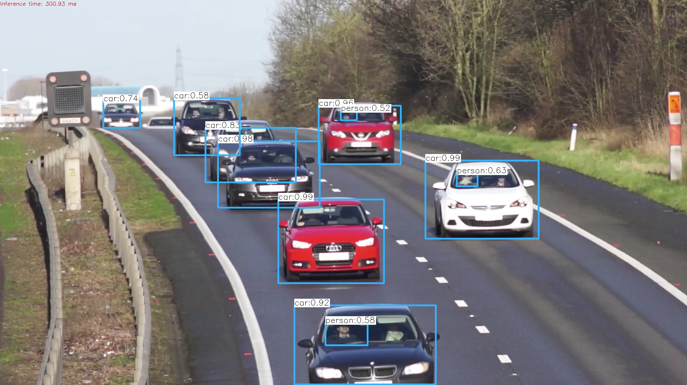
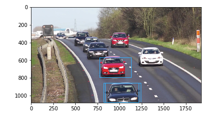
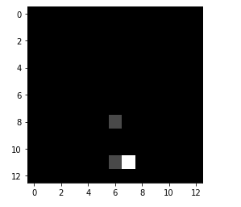
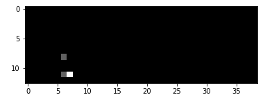

# opencvyolo

```python
import cv2
import argparse
import numpy as np
import os.path
from matplotlib import pyplot as plt
%matplotlib inline

```

```python
# Initialize the parameters
confThreshold = 0.5  #Confidence threshold / confThreshold의 크기가 크면 확률이 커야 box가 쳐지고 작으면 확률이 작아도 box가 쳐진다.
nmsThreshold = 0.4   #Non-maximum suppression threshold
# yolo2에서는 입력 이미지를 416*416으로 해서 작업한다.
inpWidth = 416       #Width of network's input image
inpHeight = 416      #Height of network's input image

# Load names of classes
# coco.names에는 80개 클래스의 이름이 써있다. 메모장 통해 내용 확인가능
classesFile = "coco.names"
classes = None
with open(classesFile, 'rt') as f:
    classes = f.read().rstrip('\n').split('\n')
print(classes)
# Give the configuration and weight files for the model and load the network using them.
# yolo3를 이용해기 위해 밑의 2개의 file이 필요하다.
# yolov3.cfg 에는 네트웍 구조에 대한 정보 있다. 메모장 통해 내용 확인가능
modelConfiguration = "yolov3.cfg"
modelWeights = "yolov3.weights"

net = cv2.dnn.readNetFromDarknet(modelConfiguration, modelWeights)
net.setPreferableBackend(cv2.dnn.DNN_BACKEND_OPENCV)
net.setPreferableTarget(cv2.dnn.DNN_TARGET_CPU)
```

```python
L = net.getLayerNames()
print(L)
print(len(L))
```

```python
# Get the names of the output layers
def getOutputsNames(net):
    # Get the names of all the layers in the network
    layersNames = net.getLayerNames()
    # Get the names of the output layers, i.e. the layers with unconnected outputs
    # 연결되지 않은 layer의 index를 2차원 배열로 return 한다.(3개의 layer의 index return 된다.)
    # i[0] - 1 : layer의 시작 번호가 1이라 index로 표현하기 위해 1을 빼준다.
    # yolo layer을 가져온다.
    return [layersNames[i[0] - 1] for i in net.getUnconnectedOutLayers()]

# Draw the predicted bounding box
def drawPred(classId, conf, left, top, right, bottom):
    # Draw a bounding box.
    cv2.rectangle(frame, (left, top), (right, bottom), (255, 178, 50), 3)
    
    label = '%.2f' % conf
        
    # Get the label for the class name and its confidence
    if classes:
        assert(classId < len(classes))
        label = '%s:%s' % (classes[classId], label)

    #Display the label at the top of the bounding box
    labelSize, baseLine = cv.getTextSize(label, cv.FONT_HERSHEY_SIMPLEX, 0.5, 1)
    top = max(top, labelSize[1])
    cv2.rectangle(frame, (left, top - round(1.5*labelSize[1])), (left + round(1.5*labelSize[0]), top + baseLine), (255, 255, 255), cv.FILLED)
    cv2.putText(frame, label, (left, top), cv.FONT_HERSHEY_SIMPLEX, 0.75, (0,0,0), 1)

# Remove the bounding boxes with low confidence using non-maxima suppression
def postprocess(frame, outs):
    frameHeight = frame.shape[0]
    frameWidth = frame.shape[1]

    # Scan through all the bounding boxes output from the network and keep only the
    # ones with high confidence scores. Assign the box's class label as the class with the highest score.
    classIds = []
    confidences = []
    boxes = []
    for out in outs:
        for detection in out:
            # 80개 object에대한 확률값
            scores = detection[5:]
            # outs[0]에 대해서는 scores가 다 0이라 argmax가 index 0을 return한다.
            # 위와 같은 경우에는 index가 0이라 사람인 경우인데 모든 확률값이 다 0이라 0 index를 return 한 경우이기 떄문에 사람으로 판단하면 않된다.
            classId = np.argmax(scores)
            # confidence 와 confThreshold 값 비교를 통해 해당 object로 판단할 것인지 아닌지 판단한다.
            confidence = scores[classId]
            if confidence > confThreshold:
                center_x = int(detection[0] * frameWidth)
                center_y = int(detection[1] * frameHeight)
                width = int(detection[2] * frameWidth)
                height = int(detection[3] * frameHeight)
                left = int(center_x - width / 2)
                top = int(center_y - height / 2)
                classIds.append(classId)
                confidences.append(float(confidence))
                boxes.append([left, top, width, height])

    # Perform non maximum suppression to eliminate redundant overlapping boxes with
    # lower confidences.
    indices = cv2.dnn.NMSBoxes(boxes, confidences, confThreshold, nmsThreshold)
    for i in indices:
        i = i[0]
        box = boxes[i]
        left = box[0]
        top = box[1]
        width = box[2]
        height = box[3]
        drawPred(classIds[i], confidences[i], left, top, left + width, top + height)
```

```python
cap = cv2.VideoCapture('cars.jpg')

hasFrame, frame = cap.read()

#inpWidth =  frame.shape[1]
#inpHeight = frame.shape[0]
# 여기서 inpWidth는 영상의 크기가 아님.
blob = cv2.dnn.blobFromImage(frame, 1/255, (inpWidth, inpHeight), [0,0,0], 1, crop=False)

net.setInput(blob)

outs = net.forward(getOutputsNames(net))
print(type(outs))
print(len(outs))

# (507, 85) -> 507개의 bounding box가 있고 85개의 ?
print(outs[0].shape)
# (2028, 85)
print(outs[1].shape)
# (8112, 85)
print(outs[2].shape)

# yolo layer 1에서 0번째 box
# outs[0][0][5:] 은 0번째 box의 80개 object에 대한 확률값
print(outs[0][0])

postprocess(frame, outs)

t, _ = net.getPerfProfile()
label = 'Inference time: %.2f ms' % (t * 1000.0 / cv2.getTickFrequency())
cv2.putText(frame, label, (0, 15), cv2.FONT_HERSHEY_SIMPLEX, 0.5, (0, 0, 255))
```

```python
cv2.imwrite("out.jpg", frame) 
img = cv2.cvtColor(frame, cv2.COLOR_BGR2RGB)
plt.imshow(img)
```




```python
cap = cv2.VideoCapture('cars.jpg')

hasFrame, frame = cap.read()

#inpWidth =  frame.shape[1]
#inpHeight = frame.shape[0]
# 여기서 inpWidth는 영상의 크기가 아님.
# 두번째 파라미터(1/255)는 scale factor이다. 여기 예제에서는 0~1로 정규화 했기떄문에 1/255로 해주었다. 정규화 하지 않았으면 그냥 1로 하면 된다.
# 네번째 파라미터([0,0,0])은 각 r,g,b채널의 평균값을 입력한다. 여기 예제에서는 r,g,b의 평균을 0으로 하겠다고 해서 [0,0,0] 이다.
# 다섯번쨰 파라미터(1)은 채널 모양을 결정한다. 1로 하면 (N(이미지 개수), 채널, 높이, 넓이) 가 된다.
# 파라미터 값을 다르게 주면 (N(이미지 개수), 높이, 넓이, 채널) 이 된다.
blob = cv2.dnn.blobFromImage(frame, 1/255, (inpWidth, inpHeight), [0,0,0], 1, crop=False)

net.setInput(blob)

#outs = net.forward(getOutputsNames(net))
# "yolo_82" : 첫번째 yolo layer의 이름(출력해서 알아낼 수 있다.) / 82, 94, 106 순서이다.
y_82 = net.forward("yolo_82")
print(y_82.shape)
```

```python
yolo = net.forward("yolo_82")

frame = cv2.imread("cars.jpg")
frameHeight = frame.shape[0]
frameWidth = frame.shape[1]
    
for i in range(len(yolo))     :   
    detection = yolo[i]    
    scores = detection[5:]
    classId = np.argmax(scores)
    confidence = scores[classId]
    if confidence > 0.01:
        center_x = int(detection[0] * frameWidth)
        center_y = int(detection[1] * frameHeight)
        width = int(detection[2] * frameWidth)
        height = int(detection[3] * frameHeight)
        left = int(center_x - width / 2)
        top = int(center_y - height / 2)        
        cv2.rectangle(frame, (left, top), (left+width, top+height), (255, 178, 50), 3)
imshow("", frame)
```



```python
cells = []
for i in range(len(yolo))     :   
    detection = yolo[i]    
    scores = detection[5:]
    classId = np.argmax(scores)
    cells.append(classId)
```

```python
cells = np.array(cells)
s = int(math.sqrt(len(yolo)/3))

# yolo 3이라서 마지막이 3이다. yolo 2이면 2이다.
cells = cells.reshape(s,s,3)

img = cells[:,:,0]*70
imshow("", img)
```



```python
cells = []
for i in range(len(yolo))     :   
    detection = yolo[i]    
    scores = detection[5:]
    classId = np.argmax(scores)
    confidence = scores[classId]    
    if confidence > 0.01:        
        cells.append(classId+1)
    else :
        cells.append(0)    
cells = np.array(cells)
s = int(math.sqrt(len(yolo)/3))
cells = cells.reshape(s,s,3)

img = np.hstack([cells[:,:,0]*30,  cells[:,:,1]*30, cells[:,:,2]*30])  
imshow("", img)
```



* youtube 영상에 yolo 적용해서 동영상 만들어보기

```python
import cv2 as cv2
fourcc = cv2.VideoWriter_fourcc(*'DIVX')
print(fourcc)
out = cv2.VideoWriter("output.avi", fourcc, 10, (513,400))
for i in range(60) :
    img1 = cv2.imread('book1.jpg')
    out.write(img1)    
out.release()
```

```python
img1.shape
```

```python
import time
fourcc = cv2.VideoWriter_fourcc(*'XVID')
video = cv2.VideoWriter("out.mp4", fourcc, 20.0, (576, 768))

cap = cv2.VideoCapture('vtest.avi')

for i in range(50) :
    ret, frame = cap.read()         
    blob = cv2.dnn.blobFromImage(frame, 1/255,
            (inpWidth, inpHeight), [0,0,0], True, crop=False)    
    net.setInput(blob)
    outs = net.forward(getOutputsNames(net))    
    postprocess(frame, outs)    
    video.write(frame)    
    cv2.waitKey(20)
video.release()
```

```python
cap = cv2.VideoCapture('vtest.avi')
ret, frame = cap.read()      
frame.shape
```

