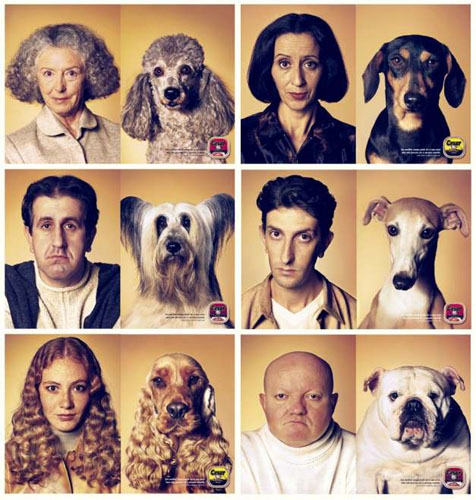
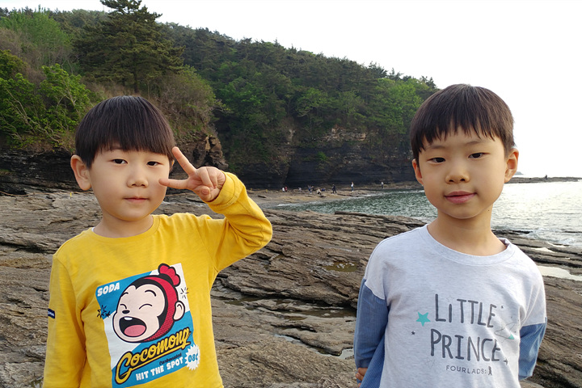
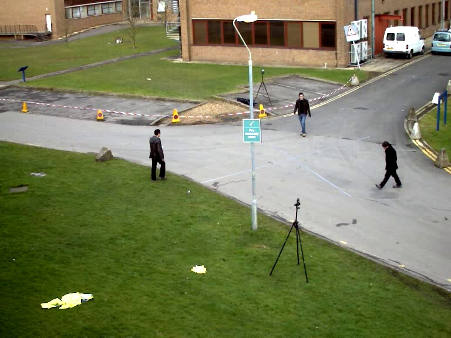
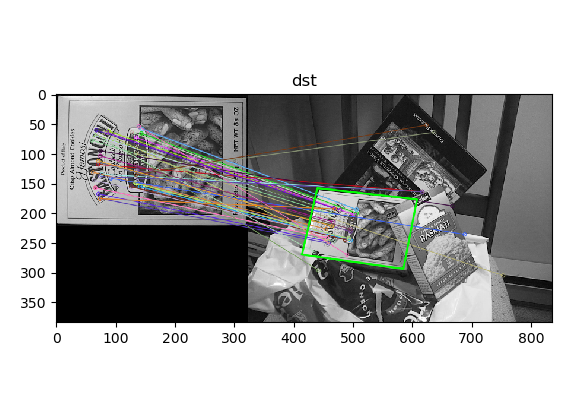
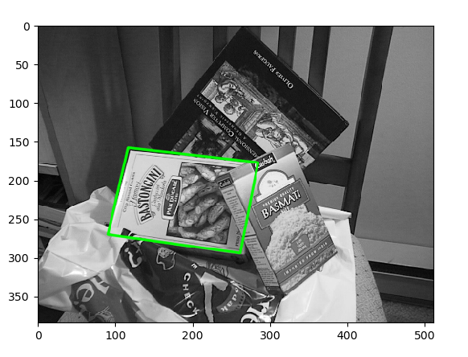

* header 및 function

```python
import cv2, numpy as np
import math
import time
import random
from matplotlib import pyplot as plt
%matplotlib inline
from bokeh.plotting import figure
from bokeh.io import output_notebook, show, push_notebook


output_notebook()


def imshow(tit, image) :
    plt.title(tit)    
    if len(image.shape) == 3 :
        plt.imshow(cv2.cvtColor(image, cv2.COLOR_BGR2RGB))
    else :
        plt.imshow(image, cmap="gray")
    plt.show()
    
    
def create_win(frames, scale=1.0) :    
    global myImage
    
    all = []
    for f in frames :
        if len(f.shape ) !=  3 : f = cv2.cvtColor(f, cv2.COLOR_GRAY2BGR)
        all.append(f)
    frame = np.vstack(all)
    
    fr=cv2.cvtColor(frame, cv2.COLOR_BGR2RGBA) # because Bokeh expects a RGBA image
    fr=cv2.flip(fr, -1) # because Bokeh flips vertically
    width=fr.shape[1]
    height=fr.shape[0]    

    p = figure(x_range=(0,width), y_range=(0,height), output_backend="webgl", width=int(width*scale), height=int(height*scale))    
    myImage = p.image_rgba(image=[fr], x=0, y=0, dw=width, dh=height)
    show(p, notebook_handle=True)   
    
    
def update_win(frames) :
    
    all = []
    for f in frames :
        if len(f.shape ) !=  3 : f = cv2.cvtColor(f, cv2.COLOR_GRAY2BGR)
        all.append(f)
    frame = np.vstack(all)
    
    fr=cv2.cvtColor(frame, cv2.COLOR_BGR2RGBA)
    # fr=cv2.flip(fr, 0) / fr=cv2.flip(fr, -1)
    fr=cv2.flip(fr, 0)
    myImage.data_source.data['image']=[fr]
    push_notebook()

```

## 1. haarlike

### 얼굴 검출 해보기

```python
classifier = cv2.CascadeClassifier('haarcascade_frontalface_default.xml')
```

dog.jpg



kids.png



```python
src = cv2.imread('kids.png')
faces = classifier.detectMultiScale(src)

for (x, y, w, h) in faces:
    cv2.rectangle(src, (x, y), (x + w, y + h), (255, 0, 255), 2)
imshow('src', src)    
```

* 위의 두 이미지 이외의 사람 얼굴 나와 있는 이미지로도 돌려보기
  * 정면 얼굴에 대해서는 잘 찾지만 측면에 대해서는 성능이 떨어진다.
  * 이미지에 얼굴들이 여러 방향으로 회전되어 있으면 다 찾기 어렵다.


### 눈 검출 해보기

* haarlike의 눈 검출 이용해서 해보기

```python
face_classifier = cv2.CascadeClassifier('haarcascade_frontalface_default.xml')
eye_classifier = cv2.CascadeClassifier('haarcascade_eye.xml')

src = cv2.imread('kids.png')

faces = face_classifier.detectMultiScale(src)

for (x1, y1, w1, h1) in faces:
        cv2.rectangle(src, (x1, y1), (x1 + w1, y1 + h1), (255, 0, 255), 2)

        faceROI = src[y1:y1 + h1, x1:x1 + w1]
        # 행의 반에 대해서만 face 검출을 하고 싶으면 행을 2로 나눠주면 된다.(얼굴이 몸의 위쪽에 있다고 가정 했을 때, 전체 이미지에서 위쪽 반만 검사할 수 있다.)
        #faceROI = src[y1:int(y1 + h1 / 2), x1:x1 + w1]
        eyes = eye_classifier.detectMultiScale(faceROI)

        for (x2, y2, w2, h2) in eyes:
            center = (int(x2 + w2 / 2), int(y2 + h2 / 2))
            cv2.circle(faceROI, center, int(w2 / 2), (255, 0, 0), 2, cv2.LINE_AA)

imshow('src', src)  
```


## 2. HOG(Histogram of Gradient)

[hog 참고 사이트](https://donghwa-kim.github.io/hog.html)

* 방향 벡터를 histogram을 이용해 사람의 특징 검출한다.
* setSVMDetector : 이미 여기에 데이가 있어서 exel 등의 외부 파일이 필요하지 않다.
* full body가 나와있어야 검출된다.

```python
hog = cv2.HOGDescriptor()
hog.setSVMDetector(cv2.HOGDescriptor_getDefaultPeopleDetector())

frame = cv2.imread("people.jpg")
detected, _ = hog.detectMultiScale(frame)

for (x, y, w, h) in detected:
		# c : random하게 색을 준다.
        c = (random.randint(0, 255), random.randint(0, 255), random.randint(0, 255))
        cv2.rectangle(frame, (x, y), (x + w, y + h), c, 3)

imshow('frame', frame)   
```

peaple.jpg




* 이미지가 아닌 영상에서 인식해보기

동영상 다루기

```python
cap = cv2.VideoCapture('vtest.avi')

hog = cv2.HOGDescriptor()
hog.setSVMDetector(cv2.HOGDescriptor_getDefaultPeopleDetector())


# 호출될때마다 동영상의 첫부분부터 한개의 frame을 읽어 온다.
# 재 호출을 하면 next frame을 읽어온다.
# ret : frame을 읽었으면 return 값이 있다.
# ret, frame = cap.read()

# 모든 frame을 각각 처리하는것은 heavy하므로, 하나의 window를 만들고 frame을 update 시킨다.
# 하나의 winodw를 만드는 작업.
create_win([frame], scale=0.7)

# 동영상 시작부터 20frame 영상 읽어온다.
for i in range(20):
    ret, frame = cap.read()
    # frame을 window에 update 시킨다.
    # jupyter notebook에서 쓰는 방식이다.
    # update_win([frame])
    cv2.imshow("frames", frame)
    cv2.waitKey(10)
cv2.destroyAllWindows()

```

* 동영상에서 사람 검출해보기

```python
for i in range(300) :
    ret, frame = cap.read()    
    if i == 0 : 
        create_win([frame], 0.5)
    if not ret:
        break

    detected, _ = hog.detectMultiScale(frame)

    for (x, y, w, h) in detected:
        c = (random.randint(0, 255), random.randint(0, 255), random.randint(0, 255))
        cv2.rectangle(frame, (x, y), (x + w, y + h), c, 3)
        
    # update_win([frame])          
    cv2.imshow("frames", frame)
    cv2.waitKey(50)
cv2.destroyAllWindows()
    
```

* youtube에서 주소 앞에 ss를 붙이면 영상 받을 수 있다.

---

---

* 위의 haarlike, HOG로는 여러방향으로 rotate된 사람에 대해서는 detect하는데 취약하다.
* 2개의 이미지에서 같은 물체를 찾을 떄, corner점을 매칭시키는(이미지 분석 두번째주에 배움) 방법 이용해보자
  * ORB


book.zip 의 이미지 이용

```python
import cv2, numpy as np
import math
import time
import random
from matplotlib import pyplot as plt
# %matplotlib inline


def imshow(tit, image) :
    plt.title(tit)
    if len(image.shape) == 3 :
        plt.imshow(cv2.cvtColor(image, cv2.COLOR_BGR2RGB))
    else :
        plt.imshow(image, cmap="gray")
    plt.show()


orb = cv2.ORB_create()

matcher = cv2.BFMatcher_create(cv2.NORM_HAMMING)

images = ['book/book1.jpg', 'book/book2.jpg', 'book/book3.jpg', 'book/book4.jpg', ]

database_kp = []
database_desc = []
for name in images:
    img = cv2.imread(name, cv2.IMREAD_GRAYSCALE)
    keypoints, desc = orb.detectAndCompute(img, None)
    database_kp.append(keypoints)
    database_desc.append(desc)

# test 이미지를 직접 rotate, scale 시킨후에도 실행시켜보자.
# 180도 회전 시킨 이미지에 대해서도 찾는다.
test = cv2.imread("book/book1test.jpg", cv2.IMREAD_GRAYSCALE)
keypoints, desc = orb.detectAndCompute(test, None)

min_distance = 1000
idx = -1
for i in range(len(images)):
    # matches에는 가장 가까운 두 점이 매핑이 되어 있다.
    matches = matcher.match(desc, database_desc[i])
    matches = sorted(matches, key=lambda x: x.distance)
    good_matches = matches[:50]

    # 가장 매칭이 잘 된 점 50개를 더한다.
    distance = 0
    for d in good_matches:
        distance += d.distance
    # 50개 점에대한 평균 거리
    distance /= len(good_matches)
    print(distance)

    # idx에는 test 데이터와 가장 거리 가까운 이미지 번호가 들어간다.
    if min_distance > distance:
        min_distance = distance
        idx = i

imshow("", test)
imshow("", cv2.imread(images[idx]))
```

---

* Homography 사용해서 두 이미지 매칭 시키기

```python
import cv2, numpy as np
import math
import time
import random
from matplotlib import pyplot as plt
# %matplotlib inline


def imshow(tit, image) :
    plt.title(tit)
    if len(image.shape) == 3 :
        plt.imshow(cv2.cvtColor(image, cv2.COLOR_BGR2RGB))
    else :
        plt.imshow(image, cmap="gray")
    plt.show()


orb = cv2.ORB_create()

matcher = cv2.BFMatcher_create(cv2.NORM_HAMMING)

src1 = cv2.imread('box.png', cv2.IMREAD_GRAYSCALE)
src2 = cv2.imread('box_in_scene.png', cv2.IMREAD_GRAYSCALE)
    
keypoints1, desc1 = orb.detectAndCompute(src1, None)
keypoints2, desc2 = orb.detectAndCompute(src2, None)

matches = matcher.match(desc1, desc2)
matches = sorted(matches, key=lambda x: x.distance)
good_matches = matches[:50]

# 두 이미지 매핑 결과를 보기위한 것 / 필수는 아니다.
dst = cv2.drawMatches(src1, keypoints1, src2, keypoints2, good_matches, None,
                         flags=cv2.DrawMatchesFlags_NOT_DRAW_SINGLE_POINTS)
```

```python
pts1 = np.array([keypoints1[m.queryIdx].pt for m in good_matches]).reshape(-1, 1, 2).astype(np.float32)
pts2 = np.array([keypoints2[m.trainIdx].pt for m in good_matches]).reshape(-1, 1, 2).astype(np.float32)


print(pts1.shape)  # 50,1,2
H, _ = cv2.findHomography(pts1, pts2, cv2.RANSAC)

print(H)

```

```python
(h, w) = src1.shape[:2]
# 원본 이미지에서 4개 점
corners1 = np.array([[0, 0], [0, h-1], [w-1, h-1], [w-1, 0]]).reshape(-1, 1, 2).astype(np.float32)
# 원본 이미지에서 4점의 2번째 이미지로의 변환된 점
corners2 = cv2.perspectiveTransform(corners1, H)
print(corners1)
print(corners2)

# numpy에서 행렬 연산에서 [1,2,3] + 5 = [1,2,3] + [5,5,5] 왼쪽 같이 broadcasting되어 연산된다.
# corner2 에 w를 더해준것은 결과 이미지를 첫번쨰 이미지와 두번째 이미지를 합한 이미지로 만들기 위해서이다.
corners3 = corners2 + np.float32([w, 0])

# 4개의 직선을 따로 그리지 않고 polylines을 쓰면 한번에 그려준다.
cv2.polylines(dst, [np.int32(corners3)], True, (0, 255, 0), 2, cv2.LINE_AA)

imshow('dst', dst)
```



* 원본이미지에 box 그리기

```python
# 원본 이미지에 box 그리기
test = cv2.imread('book/box_in_scene.png')
cv2.polylines(test, [np.int32(corners2)], True, (0, 255, 0), 2, cv2.LINE_AA)
imshow("", test)
```




* 4개의 점 찾는 기능 함수화

```python
def findBook(query, scene) :     
    src1 = cv2.cvtColor(query, cv2.COLOR_BGR2GRAY)
    src2 = cv2.cvtColor(scene, cv2.COLOR_BGR2GRAY)
    
    keypoints1, desc1 = orb.detectAndCompute(src1, None)
    keypoints2, desc2 = orb.detectAndCompute(src2, None)

    matches = matcher.match(desc1, desc2)
    matches = sorted(matches, key=lambda x: x.distance)
    good_matches = matches[:50]

    pts1 = np.array([keypoints1[m.queryIdx].pt for m in good_matches]).reshape(-1, 1, 2).astype(np.float32)
    pts2 = np.array([keypoints2[m.trainIdx].pt for m in good_matches]).reshape(-1, 1, 2).astype(np.float32)

    H, _ = cv2.findHomography(pts1, pts2, cv2.RANSAC)

    (h, w) = src1.shape[:2]
    corners1 = np.array([[0, 0], [0, h-1], [w-1, h-1], [w-1, 0]]).reshape(-1, 1, 2).astype(np.float32)
    corners2 = cv2.perspectiveTransform(corners1, H)
    
    return np.int32(corners2)


q = cv2.imread('book2.jpg')
s = cv2.imread('bookscene.jpg')

corner = findBook(q, s)

cv2.polylines(s, [corner], True, (0, 255, 0), 2, cv2.LINE_AA)

imshow("", s)
```

