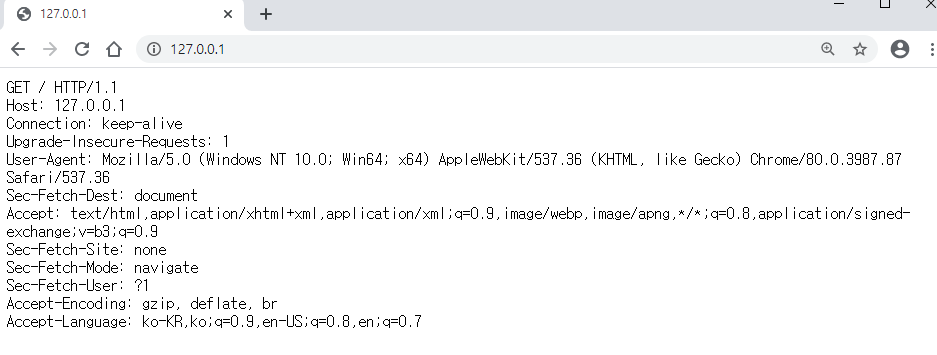
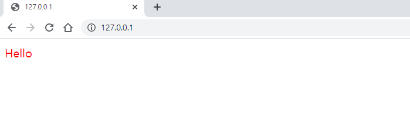
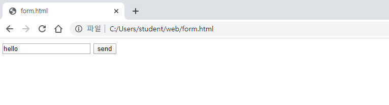
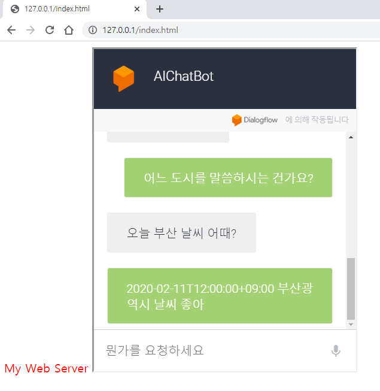
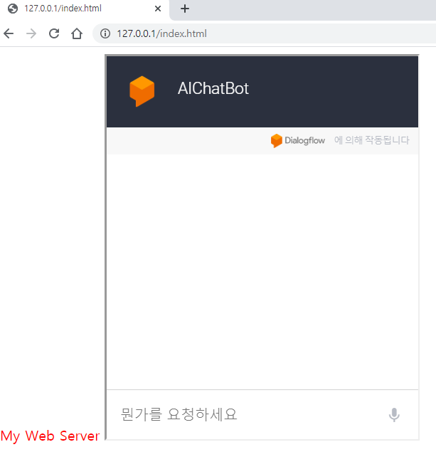
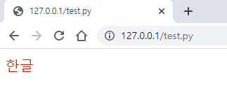
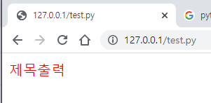
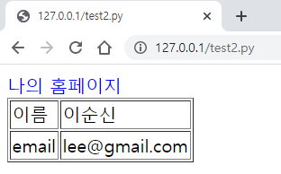
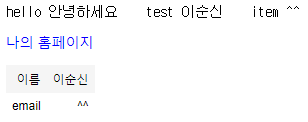

# day1

## server.py , client.py 만들어서 기본 통신 해보기

server.py

```python
import socket

server_socket = socket.socket(socket.AF_INET, socket.SOCK_STREAM)

server_socket.bind(('localhost', 12345))
server_socket.listen(0)
print("listening")

client_socket, addr = server_socket.accept()
print("accepting")
data = client_socket.recv(65535)

# python 은 C, Java와 다르게 바이트 정보 다루지 않기 때문에 디코딩 또는 인코딩을 해준다.
print("received : " + data.decode())

client_socket.send(data)
print("send data")
client_socket.close()
print("종료")
```

```
listening
accepting
received : hello
send data
종료
```

client.py

```python
import socket

sock = socket.socket(socket.AF_INET, socket.SOCK_STREAM)

sock.connect(('localhost', 80))
print("서버접속성공")

sock.send('hello'.encode())
print("sent message")

data = sock.recv(65535)

print("received : " + data.decode())
print("종료")
```

```
서버접속성공
sent message
received : hello
종료
```


### browser 에서 서버에 보낸 정보 출력해보기



```python
import socket

server_socket = socket.socket(socket.AF_INET, socket.SOCK_STREAM)

server_socket.bind(('localhost', 80))
server_socket.listen(0)
print("listening")

client_socket, addr = server_socket.accept()
print("accepting")
data = client_socket.recv(65535)

# python 은 C, Java와 다르게 바이트 정보 다루지 않기 때문에 디코딩 또는 인코딩을 해준다.
print("received : " + data.decode())

client_socket.send(data)
client_socket.close()
```

```
listening
accepting
received : GET / HTTP/1.1
Host: 127.0.0.1
Connection: keep-alive
Upgrade-Insecure-Requests: 1
User-Agent: Mozilla/5.0 (Windows NT 10.0; Win64; x64) AppleWebKit/537.36 (KHTML, like Gecko) Chrome/80.0.3987.87 Safari/537.36
Sec-Fetch-Dest: document
Accept: text/html,application/xhtml+xml,application/xml;q=0.9,image/webp,image/apng,*/*;q=0.8,application/signed-exchange;v=b3;q=0.9
Sec-Fetch-Site: none
Sec-Fetch-Mode: navigate
Sec-Fetch-User: ?1
Accept-Encoding: gzip, deflate, br
Accept-Language: ko-KR,ko;q=0.9,en-US;q=0.8,en;q=0.7
```


### browser 에 정보 보내기

* server 에서 정보를 보낼 때 `HTTP/1.0 200 OK\r\n\r\n` 를 header로 보낸다.
  * `\n\r`은 엔터로 엔터가 두번 나올때 까지를 header로 인식한다.



```python
import socket

server_socket = socket.socket(socket.AF_INET, socket.SOCK_STREAM)

server_socket.bind(('localhost', 80))
server_socket.listen(0)
print("listening")

client_socket, addr = server_socket.accept()
print("accepting")
data = client_socket.recv(65535)

# python 은 C, Java와 다르게 바이트 정보 다루지 않기 때문에 디코딩 또는 인코딩을 해준다.
print("received : " + data.decode())

# server에서 client 로 보내는 고정 form 이다.
# Hello 이전의 header 정보는 brower 창에 뜨지 않는다.
# send 안에는 bite 정보가 들어가야 된다. -> encode 후에 보낸다.
client_socket.send('HTTP/1.0 200 OK\r\n\r\n<font color=red>Hello</font>'.encode("utf-8"))

client_socket.close()
```

```
listening
accepting
received : GET / HTTP/1.1
Host: 127.0.0.1
Connection: keep-alive
Cache-Control: max-age=0
Upgrade-Insecure-Requests: 1
User-Agent: Mozilla/5.0 (Windows NT 10.0; Win64; x64) AppleWebKit/537.36 (KHTML, like Gecko) Chrome/80.0.3987.87 Safari/537.36
Sec-Fetch-Dest: document
Accept: text/html,application/xhtml+xml,application/xml;q=0.9,image/webp,image/apng,*/*;q=0.8,application/signed-exchange;v=b3;q=0.9
Sec-Fetch-Site: none
Sec-Fetch-Mode: navigate
Sec-Fetch-User: ?1
Accept-Encoding: gzip, deflate, br
Accept-Language: ko-KR,ko;q=0.9,en-US;q=0.8,en;q=0.7
```


### while 문으로 서버 돌려보기

* form.html 파일을 만들고 brower에 띄운다.
* 원래는 get 방식이 default 지만 post 방식으로 시도 해보자
* while 문으로 서버가 계속 연결 되있는 상태에서 brower가 server에 연결되있는 상태에서 form.html이 server에 접속을 하면 POST 요청 후에 favicon 요청을 browser 가 한번 더 자동으로 하기 때문에 get 으로 한번더 받아 온다.
* server에서 browser에 현재 시간 정보를 보낸다.

단계1



단계2


form.html

```html
<form action="http://127.0.0.1:80/" method=post>
    
    <input type=text name=id>
    <input type=submit value="send">
    
</form>
```

server.py

```python
import socket
from datetime import datetime

server_socket = socket.socket(socket.AF_INET, socket.SOCK_STREAM)

server_socket.bind(('localhost', 80))
server_socket.listen(0)
print("listening")

while True:
    client_socket, addr = server_socket.accept()
    print("accepting")
    data = client_socket.recv(65535)

    # python 은 C, Java와 다르게 바이트 정보 다루지 않기 때문에 디코딩 또는 인코딩을 해준다.
    print("received : " + data.decode())

    header = "HTTP/1.0 200 OK\r\n\r\n"
    html = 'hello' + str(datetime.now())
    client_socket.send(header.encode("utf-8"))
    client_socket.send(html.encode("utf-8"))
    client_socket.close()
```

```
listening
accepting
received : POST / HTTP/1.1
Host: 127.0.0.1
Connection: keep-alive
Content-Length: 8
Cache-Control: max-age=0
Upgrade-Insecure-Requests: 1
Origin: null
Content-Type: application/x-www-form-urlencoded
User-Agent: Mozilla/5.0 (Windows NT 10.0; Win64; x64) AppleWebKit/537.36 (KHTML, like Gecko) Chrome/80.0.3987.87 Safari/537.36
Sec-Fetch-Dest: document
Accept: text/html,application/xhtml+xml,application/xml;q=0.9,image/webp,image/apng,*/*;q=0.8,application/signed-exchange;v=b3;q=0.9
Sec-Fetch-Site: cross-site
Sec-Fetch-Mode: navigate
Sec-Fetch-User: ?1
Accept-Encoding: gzip, deflate, br
Accept-Language: ko-KR,ko;q=0.9,en-US;q=0.8,en;q=0.7

id=hello
accepting
received : GET /favicon.ico HTTP/1.1
Host: 127.0.0.1
Connection: keep-alive
User-Agent: Mozilla/5.0 (Windows NT 10.0; Win64; x64) AppleWebKit/537.36 (KHTML, like Gecko) Chrome/80.0.3987.87 Safari/537.36
Sec-Fetch-Dest: image
Accept: image/webp,image/apng,image/*,*/*;q=0.8
Sec-Fetch-Site: same-origin
Sec-Fetch-Mode: no-cors
Referer: http://127.0.0.1/
Accept-Encoding: gzip, deflate, br
Accept-Language: ko-KR,ko;q=0.9,en-US;q=0.8,en;q=0.7
```


### browser 가 서버에 요청한 파일 읽어서 돌려주기

* index.html 만든다.
* index.html에 원하는 정보 입력한다.(dialogflow의 iframe 넣어보기)


* 파일 읽기 코드

```python
filename = "/index.html"

# /index.html 은 절대 경로로 root 에 있는 파일을 명시한다 -> 현재 폴더 기준으로 바꿔주어야 한다.
# "." 을 붙여서 상태경로로 바꿔준다.
file = open("." + filename, "rt", encoding='utf-8')

print(file.read())
```


index.html

```html
<font color=red> My Web Server</font>

<iframe
    allow="microphone;"
    width="350"
    height="430"
    src="https://console.dialogflow.com/api-client/demo/embedded/bb18764e-5165-44f9-9399-4dd88c781281">
</iframe>
```

server.py

```python
import socket
from datetime import datetime

server_socket = socket.socket(socket.AF_INET, socket.SOCK_STREAM)

server_socket.bind(('localhost', 80))
server_socket.listen(0)
print("listening")

# 요청한 파일 return 해보기
# debugging 위해서 한번만 실행하기 위해 while을 if로 바꿔준다.
# while True:
if True:
    client_socket, addr = server_socket.accept()
    print("accepting")
    data = client_socket.recv(65535)
    data = data.decode()
    
    # 엔터 기준으로 split 
    headers = data.split("\r\n")
    filename = headers[0].split(" ")[1]
    
    file = open("." + filename, "rt", encoding='utf-8')

    header = "HTTP/1.0 200 OK\r\n\r\n"
    html = file.read()
    client_socket.send(header.encode("utf-8"))
    client_socket.send(html.encode("utf-8"))
    client_socket.close()
```

```
listening
accepting
```



* 여러 종류 파일에 대해서 코드 확장하기
  * img 파일의 형식의 경우 `HTTP/1.1 200 OK\r\n`,  `Content-Type: image\r\n`, `Accept-Ranges: bytes\r\n\r\n`를 헤더로 마지막 부분에 두번의 엔터키를 입력해서 header로 보낸다.

```python
import socket
from datetime import datetime

server_socket = socket.socket(socket.AF_INET, socket.SOCK_STREAM)

server_socket.bind(('localhost', 80))
server_socket.listen(0)
print("listening")


while True:
    client_socket, addr = server_socket.accept()
    print("accepting")
    data = client_socket.recv(65535)
    data = data.decode()
    
    # 엔터 기준으로 split 
    headers = data.split("\r\n")
    filename = headers[0].split(" ")[1]
    
    if '.html' in filename or '.txt' in filename:
        file = open("." + filename, "rt", encoding='utf-8')
        header = "HTTP/1.0 200 OK\r\n\r\n"
        html = file.read()
        client_socket.send(header.encode("utf-8"))
        client_socket.send(html.encode("utf-8"))
    elif '.jpg' in filename :         
        client_socket.send('HTTP/1.1 200 OK\r\n'.encode())
        client_socket.send("Content-Type: image\r\n".encode())
        client_socket.send("Accept-Ranges: bytes\r\n\r\n".encode())
        file = open("." + filename, "rb")            
        client_socket.send(file.read())  
        file.close()  
    else:
        header = "HTTP/1.0 404 File Not Found\r\n\r\n"
        client_socket.send(header.encode("utf-8"))
    client_socket.close()
```

* 이미지 요청 결과


* html 요청 결과




### .py 파일 출력해보기

```python
import subprocess

output = subprocess.check_output(['python.exe', 'test.py'])
print(type(output))
print(output)
# 한글까지 처리 하기 위해서는 cp949 를 붙여야 한다.
print(type(output.decode('cp949')))
print(output.decode('cp949'))
```

* test.py
  * .py 코드를 출력하려면 .py 코드에 html 코드를 넣어주어야 된다.

```python
a = 10
b =20 
c = [1,2,3,4,454,545]
html = """
<html>
   <head>
      <meta charset="utf-8">
   </head>

   <body>
       <font color=red> 한글 </font>
   </body>
</html>
"""
print(html)

```

* server.py

```python
import socket
import subprocess

server_socket = socket.socket(socket.AF_INET, socket.SOCK_STREAM)

server_socket.bind(('localhost', 80))
server_socket.listen(0)
print("listening")

if  True :
    client_socket, addr = server_socket.accept()
    print("accepting")
    data = client_socket.recv(65535)    
    data = data.decode()
    #print(data)        
    
    try :    
        headers = data.split("\r\n")
        filename = headers[0].split(" ")[1]
        
        if '.py' in filename:
            header = 'HTTP/1.0 200 OK\r\n\r\n'   
            html = subprocess.check_output(['python.exe', '.' + filename])
            html = html.decode('cp949')
            client_socket.send(header.encode("utf-8"))    
            client_socket.send(html.encode("utf-8"))            
        elif '.html' in filename:
            file = open("."+ filename, 'rt', encoding='utf-8')
            html = file.read()    
            header = 'HTTP/1.0 200 OK\r\n\r\n'        
            client_socket.send(header.encode("utf-8"))
            client_socket.send(html.encode("utf-8"))
        elif '.jpg' in filename or '.ico' in filename:         
            client_socket.send('HTTP/1.1 200 OK\r\n'.encode())
            client_socket.send("Content-Type: image/jpg\r\n".encode())
            client_socket.send("Accept-Ranges: bytes\r\n\r\n".encode())
            file = open("." + filename, "rb")            
            client_socket.send(file.read())  
            file.close()
        else :
            header = 'HTTP/1.0 404 File Not Found\r\n\r\n'        
            client_socket.send(header.encode("utf-8"))
    except Exception as e :
        print(e)         
    client_socket.close()
```



## 종합 코드

```python
import socket
import threading
from datetime import datetime
import subprocess

def httpprocess(client_socket) :
    data = client_socket.recv(65535)   
    data = data.decode()
    print(data)
    try :    
        headers = data.split("\r\n")
        filename = headers[0].split(" ")[1]
        
        if '.py' in filename:
            header = 'HTTP/1.0 200 OK\r\n\r\n'   
            html = subprocess.check_output(['python.exe', '.' + filename])
            html = html.decode('cp949')
            client_socket.send(header.encode("utf-8"))    
            client_socket.send(html.encode("utf-8"))            
        elif '.html' in filename:
            file = open("."+ filename, 'rt', encoding='utf-8')
            html = file.read()    
            header = 'HTTP/1.0 200 OK\r\n\r\n'        
            client_socket.send(header.encode("utf-8"))
            client_socket.send(html.encode("utf-8"))
        elif '.jpg' in filename or '.ico' in filename:         
            client_socket.send('HTTP/1.1 200 OK\r\n'.encode())
            client_socket.send("Content-Type: image/jpg\r\n".encode())
            client_socket.send("Accept-Ranges: bytes\r\n\r\n".encode())
            file = open("." + filename, "rb")            
            client_socket.send(file.read())  
            file.close()               
        else :
            header = 'HTTP/1.0 404 File Not Found\r\n\r\n'        
            client_socket.send(header.encode("utf-8"))
    except Exception as e :
        print(e)         
    client_socket.close()


server_socket = socket.socket(socket.AF_INET, socket.SOCK_STREAM)
server_socket.bind(('localhost', 80))
server_socket.listen(0)
print("listening")

while  True :
    client_socket, addr = server_socket.accept()
    client_socket.settimeout(3)
    print("accepting")
    t = threading.Thread(target=httpprocess, args=(client_socket,))
    t.start()
```

```
accepting
GET /test2.py HTTP/1.1
Host: 127.0.0.1
Connection: keep-alive
Upgrade-Insecure-Requests: 1
User-Agent: Mozilla/5.0 (Windows NT 10.0; Win64; x64) AppleWebKit/537.36 (KHTML, like Gecko) Chrome/80.0.3987.87 Safari/537.36
Sec-Fetch-Dest: document
Accept: text/html,application/xhtml+xml,application/xml;q=0.9,image/webp,image/apng,*/*;q=0.8,application/signed-exchange;v=b3;q=0.9
Sec-Fetch-Site: none
Sec-Fetch-Mode: navigate
Sec-Fetch-User: ?1
Accept-Encoding: gzip, deflate, br
Accept-Language: ko-KR,ko;q=0.9,en-US;q=0.8,en;q=0.7


accepting
Exception in thread Thread-38:
Traceback (most recent call last):
  File "C:\ProgramData\Anaconda3\lib\threading.py", line 926, in _bootstrap_inner
    self.run()
  File "C:\ProgramData\Anaconda3\lib\threading.py", line 870, in run
    self._target(*self._args, **self._kwargs)
  File "<ipython-input-1-e831fc87aafc>", line 7, in httpprocess
    data = client_socket.recv(65535)
socket.timeout: timed out
```

* test2.py 요청 후에 `server_socket.accept()` 에서 코드가 멈추지 않고 settimeout 에서 timeout error가 뜬다.
  * test2.py 요청 후 browser 에서 무엇인가를 요청해서 발생한 에러이다.


### 문제점

* html 코드 중간에 python을 넣어야만 python 코드가 실행이 된다.

### 해결법

* html 과 python 코드를 분리하고 python 코드의 출력하고 싶은 결과값만 html에 넣어주면 된다.

test.py

```html
html = """
<html>
   <head>
      <meta charset="utf-8">
   </head>

   <body>
       <font color=red> @out </font>
   </body>
</html>
"""

html = html.replace("@out", "제목출력")

print(html)

```




* `@out` 에 `제목출력` 이 들어가게 된다.

#### html 코드와 .py 코드 분리하기

test2.py

```python
def renderfile(file, data):
    html = open(file, "rt", encoding="utf-8").read()
    for v in data:
        html = html.replace("@" + v, data[v])
    return html


data = {"title" : "나의 홈페이지", "name" : "이순신", "email" : "lee@gmail.com"}
print(renderfile("template.html", data))
```

template.html

```html
<html>
   <head>
      <meta charset="utf-8">
   </head>

   <body>
       <font color=blue> 나의 홈페이지 </font>
      <table border=1>
          <tr>
              <td> 이름 </td> <td> @name </td>
          </tr>
          <tr>
              <Td> email </td> <td> @email </td>
          </td>
      </table> 
   </body>
</html>
```

* browser 요청 후 출력화면



* jupyter notebook에서 html 띄우기

```python
from IPython.core.display import HTML

def render(html, data):
    for k in data:
        html = html.replace("@" + k, data[k])
    return html

def renderfile(file, data):
    html = open(file, "rt", encoding="utf-8").read()
    for k in data:
        html = html.replace("@" + k, data[k])
    return html

html = "hello @v1    test @v2    item @v3"
data = {"v1": "안녕하세요", "v2" : "이순신", "v3": "^^"}

html = render(html, data)
print(html)

data = {"title" : "나의 홈페이지", "name" : "이순신", "email" : "^^"}
HTML(renderfile("template.html", data))
```




