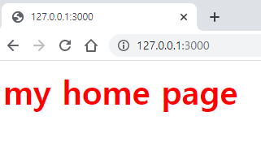
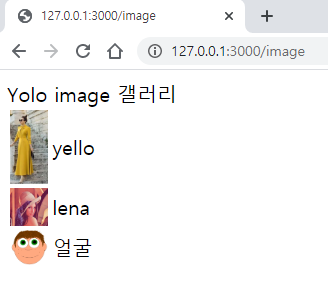
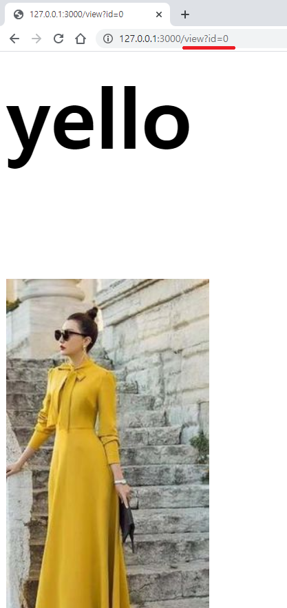
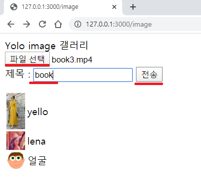
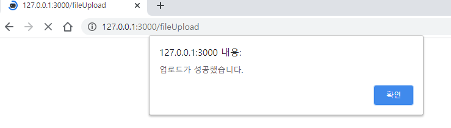
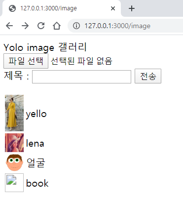
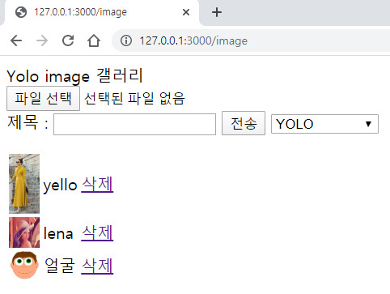

# day2

## flask 이용한 웹 서버

* python 과 html 을 분리한 template 을 이용한다.
* static 폴더를 만들어 정적 데이터를 저장하고 이용한다.
* template 폴더를 만들어 html 파일을 관리한다.

web.py

```python
from flask import Flask, render_template, request

app = Flask(__name__)

@app.route('/')
def index():
    return render_template('home.html', title="my home page")

if __name__ == '__main__':
    app.run(host='0.0.0.0', port=3000, debug=True)
```

home.html

```html
<font color=red><h1> {{title}} </h1></font>
```

실행 화면




## hyter link 이용하기

* image.html 의 ``에 hyper link `<a></a>`를 이용해 이미지 클릭 시에 view.html 로 이동하게 한다. -> 세부 정보 출력
* html 의 for loop 를 이용해서 여러 tag 를 출력할 수 있게 한다.

image.html

```html
Yolo image 갤러리 <br>

<table>
    
    <tr>
            <td> <a href=/view?id={{s.id}}>  </a> </td>
            <td> {{s.title}} </td>
            <td> <a href=/deleteimage?id={{s.id}}> 삭제 </a> </td>
    </tr>
    
</table>
```

view.html

```html
<font size=20> <h1> {{s.title}} </h1> <br>

    
<a href=/image> 목록으로 </a>
```

web.py

```python
from flask import Flask, render_template, request

app = Flask(__name__)


listData = ["img1.jpg", "img2.jpg", "img3.jpg"]
listTitle = ["yello", "lena", "얼굴"]
ID = [0,1,2]
listData = [ {"img" : s[0], "title" : s[1], "id" : s[2] } for s in zip(listData, listTitle, ID)]

@app.route('/')
def index():
    return render_template('home.html', title="my home page")

@app.route('/image')
def image():
    global listData
    return render_template('image.html', listData=listData)

@app.route('/view')    # /view?id=
def view():
    id = request.args.get("id")
    return render_template('view.html', s=listData[int(id)])

if __name__ == '__main__':
    app.run(host='0.0.0.0', port=3000, debug=True)
```





* 이미지 클릭시 image.html `<a href=/view?id={{s.id}}></a>` 에 이미지의 id가 web.py의 view 함수에 넘어가고 view.html 이 브라우저에 return 된다.

## 파일 업로드 하기

* 파일 전송은 무조건 POST 방식으로 진행한다.

image.html

```html
Yolo image 갤러리 <br>

<form action = "/fileUpload" method="POST"
      enctype = "multipart/form-data">
    <input type = "file" name = "file1" /> <br>
    제목 : <input type=text name=title>
    <input type="submit" value="전송"/>
    
    
</form>

<table>
    
    <tr>
            <td> <a href=/view?id={{s.id}}>  </a> </td>
            <td> {{s.title}} </td>
    </tr>
    
</table>
```

web.py

```python
from flask import Flask, render_template, request

app = Flask(__name__)


listData = ["img1.jpg", "img2.jpg", "img3.jpg"]
listTitle = ["yello", "lena", "얼굴"]
ID = [0,1,2]
listData = [ {"img" : s[0], "title" : s[1], "id" : s[2] } for s in zip(listData, listTitle, ID)]

@app.route('/')
def index():
    return render_template('home.html', title="my home page")

@app.route('/image')
def image():
    global listData
    return render_template('image.html', listData=listData)

@app.route('/view')    # /view?id=
def view():
    id = request.args.get("id")
    return render_template('view.html', s=listData[int(id)])

def goURL(msg, url):
    html="""
        <script>
            alert("@msg")
            window.location.href = "@url"
        </script>
        
        """
         # 네이버로 가고 싶으면 window.location.href = http://naver.com 이렇게 해주면 된다.
    html = html.replace("@msg", msg)
    html = html.replace("@url", url)
    return html

# 파일을 받을 때는 무조건 POST 방식으로 받아야 한다.
@app.route('/fileUpload', methods=['POST'])
def fileUpload():
    if request.method == 'POST':
        f = request.files['file1']
        f.save("./static/" + f.filename)
        title = request.form.get("title")
        

        
         if len(listData) == 0:
             id = 0
         else:
             id = listData[len(listData)-1]["id"] + 1
         listData.append({"id" : id, "img" : f.filename, "title" : title})
        
       
        html = goURL("업로드가 성공했습니다.", "/image")
        
    return html  
```

* 파일을 보낼 때는 image.html 의 `<form action = "/fileUpload" method="POST"
        enctype = "multipart/form-data"></form>` 이 기본 형식이다.
* 자바 스크립트를 이용해 파일 업로드 후에 다시 원래 image 페이지로 돌아오게 한다.
  * `alert("@msg")`를 이용해 alert 창을 띄운다.
  * `window.location.href = "@url"`를 이용해 alert 창의 확인을 누루면 원하는 url로 이동한다.

실행화면







파일을 선택하고 제목을 입력 후에 전송을 누룬다 -> alert 창이 뜬다 -> 확인을 누루면 파일이 추가되어 image url로 돌아온다.

## 파일 삭제하기

* 임시 db로 이용중인 listData 에서 입력 받은 id 에 해당하는 파을 찾아 listData에서 삭제한다.

image.html

```html
Yolo image 갤러리 <br>

<form action = "/fileUpload" method="POST"
      enctype = "multipart/form-data">
    <input type = "file" name = "file1" /> <br>
    제목 : <input type=text name=title>
    <input type="submit" value="전송"/>
    
</form>

<table>
    
    <tr>
            <td> <a href=/view?id={{s.id}}>  </a> </td>
            <td> {{s.title}} </td>
            <td> <a href=/deleteimage?id={{s.id}}> 삭제 </a> </td>
    </tr>
    
</table>
```

web.py

```python
from flask import Flask, render_template, request

app = Flask(__name__)


listData = ["img1.jpg", "img2.jpg", "img3.jpg"]
listTitle = ["yello", "lena", "얼굴"]
ID = [0,1,2]
listData = [ {"img" : s[0], "title" : s[1], "id" : s[2] } for s in zip(listData, listTitle, ID)]

@app.route('/')
def index():
    return render_template('home.html', title="my home page")

@app.route('/image')
def image():
    global listData
    return render_template('image.html', listData=listData)

@app.route('/view')    # /view?id=
def view():
    id = request.args.get("id")
    return render_template('view.html', s=listData[int(id)])

def goURL(msg, url):
    html="""
        <script>
            alert("@msg")
            window.location.href = "@url"
        </script>
        
        """
         # 네이버로 가고 싶으면 window.location.href = http://naver.com 이렇게 해주면 된다.
    html = html.replace("@msg", msg)
    html = html.replace("@url", url)
    return html

# 파일을 받을 때는 무조건 POST 방식으로 받아야 한다.
@app.route('/fileUpload', methods=['POST'])
def fileUpload():
    if request.method == 'POST':
        f = request.files['file1']
        f.save("./static/" + f.filename)
        title = request.form.get("title")
        
        if len(listData) == 0:
            id = 0
        else:
            id = listData[len(listData)-1]["id"] + 1
        listData.append({"id" : id, "img" : f.filename, "title" : title})
        
       
        html = goURL("업로드가 성공했습니다.", "/image")
        
    return html   
    #return f'{f.filename} - 제목{title} : 파일 업로드 성공!<br><br><a href=/image> 목록으로 </a>'
    
@app.route('/deleteimage')    # /deleteimage?id=
def deleteimage():
    idx = - 1
    id = int(request.args.get("id"))
    for i in range (len(listData)):
        if id == listData[i]["id"]:
            idx = i
            break
    if idx >= 0:
        del listData[idx]
    
    return goURL("자료를 삭제했습니다", "/image")


if __name__ == '__main__':
    app.run(host='0.0.0.0', port=3000, debug=True)
```


## 업로드 하는 파일에 yolo 와 face detection 적용해보기

* html에 select tag를 이용해서 yolo , face detection 둘 중 선택을 하게 한다.
* yolo, face detection 에 대한 .py 코드를 만들고 web.py 코드에 import 를 통해 이용한다.


image.html

```html
Yolo image 갤러리 <br>

<form action = "/fileUpload" method="POST"
      enctype = "multipart/form-data">
    <input type = "file" name = "file1" /> <br>
    제목 : <input type=text name=title>
    <input type="submit" value="전송"/>
    <select name=algorithm>
        <option value=0>YOLO</option>
        <option value=1>face detection</option>
    </select>
    
    
</form>

<table>
    
    <tr>
            <td> <a href=/view?id={{s.id}}>  </a> </td>
            <td> {{s.title}} </td>
            <td> <a href=/deleteimage?id={{s.id}}> 삭제 </a> </td>
    </tr>
    
</table>
```

web.py

```python
from flask import Flask, render_template, request
import module_yolo as yolo
import module_face as face
app = Flask(__name__)


listData = ["img1.jpg", "img2.jpg", "img3.jpg"]
listTitle = ["yello", "lena", "얼굴"]
ID = [0,1,2]
listData = [ {"img" : s[0], "title" : s[1], "id" : s[2] } for s in zip(listData, listTitle, ID)]

@app.route('/')
def index():
    return render_template('home.html', title="my home page")

@app.route('/image')
def image():
    global listData
    return render_template('image.html', listData=listData)

@app.route('/view')    # /view?id=
def view():
    id = request.args.get("id")
    return render_template('view.html', s=listData[int(id)])

def goURL(msg, url):
    html="""
        <script>
            alert("@msg")
            window.location.href = "@url"
        </script>
        
        """
         # 네이버로 가고 싶으면 window.location.href = http://naver.com 이렇게 해주면 된다.
    html = html.replace("@msg", msg)
    html = html.replace("@url", url)
    return html

# 파일을 받을 때는 무조건 POST 방식으로 받아야 한다.
@app.route('/fileUpload', methods=['POST'])
def fileUpload():
    if request.method == 'POST':
        f = request.files['file1']
        f.save("./static/" + f.filename)
        title = request.form.get("title")
        
        selector = int(request.form.get("algorithm"))
        if selector == 0:
            print("YOLO 먹힘")
            result_pic = yolo.yolo("./static/" + f.filename)
        else:
            print("face recognition 먹힘")
            result_pic = face.face("./static/" + f.filename)

        cv2.imwrite("./static/" + f.filename, result_pic)
        
        if len(listData) == 0:
            id = 0
        else:
            id = listData[len(listData)-1]["id"] + 1
        listData.append({"id" : id, "img" : f.filename, "title" : title})
        
       
        html = goURL("업로드가 성공했습니다.", "/image")
        
    return html   
    #return f'{f.filename} - 제목{title} : 파일 업로드 성공!<br><br><a href=/image> 목록으로 </a>'
    
@app.route('/deleteimage')    # /deleteimage?id=
def deleteimage():
    idx = - 1
    id = int(request.args.get("id"))
    for i in range (len(listData)):
        if id == listData[i]["id"]:
            idx = i
            break
    if idx >= 0:
        del listData[idx]
    
    return goURL("자료를 삭제했습니다", "/image")


if __name__ == '__main__':
    app.run(host='0.0.0.0', port=3000, debug=True)
```

module_yolo.py

```python
import cv2
import argparse
import numpy as np
import os.path

# 파라미터 초기화
confThreshold = 0.5  # Confidence threshold
nmsThreshold = 0.4  # Non-maximum suppression threshold
inpWidth = 416  # Width of network's input image
inpHeight = 416  # Height of network's input image
# Load names of classes
classesFile = "cfg_file/coco.names"
classes = None
with open(classesFile, 'rt') as f:
    classes = f.read().rstrip('\n').split('\n')
print(classes)
# Give the configuration and weight files for the model and load the network using them.
modelConfiguration = "cfg_file/yolov3.cfg"
modelWeights = "cfg_file/yolov3.weights"
net = cv2.dnn.readNetFromDarknet(modelConfiguration, modelWeights)
net.setPreferableBackend(cv2.dnn.DNN_BACKEND_OPENCV)
net.setPreferableTarget(cv2.dnn.DNN_TARGET_CPU)


# Get the names of the output layers
def getOutputsNames(net):
    # Get the names of all the layers in the network
    layersNames = net.getLayerNames()  # 네트웍의 모든 이름을 가져오는 함수 ,총 갯수는 254개, 실제 레이어는 100 몇개,
    # Get the names of the output layers, i.e. the layers with unconnected outputs
    return [layersNames[i[0] - 1] for i in net.getUnconnectedOutLayers()]  # 실제 output 위치는 getUnconnectedOutLayers에서 1뺌


# Draw the predicted bounding box
# 사각형으로 바운딩한 곳을 표시
def drawPred(frame, classId, conf, left, top, right, bottom):  # 클래스ID, 클래스에 대한 일치 확률,사각형 정보
    # Draw a bounding box.
    cv2.rectangle(frame, (left, top), (right, bottom), (255, 178, 50), 3)

    label = '%.2f' % conf

    # Get the label for the class name and its confidence
    if classes:
        assert (classId < len(classes))
        label = '%s:%s' % (classes[classId], label)

    # Display the label at the top of the bounding box
    labelSize, baseLine = cv2.getTextSize(label, cv2.FONT_HERSHEY_SIMPLEX, 0.5, 1)
    top = max(top, labelSize[1])
    cv2.rectangle(frame, (left, top - round(1.5 * labelSize[1])), (left + round(1.5 * labelSize[0]), top + baseLine),
                  (255, 255, 255), cv2.FILLED)
    cv2.putText(frame, label, (left, top), cv2.FONT_HERSHEY_SIMPLEX, 0.75, (0, 0, 0), 1)


# Remove the bounding boxes with low confidence using non-maxima suppression
#
def postprocess(frame, outs):
    frameHeight = frame.shape[0]
    frameWidth = frame.shape[1]

    # Scan through all the bounding boxes output from the network and keep only the
    # ones with high confidence scores. Assign the box's class label as the class with the highest score.
    classIds = []
    confidences = []
    boxes = []
    for out in outs:
        for detection in out:
            scores = detection[5:]  # 확률 80개의 값을 가져옴
            classId = np.argmax(scores)  # 확률에서 높은거 가져옴
            confidence = scores[classId]  # 확률 값 가져옴
            if confidence > confThreshold:  # confThreshold보다 더 높을 경우, 박스를 만듬
                center_x = int(detection[0] * frameWidth)
                center_y = int(detection[1] * frameHeight)
                width = int(detection[2] * frameWidth)
                height = int(detection[3] * frameHeight)
                left = int(center_x - width / 2)
                top = int(center_y - height / 2)
                classIds.append(classId)
                confidences.append(float(confidence))
                boxes.append([left, top, width, height])

    # Perform non maximum suppression to eliminate redundant overlapping boxes with
    # lower confidences.

    indices = cv2.dnn.NMSBoxes(boxes, confidences, confThreshold, nmsThreshold)
    # 같은 포인트에서 다수의 바운딩 박스가 생성되어 있는걸 좀더 정확하게 판별해서 최소화 해줌

    for i in indices:
        i = i[0]  # 2차원 행렬이므로
        box = boxes[i]
        left = box[0]
        top = box[1]
        width = box[2]
        height = box[3]
        drawPred(frame, classIds[i], confidences[i], left, top, left + width, top + height)

def yolo(img):
    cap = cv2.VideoCapture(img)

    hasFrame, frame = cap.read()
    blob = cv2.dnn.blobFromImage(frame, 1 / 255, (inpWidth, inpHeight), [0, 0, 0], 1, crop=False)
    net.setInput(blob)
    outs = net.forward(getOutputsNames(net))
    postprocess(frame, outs)


    return frame

#yolo('./pic/cars.jpg')

```

module_face.py

```python
from imutils import face_utils
import numpy as np
import imutils
import dlib
import cv2
import face_recognition #검출기 + 인식기
import os
from imutils import paths


# #파라미터 초기화
# # http://dlib.net/files/shape_predictor_68_face_landmarks.dat.bz2
# predictor = dlib.shape_predictor("cfg_file/face_recognition/shape_predictor_68_face_landmarks.dat") #하라이크처럼 고속으로 처리되는 알고리즘 사용
# detector = dlib.get_frontal_face_detector()


def face(img):
    img = cv2.imread(img)
    gray = cv2.cvtColor(img, cv2.COLOR_BGR2GRAY)
    print("그레이 변환 완료")
    face_locations = face_recognition.face_locations(gray) # CNN 기반은 속도가 느리다,, strong classifier
    #print("I found {} face(s) in this photograph.".format(len(face_locations)))
    for face_location in face_locations:
        top, right, bottom, left = face_location
        cv2.rectangle(img, (left, top),  (right, bottom), (0, 0, 255), 3)
    print("변환 완료")
    return img
```

* select 의 option tag를 통해 yolo를 선택하면 0이 face detection을 선택하면 1이 넘어간다.
  * web.py의 `selector = int(request.form.get("algorithm"))`를 통해 정보를 받는다.


127.0.0.1:3000/image 화면




## putty 이용한 aws 서버에 연결

* 푸티 기본 설정을 해준다.( 키, 주소 save)

  1) login
  2) mkdir web
  3) cd web
  4) conda activate
  5) jupyter notebook --ip=0.0.0.0 --port=8893

* 받은 아이피로 주피터 노트북 실행 (비밀번호 :1234)

  1) 파일들 압축해서 올린다.
  2) 터미널 창 실행 또는 또 하나의 putty 실행 후 unzip 파일.zip 으로 압출 파일 푼다.