# day3(DJANGO)

## DJANGO

* MVC & MTV
  * model
    * 안전하게 데이터를 저장
  * view
    * 데이터를 적절하게 유저에게 보여줌
  * control, template(Django)
    * 사용자의 입력과 이벤트에 반응하여 model에 view를 업데이트

* flask 는 db 이용하려면 db에 직접 연결을 해주어야 한다. 하지만 Django는 생성한 db 에 맞추어 정보를 넣어준다.
* Django 만으로 서비스를 제공하는 것은 비효율 적이다. static 파일들은 아파치를 이용하는 것이 효율적이다.
  * Django 와 아파치 등 여러개를 이용해서 서비스를 제공하는 것이 일반적이다.


* Project 와 APP
  * project는 전체적인 프로젝트 관리
  * app 은 여러 기능들을 관리


### Django 설치 및 기본 설정( 기본 예제 )

* 폴더를 하나 생성하고 `pip install django` 로 설치해준다.

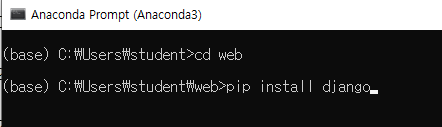

* 성공적으로 설치가 되면 `django-admin` 입력시 도움말이 나온다.

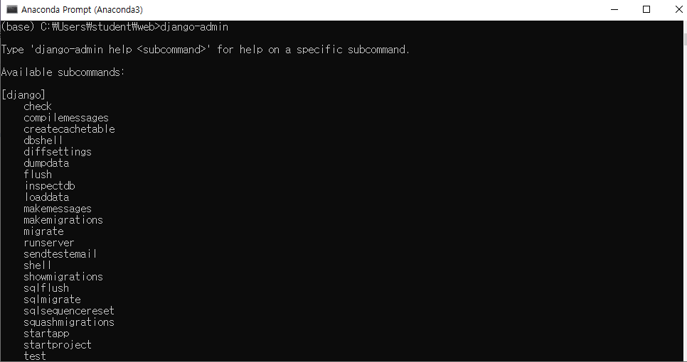


* `django-admin startproject mysite` 를 통해서 `mysite` 라는 프로젝트 폴더를 만들어 준다.

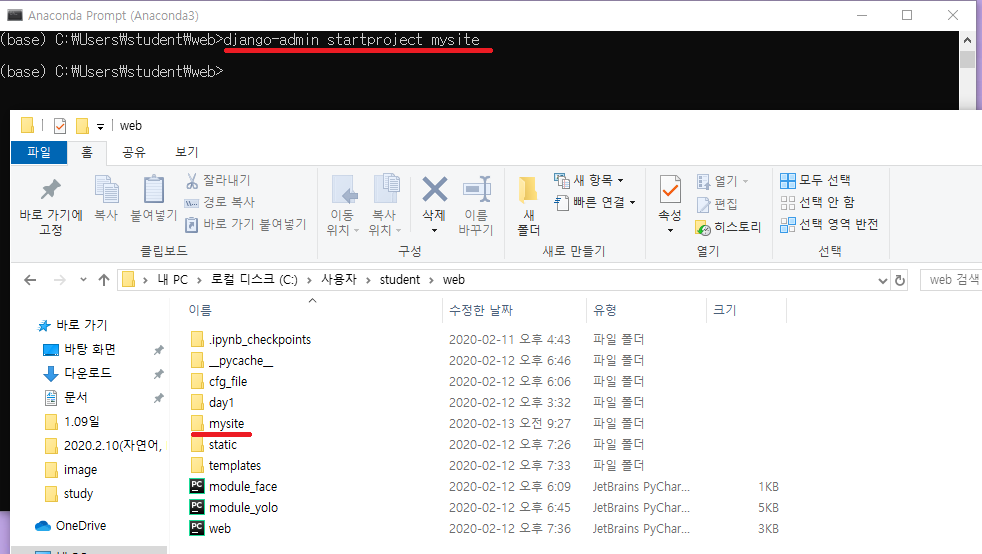


* `mysite` 폴더에 들어가면 `mysite` 폴터가 하나 더 있다.
  * `mysite` 폴더 안의 `mysite`를 폴더에 들어가보면 설정에 관련된 파일들이 있다.

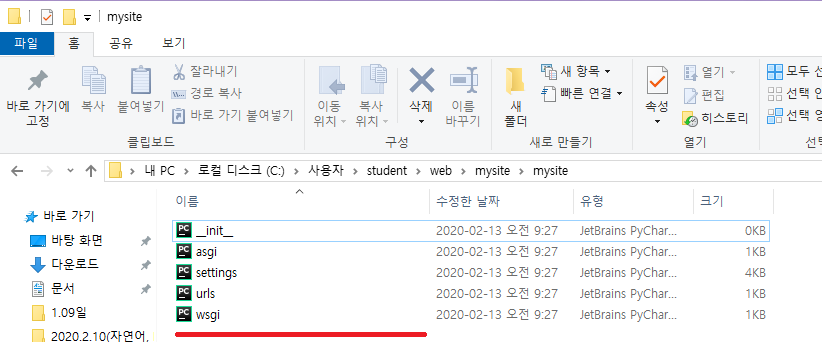


* `mysite` 폴더의 manage 파일은 프로젝트의 시작점이다.

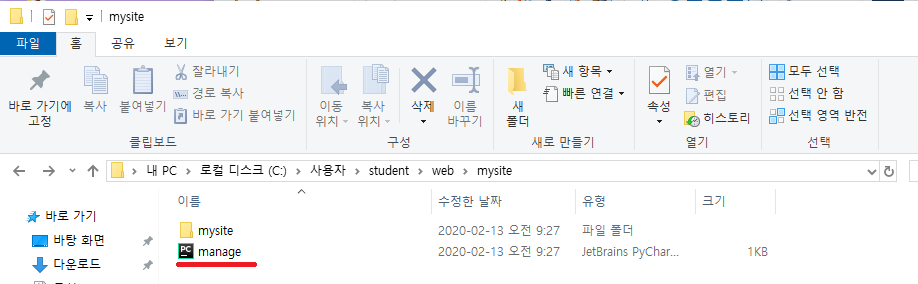

* django 설치만으로도 기본적이 서비스는 할 수 있다.
  * manage.py 파일을 실행시켜 웹 서버를 동작시켜 보자.
  * `python manage.py runserver`

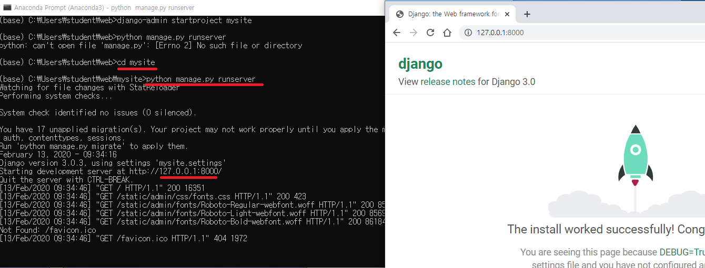


* app 폴더 생성 하기
  * 위에서 서버가 돌아가는 것을 확인했으면 잠시 다시 끄고 app 폴더를 만들어준다.
  * `python manage.py startapp myapp` 으로 `myapp ` 이름의 app 폴더 만든다.

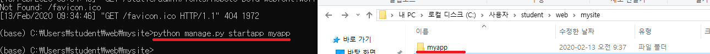


* `myapp`폴더 안의 `views.py` 기본 예제 함수 입력하기

```python
from django.shortcuts import render
from django.http import HttpResponse

# Create your views here.

def index(request):
    return HttpResponse("Hello DJango!!")

def test(request):
    return HttpResponse("test~~~")
```


* 위의 작업후 `python manage.py runserver`로 서버를 실행시킨 후 접속을 해도 index 함수가 실행되지 않는다.
  * `mysite ` 의 `urls.py` 파일을 수정해서 만든 app을 정의 해주어야 한다.
  * 기본 코드에 `from django.urls import include`, ` path('', include('myapp.urls')),`를 추가해준다.
  * `path('', include('myapp.urls'))` 의 첫번째 파라미터를 `''` 로 해두면 root 로 된다.
  * 새 어플리케이션을 만들때마다 `url.py`에 path를 추가해주면 된다.

```python
from django.contrib import admin
from django.urls import path
from django.urls import include

urlpatterns = [
    path('', include('myapp.urls')),
    path('admin/', admin.site.urls),
]

```

* 그 후에 `myapp` 폴더에 `urls.py` 파일을 만들어 준다.
  * 어플리케이션의 url 수정을 할때 매번 글로벌 `url.py`를 수정할 수 없기 때문에 어플리케이션 마다 `urls.py` 를 만들어서 관리한다.
  * `from . import views`
    * `from .` 은 현재 폴더 위치를 말하는 것이다. 
    * 현재 폴더의 views 폴더를 import 하는 것이다.
  * `path('', views.index),`
    * views 파일의 index 함수명을 의미한다.

```python
from django.urls import path
from . import views

urlpatterns = [
    path('', views.index),
    path('test', views.test),
]
```


* `python manage.py runserver`로 서버 실행 후에 서버에 접속하면 index 함수가 실행되어있다.

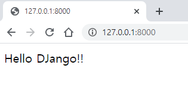

* `myapp` 폴더의 `urls.py` 의 경로는 `mysite` 의 `urls.py` 폴더에 추가해서 설정된다.
  * ex)  `mysite` 의 `url.py` 에 `path('', include('myapp.urls'))`을 설정한 후에 myapp 의 `urls.py` 에 `path('test', views.test)`를 추가해주면 root + test 가 되서 `127.0.0.1:8000/test` 로 접속해야 views 의 test 함수가 실행된다.


* `127.0.0.1:8000` 으로 접속했을 떄 `views.py`의 index 함수가 실행 되는 것은 `mysite`의 `urls.py` 로 접속하고 `myapp`의 `urls.py`로 접속하는 것이 아니라 한번에 주소를 조합 한다음에 한번마 접속을 한다.


### template & static

* `views.py` 의 test 함수 수정해준다.
  * template 쓰는 방식은 flask와 비슷하다.

```python
from django.shortcuts import render
from django.http import HttpResponse

# Create your views here.

def index(request):
    return HttpResponse("Hello DJango!!")

def test(request):
    return render(request, 'template.html', {"message":"얀녕"})
```


* 가장 상위 `mysite`폴더에 `templates` 폴더를 만들어 준다.

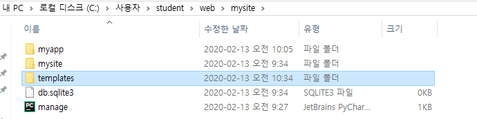


* `templates` 폴더 안에 `template.html` 파일을 만들어 준다.

template.html

```html
한글 TEST<br>

입력데이터 {{message}}
```


* 그 후에 `mysite`  폴더의 `settings.py` 폴더의 TEMPLATES 의 DIRS 를 폴더 이름인 `'templates'` 로 해준다.

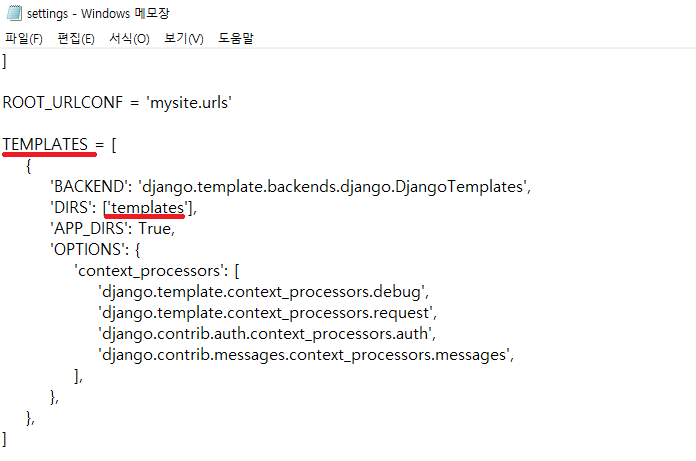


* 실행화면

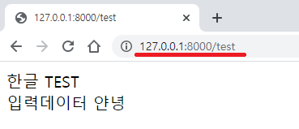


#### 데이터 넘기기

view.py

```python
from django.shortcuts import render
from django.http import HttpResponse

# Create your views here.

def index(request):
    return HttpResponse("Hello DJango!!")

def test(request):
    data = {"s":{"img":"test.png"}}
    return render(request, 'template.html', data)
```

template.html

```html
한글 TEST<br>

입력데이터 {{s.img}}
```

* 실행화면

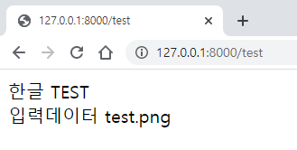

#### for loop

views.py

```python
from django.shortcuts import render
from django.http import HttpResponse

# Create your views here.

def index(request):
    return HttpResponse("Hello DJango!!")

def test(request):
    data = {"s":{"img":"test.png"}, "list":[1,2,3,4,5]}
    return render(request, 'template.html', data)
```

template.html

```html
한글 TEST<br>

입력데이터  = {{s.img}}<br>


    {{l}} <br>

```

* 실행화면

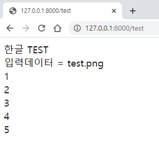

#### 정적데이터 접근하기

* root 에 `static` 폴터를 만든다
* 폴더 안에 이미지 넣어준다.
  * 이상태로 접근하면 error 뜬다.

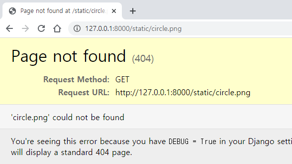

* `mysite`의 `settings.py`를 수정해준다.
  * `STATICFILES_DIRS = [os.path.join(BASE_DIR, 'static'),]` 를 추가해준다.


#### login.html

##### 기본 layout

login.html(간편하게 이용하기 위해 static에 생성)

* html 은 django와 별개로 보기 때문에 `form action=/login` 이렇게 절대 경로로 써준다.
  * 그냥 `login`으로 쓰면 현재 폴더인 static에서 login을 찾는데 없기 때문에 오류가 뜬다.
* 한글 깨짐 방지 위해 `<meta charset="utf-8">` 쓴다.

```html
<meta charset="utf-8">
<form action=/login method=get>
    id <input type=text name=id > <br>
    pw <input type=text name=pwd > <br>
    <input type=submit value="로그인" > <br>

</form>
```

* 보안을 위해 `templates` 폴더에 login.html 을 만들어 주고 `myapp`의 `views.py` 와 `urls.py` 폴더를 수정해 주는 것이 맞다.

veiws.py

```python
from django.shortcuts import render
from django.http import HttpResponse

# Create your views here.

def index(request):
    return HttpResponse("Hello DJango!!")


def test(request):
    data = {"s":{"img":"test.png"}, "list":[1,2,3,4,5]}
    return render(request, 'template.html', data)


def login(request):
    id = request.GET['id']
    pwd = request.GET['pwd']
    if id == pwd:
        return HttpResponse("로그인 성공")
    return HttpResponse("로그인 실패")
```

urls.py

```python
from django.urls import path
from . import views

urlpatterns = [
    path('', views.index),
    path('test', views.test),
    path('login', views.login),
]
```


* 하지만 간편하게 접속할 때는 static 폴더에 login.html 을 만들고 `127.0.0.1:8000/static/login.html`로 접근한다.

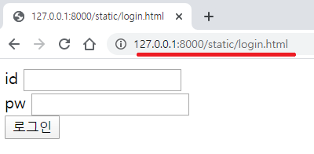

* get 방식으로 보냈기 때문에 url에 정보가 뜬다.

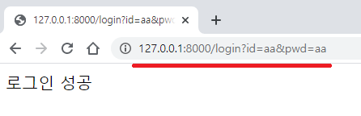

##### 시나리오 추가하기

###### 추가 시나리오1

* 로그인 성공 하면 service url 있는 페이지로 이동 / 로그인 실패 하면 로그인 페이지 url 있는 페이지로 이동

views.py

```python
from django.shortcuts import render
from django.http import HttpResponse

# Create your views here.

def index(request):
    return HttpResponse("Hello DJango!!")


def test(request):
    data = {"s":{"img":"test.png"}, "list":[1,2,3,4,5]}
    return render(request, 'template.html', data)


def login(request):
    id = request.GET['id']
    pwd = request.GET['pwd']
    if id == pwd:
        return HttpResponse("로그인 성공 <a href=/service> 서비스로 </a>")
    return HttpResponse("로그인 실패 <a href=/static/login.html>다시 로그인</a>")

def service(request):
    return HttpResponse("Main service")
```

urls.py

```python
from django.urls import path
from . import views

urlpatterns = [
    path('', views.index),
    path('test', views.test),
    path('login', views.login),
    path('service', views.service),
]
```

* `/static/login.html` 화면

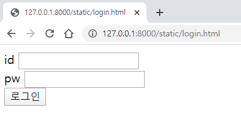

* 로그인 성공 화면

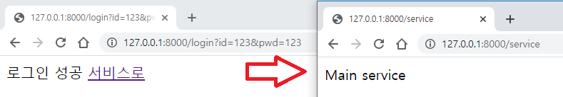

* 로그인 실패 화면

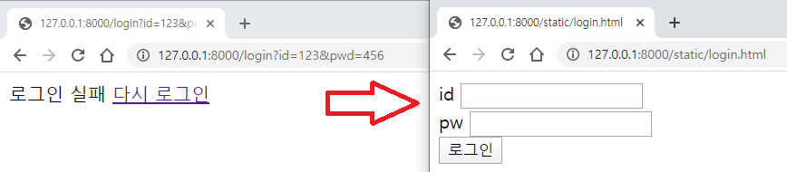

* 여기서 `views.py`의 login 함수의 성공 했을 떄 `<a href=service>` 이렇게 상대 경로로 해도 문제 없다.
  * login 함수는 `/` , 즉 루트 환경에서 실행되고 `service `도 `/`에 있는 함수 이다.
  * 현재 실행 환경인 루트에서 service를 찾기 떄문에 문제 없이 실행된다.


###### 추가 시나리오2

* 로그인 성공하면 바로 service 페이지로 이동 / 로그인 실패하면 바로 로그인 페이지로 이동

views.py

```python
from django.shortcuts import render
from django.http import HttpResponse
from django.shortcuts import redirect

# Create your views here.

def index(request):
    return HttpResponse("Hello DJango!!")


def test(request):
    data = {"s":{"img":"test.png"}, "list":[1,2,3,4,5]}
    return render(request, 'template.html', data)


def login(request):
    id = request.GET['id']
    pwd = request.GET['pwd']
    if id == pwd:
        return redirect("/service")
        #return service(request)
    return redirect("/static/login.html")

def service(request):
    return HttpResponse("Main service")
```

* 로그인 성공 했을 때 `return service(request)` 을 쓰면 login 서비스가 실행 되고 내부적으로, 즉 login 페이지에서 service 함수가 실행 된 값이 return 이 된다.
  * 예를 들어 네이버 로그인 시에 로그인 성공 후에 `F5`를 누를때, 이 방식을 이용하면 main page 가 아닌 다시 login page로 돌아가게 된다. -> 이 방식은 문제 생기는 경우가 있을 수 있다.

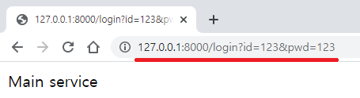

* 로그인 성공 했을 때 `return redirect("/service")` 을 쓰면 (redirect 이용) login 서비스가 요청되고 다시 service 서비스가 요청이 된다. 즉 파라미터 안의 url (여기서는 "/service") 를 다시 요청한다.
  * 실제로는 login page 에서 url 을 두번 요청하는 것이 아니다.
  * 웹은 한개의 html 또는 정보를 보내고 끝난다.
    * redirect를 쓰면 `<meta http equiv>` tag가 포함됨 html을 return 하는데 이  html이 다시 /service url을 요청하는 것이다.

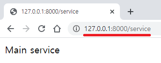

###### 문제점

* 로그인의 성공 실패 여부 없이 `http://127.0.0.1:8000/service`을 입력하면 service page를 이용할 수 있다.
* 보안 문제 생긴다.

###### Session

* session을 이용한다.
* user 별로 부여한다.

views.py

```python
from django.shortcuts import render
from django.http import HttpResponse
from django.shortcuts import redirect

# Create your views here.

def index(request):
    return HttpResponse("Hello DJango!!")


def test(request):
    data = {"s":{"img":"test.png"}, "list":[1,2,3,4,5]}
    return render(request, 'template.html', data)


def login(request):
    id = request.GET['id']
    pwd = request.GET['pwd']
    if id == pwd:
        # 로그인 성공 시 user 별로 id 부여
        request.session["user"] =  id
        return redirect("/service")
    return redirect("/static/login.html")

def service(request):
    # user의 session id 가 없으면 "" return 한다.
    if request.session.get("user", "") == "":
        return redirect("/static/login.html")
    html = "Main Service<br>" + request.session.get("user") + "님 감사합니다."
    return HttpResponse(html)
```

* 위의 작업까지 해도 error가 뜬다.
  * db 초기화를 해주어야 한다.


* 서버를 잠시 끈다.
  * cmd 창에 `python manage.py migrate` 명령어로 db 재 설정해준다.
  * db에 정보를 추가하거나 변경사항 있을 때 해주어야 한다.

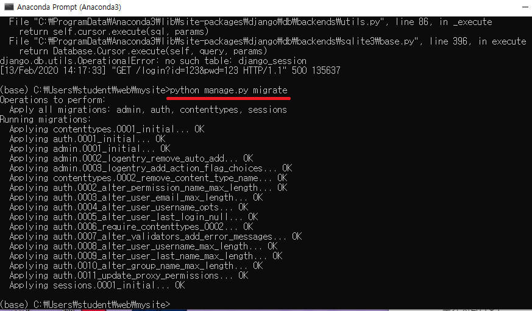


* 서버를 다시 킨다.
* 다시 로그인을 한다.

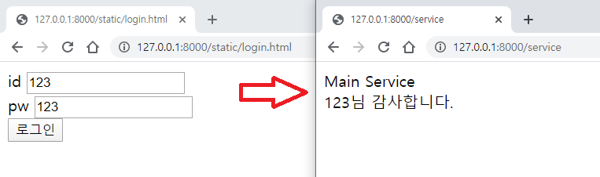

* 이렇게 로그인 후에 크롬창을 끄고 다시 `127.0.0.1:8000/service` 페이지를 요청해도 service 페이지가 뜬다.
  * 하지만 explore 에서는 다시 로그인을 해주어야 한다.


views.py

```python
from django.shortcuts import render
from django.http import HttpResponse
from django.shortcuts import redirect

# Create your views here.

def index(request):
    return HttpResponse("Hello DJango!!")


def test(request):
    data = {"s":{"img":"test.png"}, "list":[1,2,3,4,5]}
    return render(request, 'template.html', data)


def login(request):
    id = request.GET['id']
    pwd = request.GET['pwd']
    if id == pwd:
        # 로그인 성공 시 user 별로 id 부여
        request.session["user"] =  id
        return redirect("/service")
    return redirect("/static/login.html")

def service(request):
    # user의 session id 가 없으면 "" return 한다.
    if request.session.get("user", "") == "":
        return redirect("/static/login.html")
    html = "Main Service<br>" + request.session.get("user") + "님 감사합니다."
    return HttpResponse(html)
```

* user 별로 session 영역 생긴다
  * `django` 에서 `ip + browser 종류 ` 로 key 값을 만든 다음 session 영역을 부여한다.
  * 이미 session이 부여된 `ip browser`에서 service page를 요청하면 `django`에서는 key 값을 이용해 부여된 session 영역에 접근해 session id 를 확인한 후에 service page 를 제공한다.
* request는 전역 변수 와 지역 변수 사이이다
  * 함수 내에서는 지역변수로 쓰이지만, session 정보를 불러올 때는 db의 session 정보를 불러온다.


###### 추가 시나리오3

* service page에서 로그아웃을 누르면 session 정보 지워지고 login.html page로 이동한다.

views.py

```python
from django.shortcuts import render
from django.http import HttpResponse
from django.shortcuts import redirect

# Create your views here.

def index(request):
    return HttpResponse("Hello DJango!!")


def test(request):
    data = {"s":{"img":"test.png"}, "list":[1,2,3,4,5]}
    return render(request, 'template.html', data)


def login(request):
    id = request.GET['id']
    pwd = request.GET['pwd']
    if id == pwd:
        # 로그인 성공 시 user 별로 id 부여
        request.session["user"] =  id
        return redirect("/service")
    return redirect("/static/login.html")

def logout(request):
    request.session["user"] = ""
    #request.session.pop("user")
    return redirect("/static/login.html")

def service(request):
    # user의 session id 가 없으면 "" return 한다.
    if request.session.get("user", "") == "":
        return redirect("/static/login.html")
    html = "Main Service<br>" + request.session.get("user") + "님 감사합니다." + "<a href=/logout>로그아웃</a>"
    return HttpResponse(html)
```

urls.py

```python
from django.urls import path
from . import views

urlpatterns = [
    path('', views.index),
    path('test', views.test),
    path('service', views.service),
    path('login', views.login),
    path('logout', views.logout),
]
```

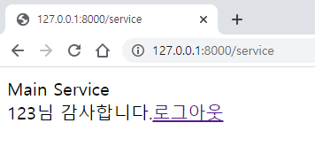


#### 파일 업로드

* 얼굴 인증으로 로그인 하기

/static/login.html

```html
<meta charset="utf-8">
<form action=/login method=get>
    id <input type=text name=id > <br>
    pw <input type=text name=pwd > <br>
    <input type=submit value="로그인" > <br>

</form>

<form action = "http://127.0.0.1:80/uploadimage" method="POST"
      enctype = "multipart/form-data">
      <input type = "file" name = "file1" /> <br>
      <input type="submit" value="얼굴인증"/>
</form>
```

/myapp/urls.py

```python
from django.urls import path
from . import views

urlpatterns = [
    path('', views.index),
    path('test', views.test),
    path('service', views.service),
    path('login', views.login),
    path('logout', views.logout),
    path('uploadimage', views.uploadimage),
]
```


/myapp/views.py

```python
from django.views.decorators.csrf import csrf_exempt

@csrf_exempt
def uploadimage(request):
    return HttpResponse("ok")
```

* `@csrf_exempt` 을 쓰지 않으면 `CSRF` 에러 뜬다.

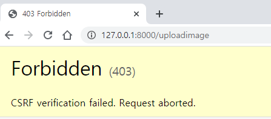

* 적용화면

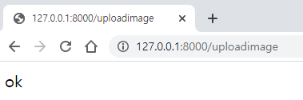

