# day1(db)

## mysite db & sqlitebrower

* 이미 만들어진 db 이용하기

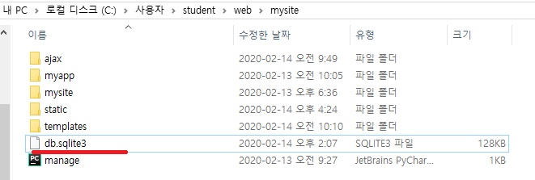


* superuser가 필요하다.
  * superuser 생성하기
  * `python manage.py createsuperuser` 로 superuser 만든다.
  * `Username` 입력한다. ( 여기서는 `home`)
  * `Email address`를 입력한다.(여기서는 `home@home.com`)
  * `Password`를 입력한다.(여기서는 `1234`)

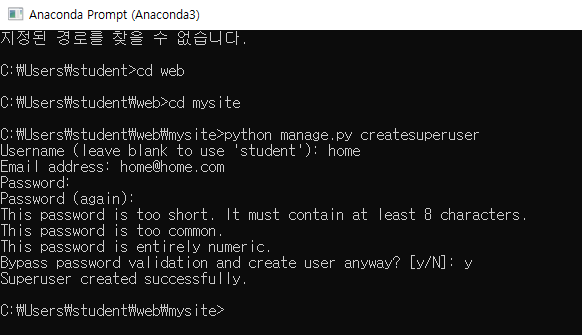

* `python manage.py runserver`로 서버를 실행한다.
  * `localhost:8000/admin` 에 접속한 다음 `superuser`로 login 한다.

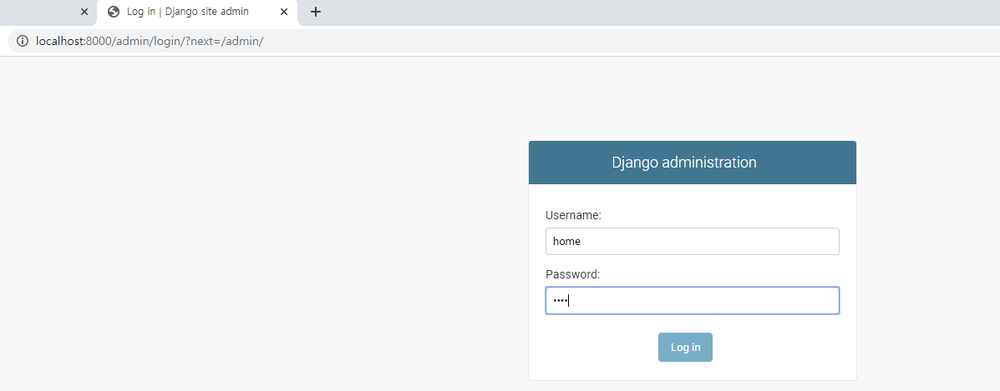


* `Users` 에 접속을 한다.
  * `ADD USER` 로 `이순신` 을 추가해준다.

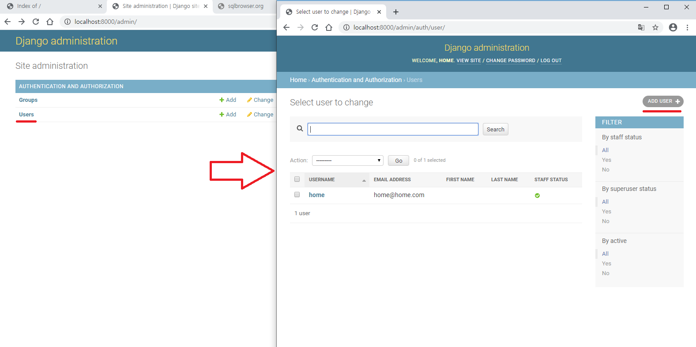

* `sqlitebrowser.org` 에 접속해서 `db browser `를 다운 받아 준다.
  * 아무 위치에 받은 파일 압축을 푼다.
  * 그 후에 `DB Browser for SQLite`를 실행시켜준다.

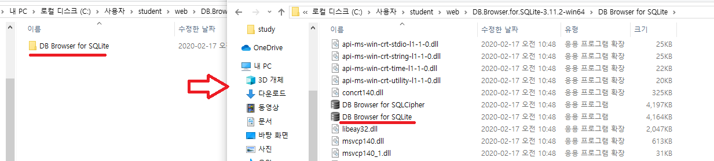


* 데이터베이스 열기 -> `mysite`의 db를 열어준다.

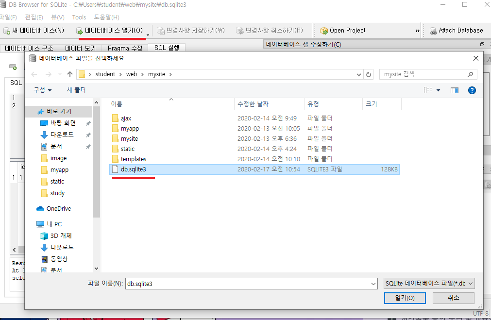


* `이순신`을 생성할 때 이메일을 입력해 주지 않았으므로 이메이을 추가해준다.
  * 데이터 보기 -> 테이블(auth_user) -> 문자열 수정
  * 마지막에 `변경사항 저장하기` 를 눌러주어야 수정사항 적용된다.

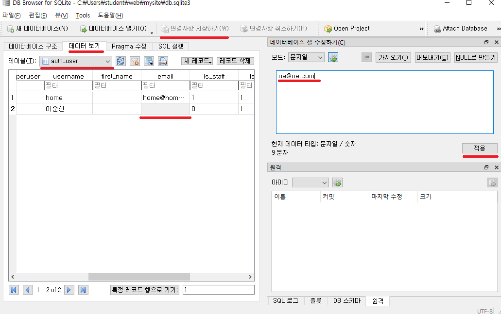


* sql 문 실행하기
  * `SQL 실행` 을 누룬다.
  * sql 문을 입력 후 실행한다.

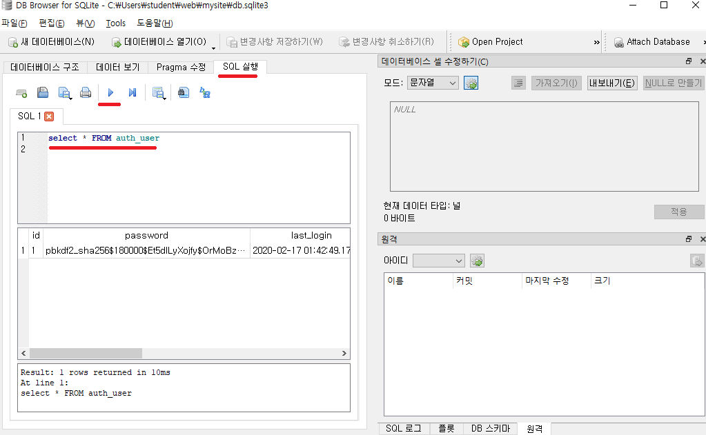


## 회원 테이블

### 테이블 생성

* sql.txt 파일의 sql문을 이용해서 회원 테이블 생성하기
  * `buytTBL`은 `num INTEGER   PRIMARY KEY AUTOINCREMENT` 때문에 NULL을 입력해도 primary key 가 증가되며 생성된다.

```sql
CREATE TABLE userTBL -- 회원 테이블 
( userID CHAR(8) NOT NULL PRIMARY KEY, -- 사용자 아이디(PK) 
  userName VARCHAR(10) NOT NULL, -- 이름 
  birthYear INT NOT NULL, -- 출생 연도 
  addr CHAR(2) NOT NULL, -- 지역(경기, 서울, 경남 식으로 2글자만 입력) 
  mobile1 CHAR(3), -- 휴대폰의 국번(011, 016, 017, 018, 019, 010 등) 
  mobile2 CHAR(8), -- 휴대폰의 나머지 번호(하이픈 제외) 
  height SMALLINT, -- 키 
  mDate DATE -- 회원 가입일
);
CREATE TABLE buyTBL -- 구매 테이블 
( num INTEGER   PRIMARY KEY AUTOINCREMENT, 
  userID CHAR(8) NOT NULL, -- 아이디(FK) 
  prodName CHAR(6) NOT NULL, -- 물품 
  groupName CHAR(4), -- 분류 
  price INT NOT NULL, -- 단가 
  amount SMALLINT NOT NULL, -- 수량 
  FOREIGN KEY (userID) REFERENCES userTBL (userID)
);
```


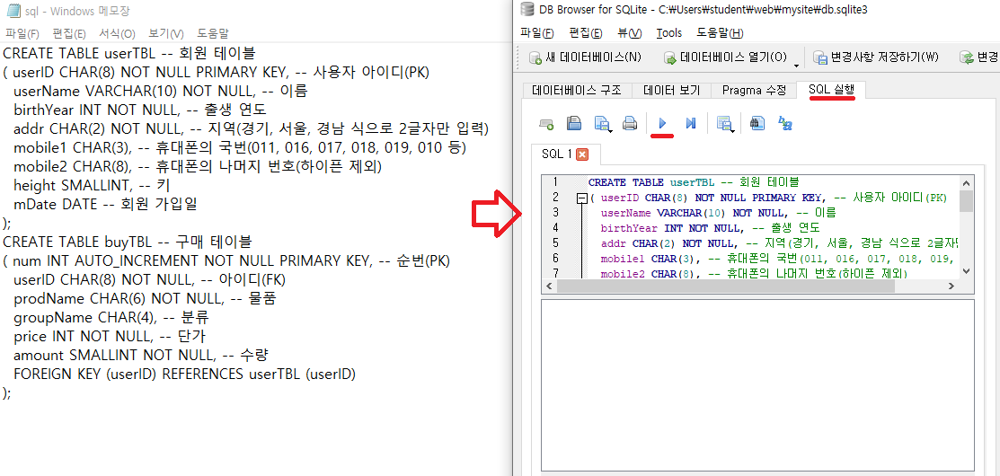

* 데이터 보기를 선택하면 `userTBL` , `buyTBL` 생성 되어 있다
  * 아직은 아무 데이터도 없다.

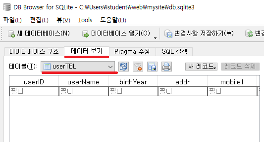


### 회원 한명만 추가해 보기

* `userTBL`에 한명의 데이터 추가하기 (강호동)

```sql
INSERT INTO userTBL VALUES
('KHD', '강호동', 1970, '경북', '011', '22222222', '182', '2007-7-7')
```

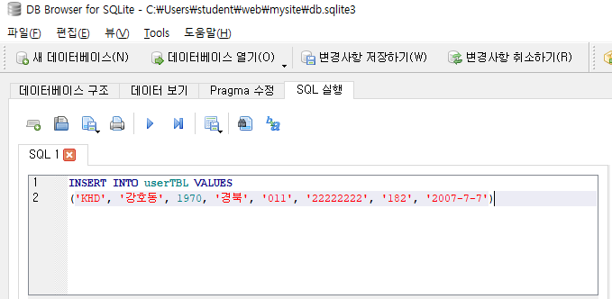


* `userTBL`에 추가된 회원에 대해서 `buyTBL` 에 정보 추가하기
  * `INSERT INTO buyTBL VALUES (NULL, 'KHD', '운동화', NULL, 30, 2);` 을 입력하면 오류 발생한다.
  * `INSERT INTO buyTBL (num, userID, prodName, price, amount ) VALUES (1, 'KHD', '운동화', 30, 2);` 로 값을 지정해서 입력해준다
  * `노트북` 에 대한 값도 추가해준다.

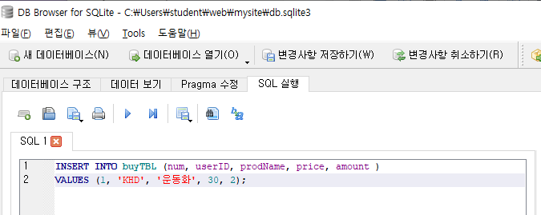

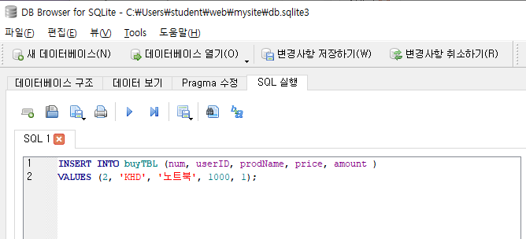


### 전체 회원 추가하기

```sql
INSERT INTO userTBL VALUES ('KHD', '강호동', 1970, '경북', '011', '2222', 182, '2007-7-7');
INSERT INTO userTBL VALUES ('KKJ', '김국진', 1965, '서울', '019', '33333333', 171, '2009-9-9');
INSERT INTO userTBL VALUES ('KYM', '김용만', 1967, '서울', '010', '44444444', 177, '2015-5-5');
INSERT INTO userTBL VALUES ('KJD', '김제동', 1974, '경남', NULL , NULL, 173, '2013-3-3');
INSERT INTO userTBL VALUES ('NHS', '남희석', 1971, '충남', '016', '66666666', 180, '2017-4-4');
INSERT INTO userTBL VALUES ('SDY', '신동엽', 1971, '경기', NULL, NULL, 176, '2008-10-10');
INSERT INTO userTBL VALUES ('LHJ', '이휘재', 1972, '경기', '011', '88888888', 180, '2006-4-4');
INSERT INTO userTBL VALUES ('LKK', '이경규', 1960, '경남', '018', '99999999', 170, '2004-12-12');
INSERT INTO userTBL VALUES ('PSH', '박수홍', 1970, '서울', '010', '00000000', 183, '2012-5-5');

INSERT INTO buyTBL VALUES (NULL, 'KHD', '운동화', NULL, 30, 2);
INSERT INTO buyTBL VALUES (NULL, 'KHD', '노트북', '전자', 1000, 1);
INSERT INTO buyTBL VALUES (NULL, 'KYM', '모니터', '전자', 200, 1);
INSERT INTO buyTBL VALUES (NULL, 'PSH', '모니터', '전자', 200, 5);
INSERT INTO buyTBL VALUES (NULL, 'KHD', '청바지', '의류', 50, 3);
INSERT INTO buyTBL VALUES (NULL, 'PSH', '메모리', '전자', 80, 10);
INSERT INTO buyTBL VALUES (NULL, 'KJD', '책', '서적', 15, 5);
INSERT INTO buyTBL VALUES (NULL, 'LHJ', '책', '서적', 15, 2);
INSERT INTO buyTBL VALUES (NULL, 'LHJ', '청바지', '의류', 50, 1);
INSERT INTO buyTBL VALUES (NULL, 'PSH', '운동화', NULL, 30, 2);
INSERT INTO buyTBL VALUES (NULL, 'LHJ', '책', '서적', 15, 1);
INSERT INTO buyTBL VALUES (NULL, 'PSH', '운동화', NULL, 30, 2);
```

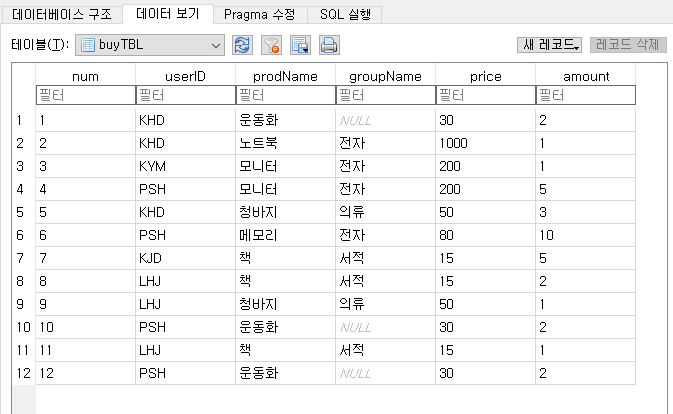

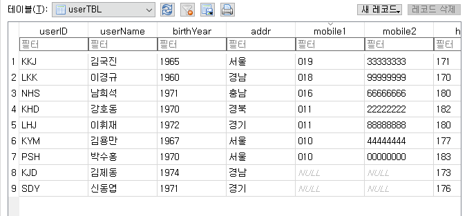


### sql

* `userTBL`에서 각회원의 `addr`과 각 `addr`별 수 뽑아보기

```sql
select addr, count(*) from userTBL
group by addr
```

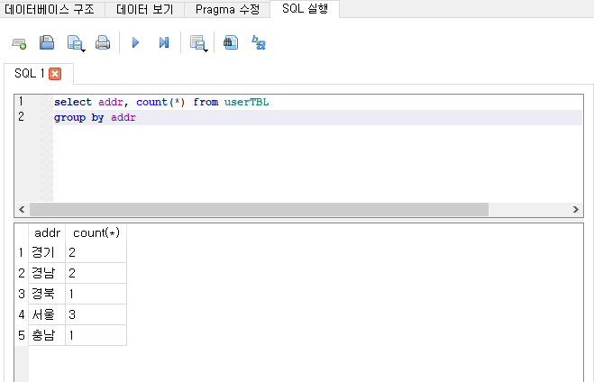

* `buyTBL`에서 각회원의 총 구매 가격 출력하기

```sql
select userid, sum(price * amount)
from buyTBL
group by userid
```

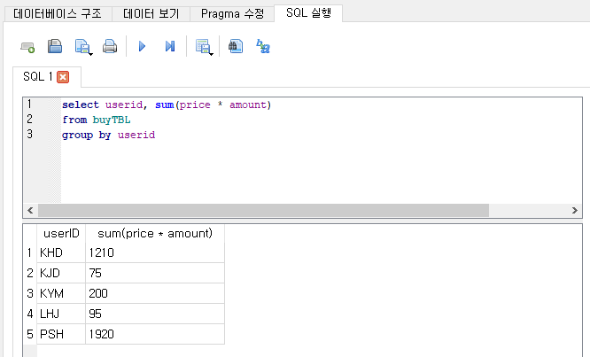


#### join

* 두 테이블 합칠때 사용


## ORM(Object Relation Model(or Mapping))

* Django는 ORM 기준으로 데이터를 다룬다.

* 객체(class)를 db에 맞게 바꿔준다.


### django 로 만든 Myapp 등록하기

* `/mysite/mysite/settings.py`의 `INSTALLED_APP`에 `myapp` 추가해준다.

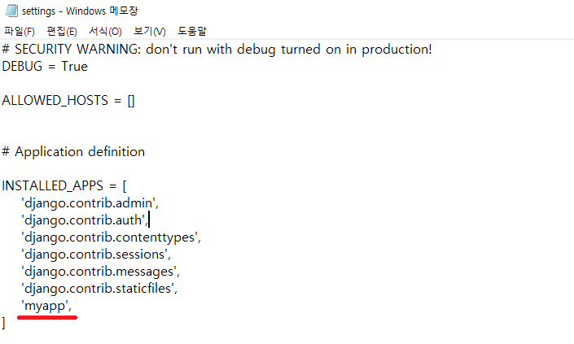


* `/mysite/myapp/models.py`에 `User` class를 만들어 준다.
  * `def __str__(self)` 함수는 print 함수에 자동 적용되는 함수이다.
  * 이 class 가 나중에 자동으로 table로 변경된다.

/mysite/myapp/models.py

```python
from django.db import models
from django.utils import timezone

# Create your models here.

class User(models.Model):
    userid = models.CharField(max_length=10, primary_key=True)
    name = models.CharField(max_length=10)
    age = models.IntegerField()
    hobby = models.CharField(max_length=20)

    def __str__(self):
        return f"{self.userid} / {self.name} / {self.age}"
```


* `/mysite/myapp/admin.py` 에 모델을 추가 해 주어야 한다.

/mysite/myapp/admin.py

```python
from django.contrib import admin
from myapp.models import User

# Register your models here.

admin.site.register(User)
```


* cmd 창에 2개의 명령어 입력한다.
  * `python manage.py makemigrations myapp`
    * db에 대한 정보를 수집한다.
  * `python manage.py migrate`
    * 바뀐 정보를 적용한다.

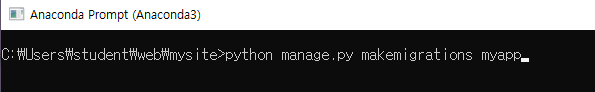

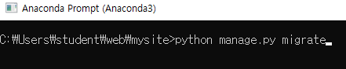


* `localhost:8000/admin`에 접속하면 app 추가되어있다.

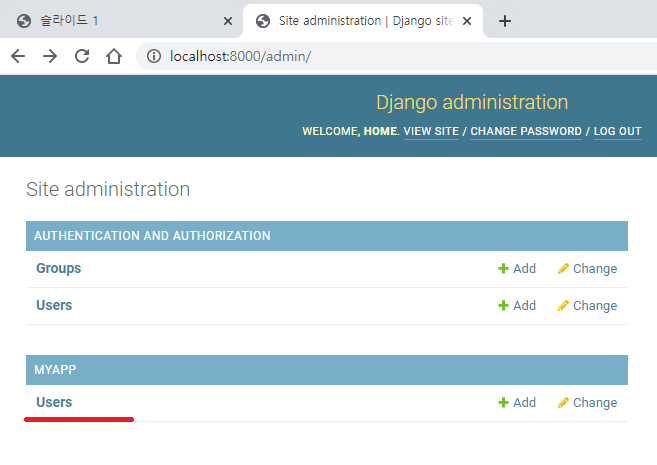


* `MYAPP`의 `Users`에 2개의 사용자 추가한 후 db browser 를 확인하면 정보가 추가되어 있다.

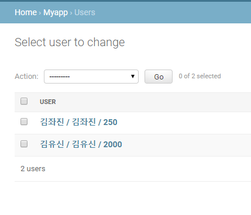

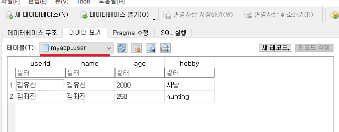


#### shell 에서 실행하기

* `python manage.py shell` 명령어로 shell 모드로 실행한다.
* `from myapp models import User`로 모델 import 해준다.
* `User.objects.all()` 로 db 정보 받아 온다.
* `.save()` 로 정보 추가 해 줄수 있다.

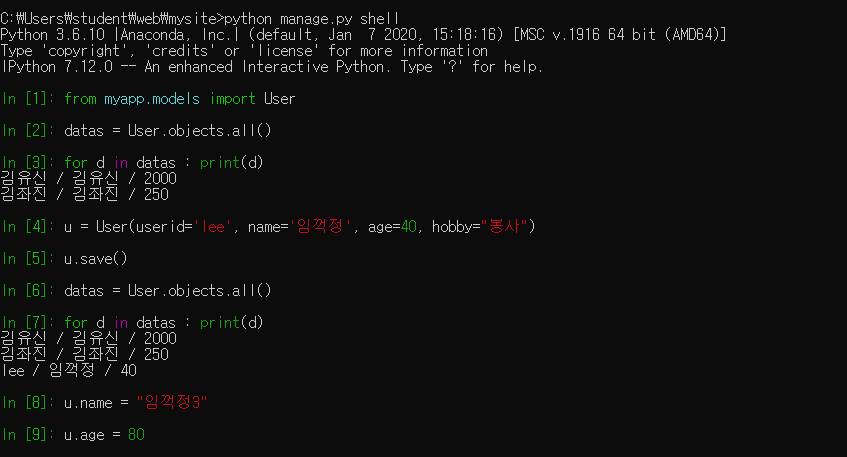


## jupyter notebook 에서 실행하기

### 기본 설정

* django 를 downgrade 해야한다.
  * `pip install django==2.0` 으로 downgrade 해준다.

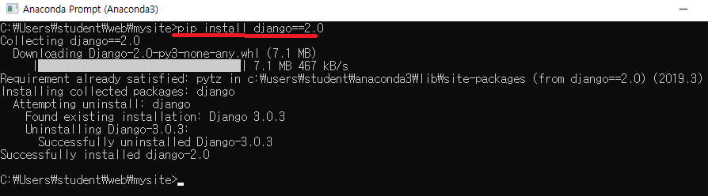


* `pip install django_extensions` 으로 `django_extensions`를 down 받아준다.

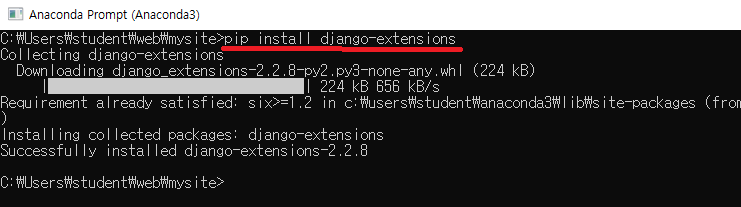


* `/mysite/mysite/settings.py`에 `django_extensions` 을 추가해준다.

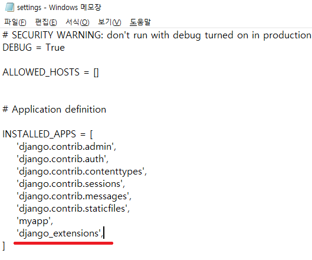


* jupyter notebook을 실행시켜준다.
  * `python manage.py shell_plus --notebook`으로 실행시킨다.

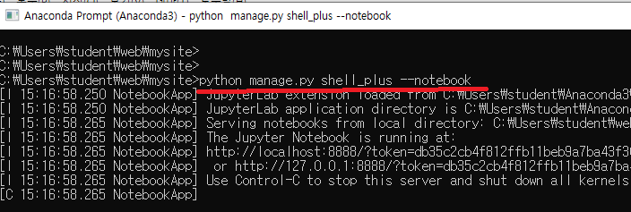


* `Django Shell-Plus`로 페이지 새로 열어준다.

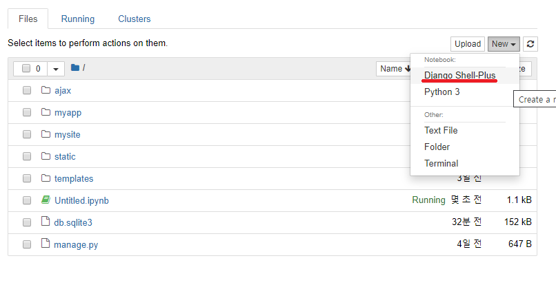

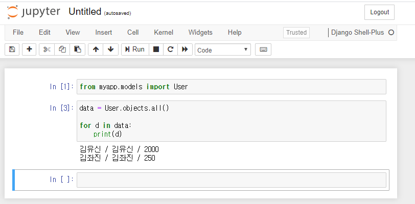


### 기본 예제

* db 의 데이터를 다 불러와서 이용하는 것은 매우 비 효율적인 방법이다.

```python
from myapp.models import User

data = User.objects.all()

for d in data:
    print(d)
```

```
김유신 / 김유신 / 2000
김좌진 / 김좌진 / 250
```


* select / filtering

```python
print(data.filter(age=250))

# age__gte=250 : age >= 250
print(data.filter(age__gte=250))


# 여러 조건 한번에 명시
print(data.filter(name='김유신', age__gte=250))
# chain rule 적용해서 조건 명시
print(data.filter(name='김유신').filter(age__gte=250))

print(data.filter(Q(age__gte=250) | Q(name__contains='유')))
```

```
<QuerySet [<User: 김좌진 / 김좌진 / 250>]>
<QuerySet [<User: 김유신 / 김유신 / 2000>, <User: 김좌진 / 김좌진 / 250>]>
<QuerySet [<User: 김유신 / 김유신 / 2000>]>
<QuerySet [<User: 김유신 / 김유신 / 2000>]>
<QuerySet [<User: 김유신 / 김유신 / 2000>, <User: 김좌진 / 김좌진 / 250>]>
```


* Insert, Update, delete(filtering 이용한)
  * ppt 를 통해 확인하자


## Myapp 의 db 정보 다루기

### db 모든 정보 출력하기

* `/mysite/myapp/views.py`에 `listUser` 함수 만들어 주고 `/mysite/myapp/models.py`의 `User`를 import 해준다.
* `/mysite/myapp/urls.py`에 `listUser` 의 url 추가해준다.
* `/mysite/templates`에 `template2.html` 을 만들어 준다.
* `python manage.py runserver` 로 서버 실행시킨다.
* `127.0.0.1:8000/listuser` 로 접속해 db정보 확인해본다.

/mysite/myapp/views.py

```python
from django.shortcuts import render
from django.http import HttpResponse
from django.shortcuts import redirect
from django.views.decorators.csrf import csrf_exempt
from django.conf import settings
from myapp.models import User

# Create your views here.

def index(request):
    return HttpResponse("Hello DJango!!")


def test(request):
    data = {"s":{"img":"test.png"}, "list":[1,2,3,4,5]}
    return render(request, 'template.html', data)


def login(request):
    id = request.GET['id']
    pwd = request.GET['pwd']
    if id == pwd:
        # 로그인 성공 시 user 별로 id 부여
        request.session["user"] =  id
        return redirect("/service")
    return redirect("/static/login.html")

def logout(request):
    request.session["user"] = ""
    #request.session.pop("user")
    return redirect("/static/login.html")

def service(request):
    # user의 session id 가 없으면 "" return 한다.
    if request.session.get("user", "") == "":
        return redirect("/static/login.html")
    html = "Main Service<br>" + request.session.get("user") + "님 감사합니다." + "<a href=/logout>로그아웃</a>"
    return HttpResponse(html)

@csrf_exempt
def uploadimage(req):
    
    file = req.FILES['file1']
    filename = file.name
    # settings.BASE_DIR 은 mysite 폴더의 settings.py 파일에 있다. settings.py 파일을 import 해주어야 된다.
    fp = open(settings.BASE_DIR + "/static/" + filename, "wb")
    for chunk in file.chunks():
        fp.write(chunk)
    fp.close()
    html = "ok :" + "^^" + filename

    result = face.faceverification(settings.BASE_DIR + "/static/" + filename)
    if result != "":
        request.session["user"] = result
        return redirect("/service")
    return redirect("/static/login.html")

def listUser(request):
    return render(request, 'template2.html', {"data": User.objects.all()})
```

/mysite/myapp/urls.py

```python
from django.urls import path
from . import views

urlpatterns = [
    path('', views.index),
    path('test', views.test),
    path('service', views.service),
    path('login', views.login),
    path('logout', views.logout),
    path('uploadimage', views.uploadimage),
    path('listuser', views.listUser),
]
```

/mysite/templates/template2.html

```html
user list<br>


    이름  {{d.name}} age  {{d.age}} <br>

```

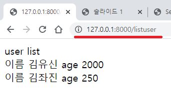

### button 이용해 특정 정보 가져오기

* 특정 이름 입력하고 버튼 클릭하면 이름에 해당하는 정보만 출력
* 아무것도 입력하지 않고 버튼 클릭하면 모든 정보 출력
* /mysite/templates/template2.html 의 form 의 action에 아무것도 적지 않으면 현재 자기 자신을 한번 더 호출하는 작업이 이루어진다.
  *  /mysite/myapp/views.py의 listUser 함수가 실행된다.

/mysite/myapp/views.py

```python
from django.shortcuts import render
from django.http import HttpResponse
from django.shortcuts import redirect
from django.views.decorators.csrf import csrf_exempt
from django.conf import settings
from myapp.models import User

# Create your views here.

def index(request):
    return HttpResponse("Hello DJango!!")


def test(request):
    data = {"s":{"img":"test.png"}, "list":[1,2,3,4,5]}
    return render(request, 'template.html', data)


def login(request):
    id = request.GET['id']
    pwd = request.GET['pwd']
    if id == pwd:
        # 로그인 성공 시 user 별로 id 부여
        request.session["user"] =  id
        return redirect("/service")
    return redirect("/static/login.html")

def logout(request):
    request.session["user"] = ""
    #request.session.pop("user")
    return redirect("/static/login.html")

def service(request):
    # user의 session id 가 없으면 "" return 한다.
    if request.session.get("user", "") == "":
        return redirect("/static/login.html")
    html = "Main Service<br>" + request.session.get("user") + "님 감사합니다." + "<a href=/logout>로그아웃</a>"
    return HttpResponse(html)

@csrf_exempt
def uploadimage(req):
    
    file = req.FILES['file1']
    filename = file.name
    # settings.BASE_DIR 은 mysite 폴더의 settings.py 파일에 있다. settings.py 파일을 import 해주어야 된다.
    fp = open(settings.BASE_DIR + "/static/" + filename, "wb")
    for chunk in file.chunks():
        fp.write(chunk)
    fp.close()
    html = "ok :" + "^^" + filename

    result = face.faceverification(settings.BASE_DIR + "/static/" + filename)
    if result != "":
        request.session["user"] = result
        return redirect("/service")
    return redirect("/static/login.html")

def listUser(request):

    q = request.GET.get("q", "")

    if q == "":
        data = User.objects.all()
    else:
        data = User.objects.all().filter(name__contains=q)

    return render(request, 'template2.html', {"data": data })
```

/mysite/templates/template2.html

```python
user list<br>


    이름  {{d.name}} age  {{d.age}} <br>


<form action>
    <input type="text" name="q">
    <input type="submit" value="검색">
</form>
```

* 출력화면
  * 이름에 `김` 이 들어간 정보 다 출력한다.
  * `유신` 을 입력하면 이름에 `유신` 이 들어간 정보 다 출력한다.

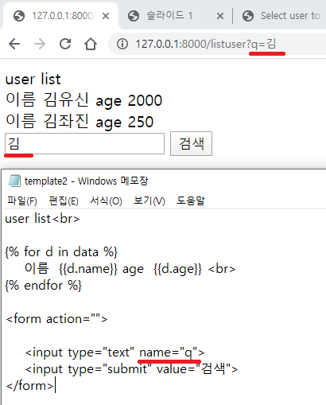

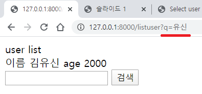


### 정보 추가하기

* 일반적으로 데이터 송신때는 post 방식을 이용한다.
  * `/mysite/templates/template2.html` 에 form tag 추가해준다.
  * POST 방식의 경우에는 `` 를 추가해 주어야 한다.
* `/mysite/myapp/views.py`의 listUser 함수를 get 일 때와 post 일때로 수정해준다.
  * post 인 경우(현재의 경우 정보 추가하는 경우)에는 정보 추가 후 rendering 없이 redirect로 원래 페이지로 돌아간다.

/mysite/templates/template2.html

```html
user list<br>


    이름  {{d.name}} age  {{d.age}} <br>


<form action="">

    <input type="text" name="q">
    <input type="submit" value="검색">
</form>


<form action="" method="post">
    
    userid : <input type="text" name="userid"><br>
    name : <input type="text" name="name"><br>
    age : <input type="text" name="age"><br>
    hobby : <input type="text" name="hobby">
    <input type="submit" value="+">
</form>

```

/mysite/myapp/views.py

```python
from django.shortcuts import render
from django.http import HttpResponse
from django.shortcuts import redirect
from django.views.decorators.csrf import csrf_exempt
from django.conf import settings
from myapp.models import User

# Create your views here.

def index(request):
    return HttpResponse("Hello DJango!!")


def test(request):
    data = {"s":{"img":"test.png"}, "list":[1,2,3,4,5]}
    return render(request, 'template.html', data)


def login(request):
    id = request.GET['id']
    pwd = request.GET['pwd']
    if id == pwd:
        # 로그인 성공 시 user 별로 id 부여
        request.session["user"] =  id
        return redirect("/service")
    return redirect("/static/login.html")

def logout(request):
    request.session["user"] = ""
    #request.session.pop("user")
    return redirect("/static/login.html")

def service(request):
    # user의 session id 가 없으면 "" return 한다.
    if request.session.get("user", "") == "":
        return redirect("/static/login.html")
    html = "Main Service<br>" + request.session.get("user") + "님 감사합니다." + "<a href=/logout>로그아웃</a>"
    return HttpResponse(html)

@csrf_exempt
def uploadimage(req):
    
    file = req.FILES['file1']
    filename = file.name
    # settings.BASE_DIR 은 mysite 폴더의 settings.py 파일에 있다. settings.py 파일을 import 해주어야 된다.
    fp = open(settings.BASE_DIR + "/static/" + filename, "wb")
    for chunk in file.chunks():
        fp.write(chunk)
    fp.close()
    html = "ok :" + "^^" + filename

    result = face.faceverification(settings.BASE_DIR + "/static/" + filename)
    if result != "":
        request.session["user"] = result
        return redirect("/service")
    return redirect("/static/login.html")

def listUser(request):

    if request.method == "GET":    
        q = request.GET.get("q", "")
        if q == "":
            data = User.objects.all()
        else:
            data = User.objects.all().filter(name__contains=q)
        return render(request, 'template2.html', {"data": data })
    else :
        # POST 방식으로 정보 넘어 올때 / 이 코드에서는 정보 추가할 때이다.        
        userid = request.POST.get("userid")
        name = request.POST.get("name")
        age = request.POST.get("age")
        hobby = request.POST.get("hobby")
        
        # User class 에 __init__ 정의해주면 초기화 과정이 더 쉽다.
        User.objects.create(userid=userid, name=name, age=age, hobby=hobby)

        return redirect("/listuser")
```

* 출력화면

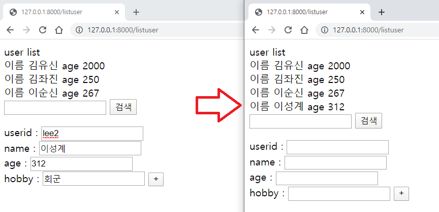


#### Javascript 이용해서 정보 추가 숨김/생성

* `/mysite/templates/template2.html` 을 수정하기
  * 기본 창은 정보 추가 부분 hide 되어 있다.
  *  `+`  버튼 누루면 정보 추가 부분 나온다.

/mysite/templates/template2.html

```html
<script src="https://code.jquery.com/jquery-3.3.1.min.js"></script>
<script src="http://malsup.github.com/jquery.form.js"></script>


user list <button id="add">+</button><br>


    이름  {{d.name}} age  {{d.age}} <br>


<form action="">

    <input type="text" name="q">
    <input type="submit" value="검색">
</form>


<div id="layer">
<form action="" method="post">
    
    userid : <input type="text" name="userid"><br>
    name : <input type="text" name="name"><br>
    age : <input type="text" name="age"><br>
    hobby : <input type="text" name="hobby">
    <input type="submit" value="Add">
</form>
</div>

<script>
    $("#layer").hide()
    $("#add").click(function(){
        $("#layer").toggle()

    });
</script>
```

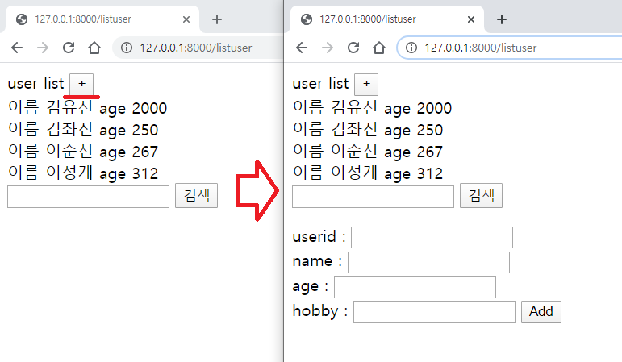

### 정보 삭제하기

* `/mysite/templates/template2.html` 에 삭제 를 위한 하이퍼링크를 만들어준다.
  * `default`로 `userid` 값을 넘겨준다.
  * `<a href=listuser?userid={{d.userid}}>삭제</a>`
* `/mysite/myapp/views.py`의 `listUser` 에 삭제 부분 추가해 준다.

/mysite/templates/template2.html

```python
<script src="https://code.jquery.com/jquery-3.3.1.min.js"></script>
<script src="http://malsup.github.com/jquery.form.js"></script>


user list <button id="add">+</button><br>


    이름  {{d.name}} age  {{d.age}} <a href=listuser?userid={{d.userid}}>삭제</a> <br>


<form action="">

    <input type="text" name="q">
    <input type="submit" value="검색">
</form>


<div id="layer">
<form action="" method="post">
    
    userid : <input type="text" name="userid"><br>
    name : <input type="text" name="name"><br>
    age : <input type="text" name="age"><br>
    hobby : <input type="text" name="hobby">
    <input type="submit" value="Add">
</form>
</div>

<script>
    $("#layer").hide()
    $("#add").click(function(){
        $("#layer").toggle()

    });
</script>
```

/mysite/myapp/views.py

```python
from django.shortcuts import render
from django.http import HttpResponse
from django.shortcuts import redirect
from django.views.decorators.csrf import csrf_exempt
from django.conf import settings
from myapp.models import User

# Create your views here.

def index(request):
    return HttpResponse("Hello DJango!!")


def test(request):
    data = {"s":{"img":"test.png"}, "list":[1,2,3,4,5]}
    return render(request, 'template.html', data)


def login(request):
    id = request.GET['id']
    pwd = request.GET['pwd']
    if id == pwd:
        # 로그인 성공 시 user 별로 id 부여
        request.session["user"] =  id
        return redirect("/service")
    return redirect("/static/login.html")

def logout(request):
    request.session["user"] = ""
    #request.session.pop("user")
    return redirect("/static/login.html")

def service(request):
    # user의 session id 가 없으면 "" return 한다.
    if request.session.get("user", "") == "":
        return redirect("/static/login.html")
    html = "Main Service<br>" + request.session.get("user") + "님 감사합니다." + "<a href=/logout>로그아웃</a>"
    return HttpResponse(html)

@csrf_exempt
def uploadimage(req):
    
    file = req.FILES['file1']
    filename = file.name
    # settings.BASE_DIR 은 mysite 폴더의 settings.py 파일에 있다. settings.py 파일을 import 해주어야 된다.
    fp = open(settings.BASE_DIR + "/static/" + filename, "wb")
    for chunk in file.chunks():
        fp.write(chunk)
    fp.close()
    html = "ok :" + "^^" + filename

    result = face.faceverification(settings.BASE_DIR + "/static/" + filename)
    if result != "":
        request.session["user"] = result
        return redirect("/service")
    return redirect("/static/login.html")

def listUser(request):

    if request.method == "GET":    

        userid = request.GET.get("userid", "")
        if userid != "":
            User.objects.all().get(userid=userid).delete()
            return redirect("/listuser")

        q = request.GET.get("q", "")
        data = User.objects.all()
        if q != "":
            data = data.filter(name__contains=q)
        return render(request, 'template2.html', {"data": data })
    else :
        # POST 방식으로 정보 넘어 올때 / 이 코드에서는 정보 추가할 때이다.        
        userid = request.POST.get("userid")
        name = request.POST.get("name")
        age = request.POST.get("age")
        hobby = request.POST.get("hobby")
        
        # User class 에 __init__ 정의해주면 초기화 과정이 더 쉽다.
        User.objects.create(userid=userid, name=name, age=age, hobby=hobby)

        return redirect("/listuser")
```

* 실행 화면

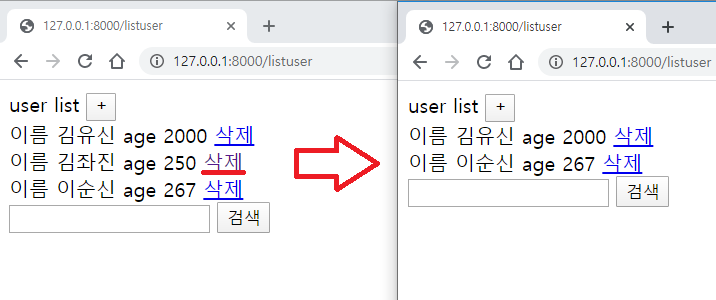

