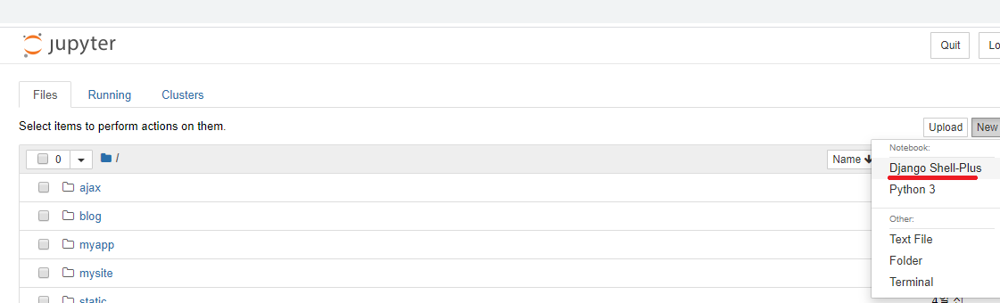

# day2(db)

## 기본 설정

* ORM 방법을 이용하지 않는다.

* 1일차에 만들었던 db 외에 새로운 app에 대한 새로운 db 만들어서 진행
* `python manage.py startapp blog` 명렁어로 `blog` 라는 새로운 app 생성한다.


* `/mysite/mysite/settings.py` 의 `INSTALLED_APPS`에 `blog` 추가해준다.
  * `INSTALLED_APP += ['blog']` : 이렇게 추가 해 줄 수도 있다.


* `blog`  app 에 대한 db 생성해 준다.
  * `/mysite/blog/models.py` 에 `Post` class 추가해준다.
    * table 을 추가해 주는 작업이다.

/mysite/blog/models.py

* `author = models.ForeignKey('auth.User', on_delete=models.CASCADE)`
  * 첫번째 파라미터 `auth.User` 는 항목을 만든 저자를 명시해주는 것이다.
  * 두번째 파라미터 `on_delete=models.CASCADE` 는 user를 삭제할 때 post 데이터도 같이 삭제하라는 의미이다.
    * user table 에서 user 를 삭제하면 post table 에 삭제된 user id 와 같은 레이블은 다 삭제된다는 의미이다.

```python
from django.db import models
from django.utils import timezone


# Create your models here.

class Post(models.Model):
    author = models.ForeignKey('auth.User', on_delete=models.CASCADE)
    title = models.CharField(max_length=200)
    text = models.TextField()  # 글자수에 제한 없는 텍스트
    created_date = models.DateTimeField(
        default=timezone.now)  # 날짜와 시간
    published_date = models.DateTimeField(
        blank=True, null=True) #  필드가 폼에서 빈 채로 저장되는 것을 허용(blanck=True) : 어플리 케이션 관점이다. / null = True : db 관점에서 값이 없어도 된다는 것이다.

    def publish(self):
        self.published_date = timezone.now()
        self.save()

    def __str__(self):
        return self.title
```


* `/mysite/blog/admin.py`를 수정해준다.

/mysite/blog/admin.py

```python
from django.contrib import admin
from blog.models import Post

# Register your models here.

admin.site.register(Post)
```


* 만든 model(db)를 적용해준다.
  * `python manage.py makemigrations blog`
  * `python mange.py migrate`


* `python manage.py runserver` 로 서버 실행시킨다.
  * `127.0.0.1:8000/admin` 에 접속한다.
    * superuser로 접속한다.(id:host / pwd:1234
      * `blog` 에 대한 테이블 만들어져 있다.


### `auth.User`

* `author = models.ForeignKey('auth.User', on_delete=models.CASCADE)` 의 `auth.User` 때문에 blog 는  django를 만들때 생성된 시스템 테이블중 `Users`의 user 를 공유하게 된다.


* 따라서 `blog`에서 기사 추가 할때 author 를 user table 의 user 중 하나를 고르게 된다.


* db browser 를 이용해서도 생성된 blog_post table 을 확인할 수 있다.
  * `/mysite/blog/models.py` 에서 model을 만들 때 id 를 만들지 않았는데 id 가 생성되어 있다.
    * 모든 table에는 id가 생기는 django 의 규칙이다.
  * `author`로 만든 이름이 `author_id` 로 바뀌어 있다.
    * `foreign key` 로 인식한 값은 뒤에 `_id` 가 붙는다.


### `on_delete=models.CASCADE`

* blog_post 의 author_id 는 auth_user 의 id 를 이용한다.
* `on_delete=models.CASCADE` 를 설정하면 auth_user 의 id 를 삭제하면 blog_post 의 연관된 데이터는 다 삭제된다.


## jupyter noteboook 에서 실행

* `python manage.py shell_plus --notebook` 명령어로 jupyter notebook 실행시킨다.
* `Django Shell-Plus`로 파일 만들어 준다.




### 객체 추가해보기

* 요소값들을 정확히 입력해 주지 않으면 객체가 db에 추가 되지 않는다

```python
from blog.models import Post
```

```python
p = Post(title="오늘 점심 메뉴", text='머지?')
# error 발생한다.
# Post class 의 created_date 는 default 로 현재 시간 들어가고, published_date 는 값 입력 하지 않아도 된다.
# title , text 는 위에서 명시 해주었다.
# 하지만 author 정보를 입력해 주지 않아서 error 발생한다.
p.save()
```

* author 에 대한 정보를 받아와서 필요한 요소들을 다 입력해준다.

```python
# author을 받아와서 입력해 주어야 한다.
# system table 의 user 를 import 해준다.
from django.contrib.auth.models import User
```

```python
u = User.objects.all().get(username='lee')
print(u)
p.author = u
p.save()
```

* 실행화면
  * db에 적용이 되어 저장되어 있다.


* 만든 객체는 유지되기 때문에 수정 후 save 하면 db에 적용이 된다.

```python
p.title = '점심 메뉴???'
p.save()
```


* 한줄로 정보 추가하는 방법

```python
u = User.objects.all().get(username='lee')
Post.objects.create(title='오늘 저녁 메뉴', text='머지?', author=u)
```


## blog app 기능 추가

### 기본 설정

* `/mysite/mysite/urls.py` 에 blog url 추가해준다.
* `/mysite/blog/views.py` 에 index 함수 만들어 준다.
* `/mysite/blog/urls.py` 를 만들어 주고 설정해 준다.

/mysite/mysite/urls.py


/mysite/blog/views.py

```python
from django.shortcuts import render
from django.http import HttpResponse

# Create your views here.

def index(request):
    return HttpResponse("ok")
```

/mysite/blog/urls.p

```python
from django.urls import path
from . import views

urlpatterns = [
    path('', views.index),
]
```


### index2

* `/mysite/blog/views.py` 에 index2 함수 만들어 준다.
* `/mysite/blog/urls.py` 를 만들어 주고 설정해 준다.
  * `<name>` : 문자열만 받는다
* 기본 경로 뒤에 임의의 문자열이 들어오면 `<name>` 에 값이 넘어가고 index2 가 호출된다.
  * name 이 index2 의 파라미터로 넘어간다.

/mysite/blog/views.py

```python
from django.shortcuts import render
from django.http import HttpResponse

# Create your views here.

def index(request):
    return HttpResponse("ok")

def index2(request, name):
    return HttpResponse("ok " + name)
```

/mysite/blog/urls.py

```python
from django.urls import path
from . import views

urlpatterns = [
    path('', views.index),
    path('<name>/', views.index2),
]
```

* 실행화면


### index3

* pk 로 변수를 넘기면 django 에서 primary key 된 변수를 찾는다.

* index2와 같은 방식으로 index3 만들어 준다.
  * 숫자만 받고 싶을 때는 int를 붙여준다.

/mysite/blog/views.py

```python
from django.shortcuts import render
from django.http import HttpResponse

# Create your views here.

def index(request):
    return HttpResponse("ok")

def index2(request, name):
    return HttpResponse("ok " + name)

def index3(request, pk):
    return HttpResponse("ok " + str(pk))
```

/mysite/blog/urls.py

```python
from django.urls import path
from . import views

urlpatterns = [
    path('', views.index),
    path('<name>/', views.index2),
    path('<int:pk>/detail', views.index3),
]
```

* 실행화면


* pk 를 이용해서 원하는 게시물의 key값 넘겨서 정보 받아보기
  * `/mysite/blog/models.py`의 Post 를 import 해준다
  * `get_object_or_404` 는 게시물이 없는 경우에 404 에러 출력하게 해준다.

/mysite/blog/views.py

```python
from django.shortcuts import render
from django.http import HttpResponse
from blog.models import Post
from django.shortcuts import get_object_or_404

# Create your views here.

def index(request):
    return HttpResponse("ok")

def index2(request, name):
    return HttpResponse("ok " + name)

def index3(request, pk):
    #p = Post.objects.get(pk=pk)
    p = get_object_or_404(Post, pk=pk)
    return HttpResponse(p)
```


### list.html, detail.html

* 앞서 만들었던 index3 함수가 겹칠수 있기 때문에 `/mysite/blog/urls.py` 에서 주석 처리를 해준다.


* 상위 base.html 을 만들고 하위 html은 base.html 의 형식에 디자인이나 기능을 추가하는 방식을 이용한다.


* `/mysite/templates/` 에 `blog ` 폴더 생성한다.
*  `base.html` 을 만든다.

/mysite/templates/base.html

* `
  ` 이 부분에 자식 html 이 들어간다.

```html
<font color="red"><h1>My blog</h1></font> <br>




<br><br><br>
copy right..... <br>
서울 특별시.........
```

* `list.html`, `detail.html`을 만든다.
  * `list.html` 에서는 모든 기사의 제목 정보를 하이퍼링크로 보여준다.
  * 하이퍼 링크를 클릭하면 기사의 자세한 정보를 위해 `detail.html` 페이지로 이동한다.
  * 하이퍼 링크에 동적으로 정보 넘겨준다. -> `<a href="{{d.pk}}/detail">`

/mysite/templates/list.html

```html


게시물 보기 <br>



    <a href="{{d.pk}}/detail"> {{d.title}} </a> <br>



```

/mysite/templates/detail.html

```html




    {{d.title}} <br>
    {{d.text | linebreaks}}
    <hr>


```


* `/mysite/blog/views.py` 에  list, detail 함수 추가해준다.

/mysite/blog/views.py

* `from blog.models import Post` 를 해줘야 객체 불러 올수 있다.

```python
from django.shortcuts import render
from django.http import HttpResponse
from blog.models import Post
from django.shortcuts import get_object_or_404

# Create your views here.

def index(request):
    return HttpResponse("ok")

def index2(request, name):
    return HttpResponse("ok " + name)

def index3(request, pk):
    #p = Post.objects.get(pk=pk)
    p = get_object_or_404(Post, pk=pk)
    return HttpResponse(p)

def list(request):
    data = Post.objects.all()
    return render(request, "blog/list.html", {"data": data})

def detail(request, pk):
    p = get_object_or_404(Post, pk=pk)
    return render(request, "blog/detail.html", {"d": p})
```


* `/mysite/blog/urls.py` 에  list, detail 함수 추가해준다.

/mysite/blog/urls.py

```python
from django.urls import path
from . import views

urlpatterns = [
    path('', views.index),
    path('<name>/', views.index2),
    path('<int:pk>/index3', views.index3),

    path('list', views.list),
    path('<int:pk>/detail', views.detail),
]
```


### class (get, post)

* view 를 상속 받아 많은 기능을 이용할 수 있다 :  `from django.views.generic import View`
  * get,post 방식을 `def get` , `def post` 함수로 처리 할 수 있다.
  * 정보 상태 체크등을 할 수 있다.


#### login(LoginView class)

* 로그인에 성공하면 user가 작성한 글 제목 목록을 보여준다.


* `/mysite/templates/blog/`에 `login.html` 을 만들어 준다.
  * `form action=`  : `login`의 자리에는 `urls.py` 에 설정해 준 name 이름이 온다. 필요에 따라 뒤에 파라미터를 넣어주면 된다.
  * post 방식이므로 csrf 예외처리를 해준다.

/mysite/templates/blog/login.html

```html
<form action= method=post>
    
    username <input type=text name=username > <br>
    password <input type=password name=password> <br>
    <input type=submit value="로그인">
</form>
```


* `/mysite/blog/views.py` 에 `LoginView`  class를 만들어 준다.
  * `def get` 함수는 browser 에서 페이지 요청했을 때 `/mysite/templates/blog/login.html`을 rendering 해준다.
    * 파라미터에는 self, request가 온다. 필요에 따라 pk 등의 추가 파라미터가 올 수 있다.
  * `def post` 함수는 `authenticate` 함수를 이용해서 id, pwd 를 확인한 후 정보가 맞으면 user 글 list 페이지로 이동한다. 틀리면 다시 login 페이지로 이동한다.
    * `from django.contrib.auth import authenticate` 를 import 해야 `authenticate` 함수를 이용할 수 있다.
      * `authenticate` 함수는 id,pwd 가 맞지 않으면 `None`를 return 한다.
  * 로그인에 성공하면 session 값을 지정해 준다.

/mysite/blog/views.py(header + LoginView)

```python
from django.shortcuts import render
from django.http import HttpResponse
from blog.models import Post
from django.shortcuts import get_object_or_404
from django.views.generic import View
from django.shortcuts import redirect
# LoginView
from django.contrib.auth import authenticate
# list
from django.contrib.auth.models import User
# PostForm
from django.forms import Form
# PostForm
from django.forms import CharField, Textarea
from django.forms import ValidationError

class LoginView(View):
    
    def get(self, request):
        return render(request, "blog/login.html")

    def post(self, request):
        #loging처리

        username = request.POST.get("username")
        password = request.POST.get("password")

        # id 또는 password 에 틀린 값을 넣으면 None 이 return 된다.
        # password 에는 암호화 되기 전의 password 입력한다.
        user = authenticate(username=username, password=password)

        if user == None:
                # 상대 경로로 지정을 해주려면 urls.py 에 name 을 지정해주고 그 name 을 redirect 에서 호출해야 된다.
                return redirect("login")
        request.session["username"] = username
        return redirect("list")
```


* `/mysite/blog/urls.py` 에 `login` 을 추가해 준다.


/mysite/blog/urls.py

* `/mysite/templates/blog/login.html` 에서 name 을 이용하기 때문에 `name=login`을 써준다.
* 지금까지는 함수 호출 방식이었는데 이 예제에서는 class 호출이다.
  * class 이름 뒤에 `.as_view()`를 써준다 : `views.LoginView.as_view()`

```python
from django.urls import path
from . import views

urlpatterns = [
    path('', views.index),
    #path('<name>/', views.index2),
    #path('<int:pk>/index3', views.index3),

    path('login', views.LoginView.as_view(), name="login"),

    path('list', views.list, name="list"),
    path('<int:pk>/detail', views.detail, name='detail'),
]
```

* 로그인 실패 화면


* 로그인 성공 화면


#### Post(PostView class)

* 로그인 성공 후 게시물 올리는 기능


* `/mysite/templates/blog/` 에 `edit.html` 을 만든다.
  * post 방식 이므로 csrt 에러 처리를 해준다.

/mysite/templates/blog/edit.html

```html
<form action= method=post>
    


    제목 <input type="text" name="title" > <br>
    text <textarea rows="10" cols="30" name="text" ></textarea> <br>

    <input type="submit" value="작성" >

</form>
```


* `/mysite/blog/views.py` 에 `PostView` class 를 만든다.
  * browser 가 `127.0.0.1/blog/add` 를 통해 get 으로 페이지 요청하면 `def get`함수가 호출되고 `/mysite/templates/blog/edit.html` 이 return 된다.
  * 글의 제목과 내용을 작성 후 `작성`을 누르면 post  방식으로 정보가 넘어가고 `def post` 함수가 호출된다.
    * system user table 을 import 하고 현재 user의 username을 가져온다.
    * Post 객체에 새로운 글 생성한다.
    * `/mysite/blog/views.py`의 list 함수 호출한다.

/mysite/blog/views.py(header + PostView)

```python
from django.shortcuts import render
from django.http import HttpResponse
from blog.models import Post
from django.shortcuts import get_object_or_404
from django.views.generic import View
from django.shortcuts import redirect
# LoginView
from django.contrib.auth import authenticate
# list
from django.contrib.auth.models import User
# PostForm
from django.forms import Form
# PostForm
from django.forms import CharField, Textarea
from django.forms import ValidationError

class PostView(View):
    
    def get(self, request):
        return render(request, "blog/edit.html")

    def post(self, request):
        
        title = request.POST.get("title")
        text = request.POST.get("text")
        username = request.session["username"]
        user = User.objects.get(username=username)

        Post.objects.create(title=title, text=text, author=user)

        return redirect("list")
```


* `/mysite/blog/urls.py` 에 `PostView` class 추가해 준다.
  * class 호출 이므로 `.as_view()`를 써준다.

```python
from django.urls import path
from . import views

urlpatterns = [
    path('', views.index),
    #path('<name>/', views.index2),
    #path('<int:pk>/index3', views.index3),

    path('login', views.LoginView.as_view(), name="login"),

    path('list', views.list, name="list"),
    path('<int:pk>/detail', views.detail, name='detail'),
    path('add', views.PostView.as_view(), name="add"),
]
```


#### modify(PostEditView,PostForm class)

* 기존에 작성된 글을 수정하는 기능이다.

* `PostView ` class 에서 이용했던 `/mysite/templates/blog/edit.html`을 수정해서 사용한다.
* `from django.forms import Form` 을 `/mysite/blog/views.py`에 import 해서 사용한다.
  * `PostForm` class 가 `Form`을 상속받아 사용한다.
    * 파라미터 값만 입력하면 형식에 맞춰서 `form` 객체가 생성된다.
    * `validators` 파라미터로 title, text의 길이를 제한 할 수 있다.
  * `/mysite/templates/blog/edit.html` 에서도 `form`을 출력할 때 간편하게 출력할 수 있다.


* `/mysite/templates/blog/edit.py`를 수정해서 사용한다.
  * `PostEditView` class 에서 render 함수를 이용해서 `form` 객체와 `pk` 를 넘겨준다.
    * `PostView` class 와는 다르게 `form.as_p`로 `<input>`, `<textarea>` 를 표현 할 수 있다.
  * `<form action=>`
    * 특정 글에 접근해야 하므로 `pk` 를 써야한다.
  * post 방식이므로 csrt 예외 처리를 해준다.

```python
<form action= method=post>
    

    {{ form.as_p }}

    <input type="submit" value="작성" >

</form>
```


* `/mysite/templates/blog/detail.py` 에 하이퍼 링크를 추가해 `수정` 기능을 추가해 준다.

/mysite/templates/blog/detail.py

```html




    {{d.title}} <br>
    {{d.text | linebreaks}}
    <hr>

<a href=""> 수정 </a>


```


* `/mysite/blog/views.py`에 `PostForm`, `PostEditView` 두개의 class 를 생성한다.
  * `PostForm` class 는 `Form`을 상속받는다.
    * `Form` 객체를 만들어 주는 역할을 한다.
  * `PostEdidtView` class 
    * brower 로 부터 호출되면 `def get` 함수가 호출되고 작성된 글의 내용을 `form`에 넣어 `/mysite/templates/blog/edit.html` 을 rendering 해준다.
    * 글 수정후에 `작성` 을 누르면 `def post` 함수가 호출되고 변경된 정보를 db 에 적용한다.
  * `validator` 함수는 글의 길이를 제한해  조건에 합당하면 `ValidationError`를 호출한다.

/mysite/blog/views.py(header, PostForm, PostEditView, validator)

```python
from django.shortcuts import render
from django.http import HttpResponse
from blog.models import Post
from django.shortcuts import get_object_or_404
from django.views.generic import View
from django.shortcuts import redirect
# LoginView
from django.contrib.auth import authenticate
# list
from django.contrib.auth.models import User
# PostForm
from django.forms import Form
# PostForm
from django.forms import CharField, Textarea
from django.forms import ValidationError


class PostEditView(View):
    def get(self, request, pk):

        post = get_object_or_404(Post, pk=pk)
        form = PostForm(initial={"title": post.title, "text": post.text})
        return render(request, "blog/edit.html", {"form":form, "pk":pk})

    def post(self, request, pk):
        form = PostForm(request.POST)
        if form.is_valid():
            post = get_object_or_404(Post, pk=pk)
            post.title = form['title'].value()
            post.text = form['text'].value()
            # 변경된 정보 db에 적용
            post.publish()
            return redirect("list")
        return render(request, "blog/edit.html", {"form":form, "pk":pk})

def validator(value):
    if len(value) < 5 : raise ValidationError("길이가 너무 짧아요.");


class PostForm(Form):
    title = CharField(label="제목", max_length=20, validators=[validator])
    # widget : default는 text 요소이다.
    text = CharField(label="내용", widget=Textarea)
```


* `/mysite/blog/urls.py`에  `PostEditView` class 를 추가해 준다.
  * `PosForm` class 와 `validator` 함수는 `/mysite/blog/views.py` 안에서만 사용되므로 추가해 줄 필요 없다.

/mysite/blog/urls.py

```python
from django.urls import path
from . import views

urlpatterns = [
    path('', views.index),
    #path('<name>/', views.index2),
    #path('<int:pk>/index3', views.index3),

    path('login', views.LoginView.as_view(), name="login"),

    path('list', views.list, name="list"),
    path('<int:pk>/detail', views.detail, name='detail'),
    path('add', views.PostView.as_view(), name="add"),
    path('<int:pk>/edit', views.PostEditView.as_view(), name="edit"),
]
```

* 실행화면


