# day4(db)

## Paging

* 서버가 많은 정보를 한번에 보내지 않고 page 단위로 전송한다.
* client 에게 네비게이션 제공한다.


* 이미 만들었던 `myboard` app 을 이용해서 실습 진행한다.


### list 를 이용한 간단한 paging 예제

* `/mysite/myboard/views.py` 에 `def page` 함수 만들어준다.
  * db 정보 대신 list 를 이용해 `data`만들어준다.
  * `Paginator` 함수를 이용해 한 페이지당 보여줄 데이터 갯수 정해준다.
  * `request.GET.get` 을 이용해 요청한 페이지 번호 가져온다.
  * `.page()` 함수로 요청한 페이지의 데이터 가져온다.
    * `.page()` 함수는 `전달할 데이터 + key 값(has_other_pages, has_previous, ....)` 을 포함시켜서 return 한다.

```python
from django.core.paginator import Paginator

def page(request):

    datas = [{"id":1, "name":"홍길동1"},
              {"id":2, "name":"홍길동2"},
              {"id":3, "name":"홍길동3"},
              {"id":4, "name":"홍길동4"},
              {"id":5, "name":"홍길동5"},
              {"id":6, "name":"홍길동6"},
              {"id":7, "name":"홍길동7"},]

    # 두번째 파라미터는 한 페이지에 보여줄 데이터 갯수이다.
    p = Paginator(datas, 3)

    #(page-1)*3:page*3
    page = request.GET.get("page", 1)

    # 파라미터에 가져올 페이지 번호 입력한다.
    subs = p.page(page)

    return render(request, "myboard/page.html", {"datas": subs})
```


* `/mysite/templates/myboard`에 `page.html` 을 만들어 준다.
  * 현재 페이지에서는 현재 페이지의 하이퍼 링크가 disable 되어야 한다.
  * 첫 페이지에서는 `이전`에 대한 하이퍼 링크가 disable 되어야 한다.
  * 마지막 페이지 에서는 `다음`에 대한 하이퍼 링크가 disable 되어야 한다.

```html



   {{data.id}}  / {{data.name}}  <br>




        
          <a href="?page={{ datas.previous_page_number }}">&laquo;</a>
        
          <span>&laquo;</span>
        

        
          
            <span>{{ i }} </span>
          
            <a href="?page={{ i }}">{{ i }}</a>
          
        
        
            <a href="?page={{ datas.next_page_number }}">&raquo;</a>
        
            <span>&raquo;</span>
        
    

```


* `/mysite/myboard/urls.py` 에 `page` 함수의 url 추가해준다.
  * 루트 경로가 겹치므로 `lambda`를 이용한 path는 주석 처리 해준다.

```python
from django.urls import path
from . import views
from django.shortcuts import redirect

urlpatterns = [
    path('', views.page),
    path('<category>/<int:pk>/<mode>/', views.BoardView.as_view(), name="myboard"),
    #path('', lambda request: redirect('myboard', 'data', 0, 'list')),
]
```


* 실행화면 
  * `127.0.0.1:8000/myboard` 로 접속하면 `/mysite/myboard/views.py`의 list 함수에서 get에 아무것도 요청된것이 없으면 1을 return 하기 때문에 1 page로 접속한다.
    * 첫 페이지이므로 이전 하이퍼링크가 disable 되어있다.
    * 현재 페이지인 1페이지의 하이퍼링크가 disable 되어있다.
  * 3 하이퍼 링크를 누르면 마지막 페이지로 이동한다.
    * 3 페이지를 요청했기 때문에 url에 `?page=3` 가 포함된다.
    * 마지막 페이지이므로 다음 하이퍼링크가 disable 되어 있다.
    * 현재 페이지인 3페이지의 하이퍼링크가 disable 되어있다.

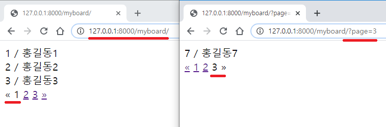


### `db.sqlite3`  를 이용한 paging

#### 네이게이션 적용하기

* `/mysite/myboard/views.py` 의 `list`함수의 방식을 `BoardView` 함수에 적용한다.
  * `BoardView`함수의 `elif mode=='list'` 부분에 적용한다.
  * `context` 의 `datas` 의 value를 `subs`로 해준다.

```python
elif mode == 'list':
            username = request.session["username"]
            user = User.objects.get(username=username)
            data = models.Board.objects.all().filter(author=user, category=category)

            page = request.GET.get("page", 1)
            p = Paginator(data, 3)
            subs = p.page(page)

            context = {"datas":subs, "username":username, "category":category}
            return render(request, "myboard/list.html", context)
```


* `/mysite/templates/myboard/list.html` 을 수정해준다.
  * 네비게이션 부분을 추가해준다.
    * ` ` 사이에 추가해 주어야 된다.
  * `data` -> `datas`

```html




<button type="button"><a href="" style="text-decoration:none">Add </a></button> <hr>



<a href="" style="text-decoration:none"> {{d.title}} </a> 조횟수 {{d.cnt}}
<button type="button"><a href="" style="text-decoration:none"> 삭제 </a></button> <br>



        
          <a href="?page={{ datas.previous_page_number }}">&laquo;</a>
        
          <span>&laquo;</span>
        

        
          
            <span>{{ i }} </span>
          
            <a href="?page={{ i }}">{{ i }}</a>
          
        
        
            <a href="?page={{ datas.next_page_number }}">&raquo;</a>
        
            <span>&raquo;</span>
        




```


* `/mysite/myboard/urls.py` 를 수정해준다.
  * `page` 함수에 대한 url을 주석처리 해준다.
  * `lambda` 함수에 대한 url의 주석처리를 제거해준다.

```python
from django.urls import path
from . import views
from django.shortcuts import redirect

urlpatterns = [
    #path('', views.page),
    path('<category>/<int:pk>/<mode>/', views.BoardView.as_view(), name="myboard"),
    path('', lambda request: redirect('myboard', 'data', 0, 'list')),
]
```


* 실행화면
  * `127.0.0.1:8000:myboard` 로 접속하면 `/mysite/myboard/urls.py` 의 `lambda`함수 때문에 `127.0.0.1:8000/myboard/data/0/list/` 로 접속된다.
  * 페이지 2에 대한 하이퍼 링크를 클릭하면 2페이지로 이동한다.
    * `url`의 맨 뒤에는 `?page=2` 가 붙는다.

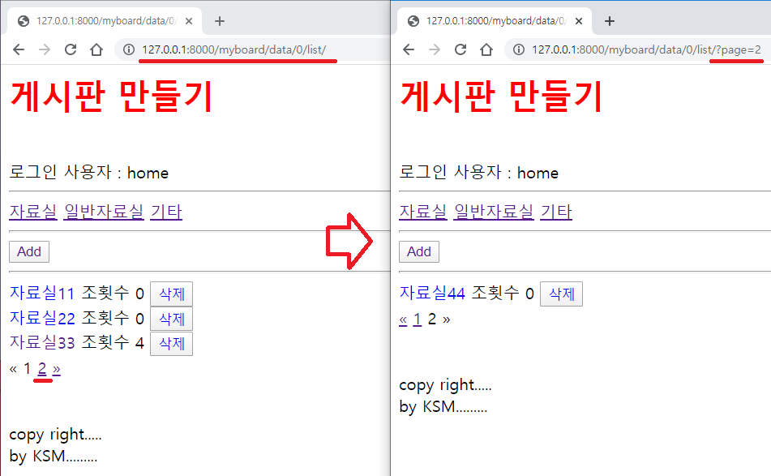


#### 게시글 수정

* 게시글 수정 후에 어느 페이지로 갈것인지 결정해야한다.
  * 수정 페이지는 이전 페이지 번호에 대한 정보가 없는 url 이다.
  * 방법1(정적url): 페이지 번호에 대한 정보를 url에 추가를 해준다.
  * 방법2(동적url): Javascript 를 이용해 이전 페이지로 돌아간다.(수정 완료후에는 이전 페이지로 이동을 2번해야 list 페이지로 이동한다.)

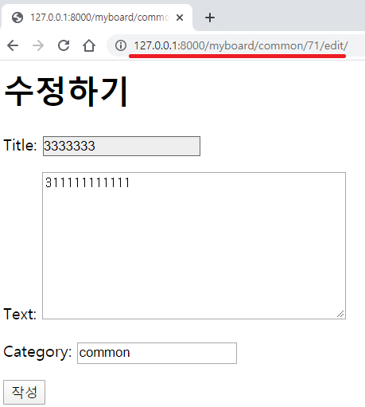


##### 방법1(정적url)


##### 방법2(동적url)


#### 게시글 삭제

##### 동적인 방법 이용(AJAX)

* 게시글 삭제 할 때마다 `redirect`로 html 재요청하지 않는다.
* 백엔트에서는 요청한 게시글을 db 에서 삭제한다.
  * 삭제 완료시에는 삭제 완료에 대한 json만 return 한다.
* 프론트 엔드에서는 삭제된 게시글에 대한 요소만 삭제한다.
  * 삭제 버튼 클릭시 게시글의 primary key 값을 백엔드에 보낸다.


##### 기본 예제로 작업해보기

* code 연습은 `python manage.py shell_plus --notebook` 명령어로 `jupyter notebook` 실행 후 할 수 있다.


* `/mysite/myboard/views.py` 에 `def ajaxdel` 함수 만들어준다.
  * 삭제 완료시 Json 데이터 return 한다.
    * `HttpResponse` 로 return 하면 text 형식으로 데이터 넘어가서 Json 형식으로 바꿔주어야 한다.
    * 연습일 뿐 실제 삭제는 아니기 때문에 `.delete`는 주석처리 해준다.

```python
from django.http import JsonResponse

def ajaxdel(request):

    pk = request.GET.get("pk")
    board = models.Board.objects.get(pk=pk)
    #board.delete()

    return JsonResponse({"error":'0'})
```


* `/mysite/myboard/views.py` 에 `def ajaxget` 함수 만들어준다.
  * `datas` 의 `category`는 임시로 `common` 게시글의 데이터 가져오자.
  * `p = Paginator(datas, 3)`, `subs = p.page(page)` 를 `sub = datas[(page-1)*3:(page)*3]` 로 표현할 수 있다.
    * 대신 `.page()` 함수를 이용하지 않으므로 key 값에 대한 정보는 들어가 있지 않다.
    * 3개의 게시글만 가져온다.
  * 한글이 return 될 때, 깨지지 않게 하기 위해서 `json_dumps_params = {"ensure_ascii": False}` 를 추가한다.

```python
from django.http import JsonResponse

def ajaxget(request):
    page = request.GET.get("page", 1)

    datas = models.Board.objects.all().filter(category='common')
    page = int(page)
    subs = datas[(page-1)*3:(page)*3]

    #p = Paginator(datas, 3)
    #subs = p.page(page)

    datas = {"datas":[{'pk': data.pk, 'title':data.title, 'cnt': data.cnt} for data in subs]}
    return JsonResponse(datas, json_dumps_params = {"ensure_ascii": False})
    #return JsonResponse(datas)
```


* `/mysite/myboard/urls.py` 에 `def ajaxdel`, `ajaxget` 함수의 url 추가해준다.

```python
from django.urls import path
from . import views
from django.shortcuts import redirect

urlpatterns = [
    #path('', views.page),
    path('ajaxdel', views.ajaxdel),
    path('ajaxget', views.ajaxget),


    path('<category>/<int:pk>/<mode>/', views.BoardView.as_view(), name="myboard"),
    path('', lambda request: redirect('myboard', 'data', 0, 'list')),
]
```


* `ajaxdel` 실행화면
  * pk=60 인 글을 요청하면  정상 작업이 이루어진 후 {"error:"0"} 를 return 받는다.

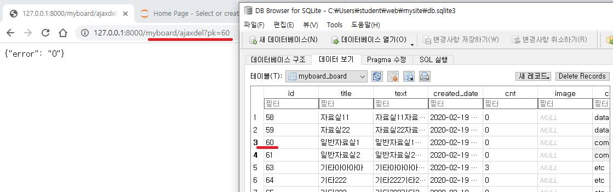

* `ajaxget` 실행화면
  * page =1 을 요청했기 때문에 `common` category 중 상위 3개가 return 된다.

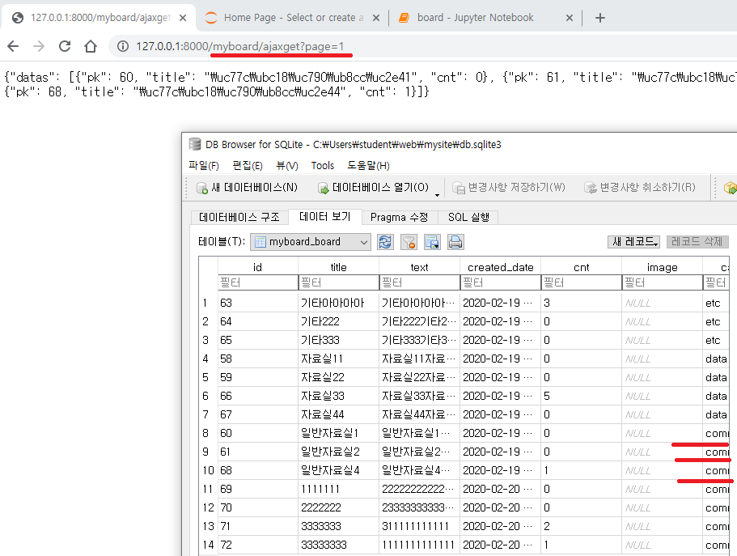


## JQuery

### jquery로 ajaxget 에서 게시글 데이터 받아오기

* `/mysite/static/` 에 연습용도로 `jquerytest.html` 만들어준다.
* `jquerytest.html` 을 더블클릭하면 실행할 수 있다.

/mysite/static/jquerytest.html

* `$("#view").append("<a href=fefef>데이터2</a>")` : `view`를 `id`로 갖는 요소를 찾아서 `<a href=fefef>데이터2</a>` 를 붙인다.

```html
<script src="http://code.jquery.com/jquery-1.11.3.min.js"></script>
<script src="http://code.jquery.com/jquery-migrate-1.2.1.min.js"></script>

<button id="btnAdd">Add</button>

<div id="view">
    <div id='item'>
        <a href=list?id=4> <span id="title">제목</span> </a> 
        조회수<span id="cnt">5</span>
        <br>
    </div>
</div>

<script>

    $("#view").append("<a href=fefef>데이터2</a>")
    $("#view").append("<a href=fefef>데이터3</a>")

</script>
```

* 실행화면

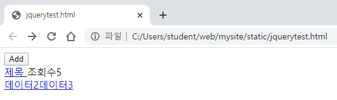


/mysite/static/jquerytest.html

* `$("#item").clone()` : `item` 을 `id` 로 갖는 요소를 복사한다.
* `$("#title").html("제목1")` : `title` 을 `id`로 하는 요소의 html 을 `제목1` 으로 한다.

```html
<script src="http://code.jquery.com/jquery-1.11.3.min.js"></script>
<script src="http://code.jquery.com/jquery-migrate-1.2.1.min.js"></script>

<button id="btnAdd">Add</button>

<div id="view">
    <div id='item'>
        <a href=list?id=4> <span id="title">제목</span> </a> 
        조회수<span id="cnt">5</span>
        <br>
    </div>
</div>

<script>


    item = $("#item").clone()
    $("#title").html("제목1")
    $("#cnt").html("10")
    $("#view").append(item)

</script>
```

* 실행화면
  * clone은 원본 데이터를 복사한다.
  * 원본 데이터의 내용이 바뀐다.
  * 첫번째 줄에 바뀐 내용의 원본 데이터가 출력된다.

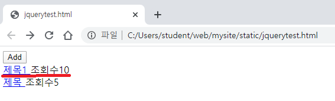

/mysite/static/jquerytest.html

* `$("#title").html("제목1")` : 원본 요소의 내용이 바뀐다.
  * 원본이 아닌 clone 된 요소의 내용을 바꾸길 원한다.
  * `$("#title", item).html("제목1")` : 복사한 요소의 내용을 바꿔준다.

```html
<script src="http://code.jquery.com/jquery-1.11.3.min.js"></script>
<script src="http://code.jquery.com/jquery-migrate-1.2.1.min.js"></script>

<button id="btnAdd">Add</button>

<div id="view">
    <div id='item'>
        <a href=list?id=4> <span id="title">제목</span> </a> 
        조회수<span id="cnt">5</span>
        <br>
    </div>
</div>

<script>

    item = $("#item").clone()
    $("#title", item).html("제목1")
    $("#cnt", item).html("10")
    $("#view").append(item)


</script>
```

* 실행화면


/mysite/static/jquerytest.html

* `$("#item").hide()` : 원본의 내용은 숨긴다.
* `$("#btnAdd").click` : `btnAdd`을 `id` 로 갖는 button 을 누를 때마다 function 이 실행 된다.
* `item.show()` : 복사된 요소는 보여준다.

```html
<script src="http://code.jquery.com/jquery-1.11.3.min.js"></script>
<script src="http://code.jquery.com/jquery-migrate-1.2.1.min.js"></script>

<button id="btnAdd">Add</button>

<div id="view">
    <div id='item'>
        <a href=list?id=4> <span id="title">제목</span> </a> 
        조회수<span id="cnt">5</span>
        <br>
    </div>
</div>

<script>

    $("#item").hide()

    var index = 0;

    $("#btnAdd").click( function(){
    item = $("#item").clone()
    item.show()
    $("#title", item).html("제목" + index)
    $("#cnt", item).html(index)
    $("#view").append(item)
    index++;
    });

</script>
```

* 실행화면


/mysite/static/jquerytest.html

* `http://127.0.0.1:8000/myboard/ajaxget?page=2` 로 받았던 Json 데이터를 복사해서 functon 안에 붙여준다.
* `Add`를 클릭할때마다 console 에 타이들에 대한 정보 찍힌다.
  * console은 `ctrl + shift  + i`  또는 `F12` 를 눌러 확인할 수 있다.

```html
<script src="http://code.jquery.com/jquery-1.11.3.min.js"></script>
<script src="http://code.jquery.com/jquery-migrate-1.2.1.min.js"></script>

<button id="btnAdd">Add</button>

<div id="view">
    <div id='item'>
        <a href=list?id=4> <span id="title">제목</span> </a> 
        조회수<span id="cnt">5</span>
        <br>
    </div>
</div>

<script>

    $("#item").hide()

    $("#btnAdd").click( function(){

        json = {"datas": [{"pk": 69, "title": "1111111", "cnt": 0}, {"pk": 70, "title": "2222222", "cnt": 0}, {"pk": 71, "title": "3333333", "cnt": 2}]}

        for(i = 0; i < json.datas.length; i++){
            console.log(json.datas[i].title);
        }
        
        item = $("#item").clone()
        item.show()
        $("#title", item).html("제목" + index)
        $("#cnt", item).html(index)
        $("#view").append(item)
        index++;
    });

</script>
```

* 실행화면

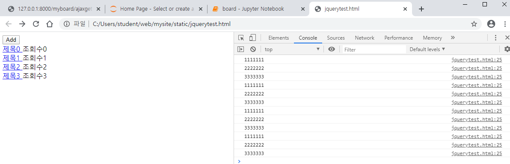


/mysite/static/jquerytest.html

* `Add` button 을 클릭할 때마다 게시물의 title, 조회수 에 대한 정보가 출력된다.

```html
<script src="http://code.jquery.com/jquery-1.11.3.min.js"></script>
<script src="http://code.jquery.com/jquery-migrate-1.2.1.min.js"></script>

<button id="btnAdd">Add</button>

<div id="view">
    <div id='item'>
        <a href=list?id=4> <span id="title">제목</span> </a> 
        조회수<span id="cnt">5</span>
        <br>
    </div>
</div>

<script>

    $("#item").hide()

    $("#btnAdd").click( function(){

        json = {"datas": [{"pk": 69, "title": "1111111", "cnt": 0}, {"pk": 70, "title": "2222222", "cnt": 0}, {"pk": 71, "title": "3333333", "cnt": 2}]}

        for(i = 0; i < json.datas.length; i++){
            //console.log(json.datas[i].title);
            item = $("#item").clone()
            item.show()
            $("#title", item).html(json.datas[i].title)
            $("#cnt", item).html(json.datas[i].cnt)
            $("#view").append(item)
        }
    });

</script>
```

* 실행화면

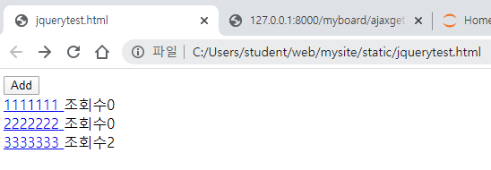

/mysite/static/jquerytest.html

* 지금까지 만들었던 기능을 `getPage` 함수를 만들어서 실행시킨다.
  * 처음에 1페이지 정보가 출력된다.
  * 현재는 `datas`의 정보가 출력된다.
* 몇번 페이지를 요청하면 그 페이지 정보 출력하게 된다.
  * `Add` 버튼을 누르면 실행된다.
  * 현재는 `datas`의 정보만 계속 출력된다.

```html
<script src="http://code.jquery.com/jquery-1.11.3.min.js"></script>
<script src="http://code.jquery.com/jquery-migrate-1.2.1.min.js"></script>

<button id="btnAdd">Add</button>

<div id="view">
    <div id='item'>
        <a href=list?id=4> <span id="title">제목</span> </a> 
        조회수<span id="cnt">5</span>
        <br>
    </div>
</div>

<script>

    $("#item").hide()

    var page = 1
    
    function getPage(page) {
        json = {"datas": [{"pk": 69, "title": "1111111", "cnt": 0}, {"pk": 70, "title": "2222222", "cnt": 0}, {"pk": 71, "title": "3333333", "cnt": 2}]}

        for(i = 0; i < json.datas.length; i++){
            //console.log(json.datas[i].title);
            item = $("#item").clone()
            item.show()
            $("#title", item).html(json.datas[i].title)
            $("#cnt", item).html(json.datas[i].cnt)
            $("#view").append(item)
        }
    }


    $("#btnAdd").click( function(){
        getPage(++page);
    });

    getPage(page);

</script>
```

* 실행화면

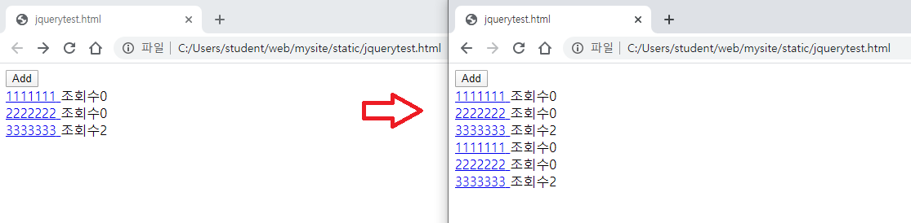


/mysite/static/jquerytest.html

* `$.get("http://127.0.0.1:8000/myboard/ajaxget", {page:1}, function(json) {
          console.log(JSON.stringify(json));
      });`
  * `http://127.0.0.1:8000/myboard/ajaxget?page=1` 에서 받아온 정보를 console 에서 확인할 수있다.
    * html 파일을 더블클릭해서 실행시키면 보안문제 때문에 console 창에 error 가 뜬다.
    * `python manage.py runserver`명령어로 서버를 실행시킨 후 `http://127.0.0.1:8000/static/jquerytest.html` 를 요청하면 확인 할 수 있다.

```html
<script src="http://code.jquery.com/jquery-1.11.3.min.js"></script>
<script src="http://code.jquery.com/jquery-migrate-1.2.1.min.js"></script>

<button id="btnAdd">Add</button>

<div id="view">
    <div id='item'>
        <a href=list?id=4> <span id="title">제목</span> </a> 
        조회수<span id="cnt">5</span>
        <br>
    </div>
</div>

<script>

    $("#item").hide()

    var page = 1
    
    function getPage(page) {
        json = {"datas": [{"pk": 69, "title": "1111111", "cnt": 0}, {"pk": 70, "title": "2222222", "cnt": 0}, {"pk": 71, "title": "3333333", "cnt": 2}]}

        for(i = 0; i < json.datas.length; i++){
            //console.log(json.datas[i].title);
            item = $("#item").clone()
            item.show()
            $("#title", item).html(json.datas[i].title)
            $("#cnt", item).html(json.datas[i].cnt)
            $("#view").append(item)
        }
    }


    $("#btnAdd").click( function(){
        getPage(++page);
    });

    getPage(page);

    $.get("http://127.0.0.1:8000/myboard/ajaxget", {page:1}, function(json) {
        console.log(JSON.stringify(json));
    });

</script>
```

* 실행화면

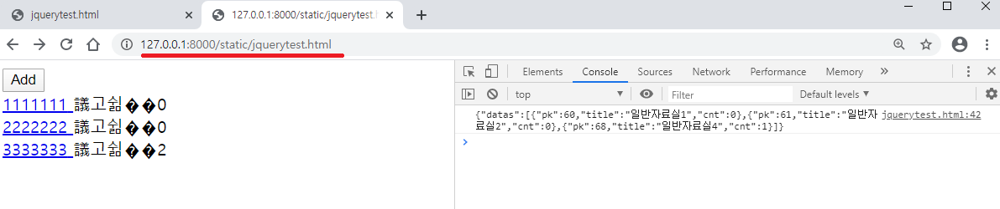

/mysite/static/jquerytest.html

* 정보를 서버로 부터 받아오기 위해 `$.get` 함수를 `getPage` 함수에 넣어준다.
* script 는 비동기 방식으로 진행되기 때문에 `$.get` 안에 for 문을 넣어주지 않으면 작동하지 않는다.
  * for 문을 `$.get` 안에 넣어준다.
* `$.get` 의 두번째 파라미터를 `{page:page}` 로 바꿔준다. / 요청한 페이지를 받기 위함이다.
* `$.get` 의 세번째 파라미터인 function의 파라미터 `json`은 입력파라미터가 아니라 출력 파라미터 이다.
  * 즉 요청한 데이터가 `json` 에 return 이 된다.

```html
<script src="http://code.jquery.com/jquery-1.11.3.min.js"></script>
<script src="http://code.jquery.com/jquery-migrate-1.2.1.min.js"></script>

<button id="btnAdd">Add</button>

<div id="view">
    <div id='item'>
        <a href=list?id=4> <span id="title">제목</span> </a> 
        조회수<span id="cnt">5</span>
        <br>
    </div>
</div>

<script>

    $("#item").hide()

    var page = 1
    
    function getPage(page) {
        //json = {"datas": [{"pk": 69, "title": "1111111", "cnt": 0}, {"pk": 70, "title": "2222222", "cnt": 0}, {"pk": 71, "title": "3333333", "cnt": 2}]}

        $.get("http://127.0.0.1:8000/myboard/ajaxget", {page:page}, function(json) {
            console.log(JSON.stringify(json));
            if( json.datas.length == 0) alert("마지막페이지 입니다.");
            for(i = 0; i < json.datas.length; i++){
                //console.log(json.datas[i].title);
                item = $("#item").clone()
                item.show()
                $("#title", item).html(json.datas[i].title)
                $("#cnt", item).html(json.datas[i].cnt)
                $("#view").append(item)
            }
        });
    }

    $("#btnAdd").click( function(){
        getPage(++page);
    });

    getPage(page);

</script>
```


* 실행화면

  * `/mysite/myboard/views.py` 의 `ajaxget` 함수를 보면 `subs = datas[(page-1)*3:(page)*3]` 이렇게 정보를 받아온다.

    * `datas`가 list 형 데이터이면 `indexError` 가 발생하는 것이 맞다.
    * 하지만 `datas`는 `qeurySet` 형식의 데이터 이므로 범위 넘어간 슬라이싱에 대해서는 빈값 return 한다.
    * 이를 예외 처리 하기 위해서는 `/mysite/static/jquerytest.html`의 `$.get`함쉬의 for 문위에 `if( json.datas.length == 0) alert("마지막페이지 입니다.");` 이 구문 추가해 주면 된다.

    ```html
    $.get("http://127.0.0.1:8000/myboard/ajaxget", {page:page}, function(json) {
                console.log(JSON.stringify(json));
                if( json.datas.length == 0) alert("마지막페이지 입니다.");
                for(i = 0; i < json.datas.length; i++){
                    //console.log(json.datas[i].title);
                    item = $("#item").clone()
                    item.show()
                    $("#title", item).html(json.datas[i].title)
                    $("#cnt", item).html(json.datas[i].cnt)
                    $("#view").append(item)
                }
            });
    ```

    

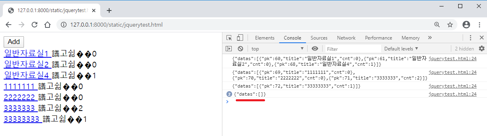


### `$.함수` (익명함수)원리

* 예를 들어 `$.get(url, function)` 의 경우
  * `$.get` 함수가 호출되면 `url`을 요청하는 http 가 thread 로 생성된다.
  * http는 네트웍 연결 후 데이터를 가져온 후 function에 데이터를 넘겨 실행시킨다.
  * function 파라미터 위치에 `def f` 등의 함수를 만들어서 대입할 수도 있다.

```python
def get(url , function){
	http 요청하는 thread 생성(http)
}

http(url, function){
	네트웍을 연결
	데이터 가져오기
	function(데이터)
}

function(데이터){
    .....
}
```


### 게시글 삭제(con.)

* `/mysite/static/jquerytest.html` 의 `view` div 의 `item` div 에 지우기 하이퍼링크를 만들어 준다.
* ` <a href=/myboard/ajaxdel?pk=1> 지우기 </a> ` 는 `지우기` 클릭할 때마다 페이지가 바뀐다.
* 페이지가 바뀌지 않고 요청한 정보만 삭제되게 작업한다.


#### 지우기 button 클릭시 게시글의 `pk`  정보 alert 시키기

/mysite/static/jquerytest.html

* `<script>` 에 `function deleteBoard(pk)` 을 만든다.

* `<a id='del' href=javascript:deleteBoard()> 지우기 </a> `  를 추가한다.
  * 하이퍼 링크를 클릭하면 `function deleteBoard(pk)` 함수가 실행된다.
  * `alert` 함수가 정의 되어 있으므로 클릭시 그 게시물의 `pk` 정보가 alert 된다.
* `$("#del").attr("href", "javascript:deleteBoard(2)");`
  * `de`l 을 `id`로 가지는 하이퍼링크의 `href`를 `javascript:deleteBoard(2)` 로 바꾼다.
  * clone의 `del` 의 하이퍼링크를 바꿔야 한다. `$("#del", item).attr` 을 쓴다.
    * `$("#del", item).attr("href", "javascript:deleteBoard(" + json.datas[i].pk + ")");` 를 for 문 안에 추가한다.

```html
<head>
  <meta charset="UTF-8">
</head>

<script src="http://code.jquery.com/jquery-1.11.3.min.js"></script>
<script src="http://code.jquery.com/jquery-migrate-1.2.1.min.js"></script>

<button id="btnAdd">Add</button>

<div id="view">
    <div id='item'>
        <a href=list?id=4> <span id="title">제목</span> </a> 
        조회수<span id="cnt">5</span>
        <a id='del' href=javascript:deleteBoard()> 지우기 </a> 
        <br>
    </div>
</div>

<script>
    var page = 1
    $("#item").hide()

    function deleteBoard(pk){
        alert(pk);
    }
    
    function getPage(page) {
        //json = {"datas": [{"pk": 69, "title": "1111111", "cnt": 0}, {"pk": 70, "title": "2222222", "cnt": 0}, {"pk": 71, "title": "3333333", "cnt": 2}]}

        $.get("http://127.0.0.1:8000/myboard/ajaxget", {page:page}, function(json) {
            console.log(JSON.stringify(json));
            if( json.datas.length == 0) alert("마지막페이지 입니다.");
            for(i = 0; i < json.datas.length; i++){
                item = $("#item").clone()
                $("#del", item).attr("href", "javascript:deleteBoard(" + json.datas[i].pk + ")");
                item.show()
                $("#title", item).html(json.datas[i].title)
                $("#cnt", item).html(json.datas[i].cnt)
                $("#view").append(item)
            }
        });
    }

    $("#btnAdd").click( function(){
        getPage(++page);
    });

    getPage(page);

</script>
```

* 실행화면

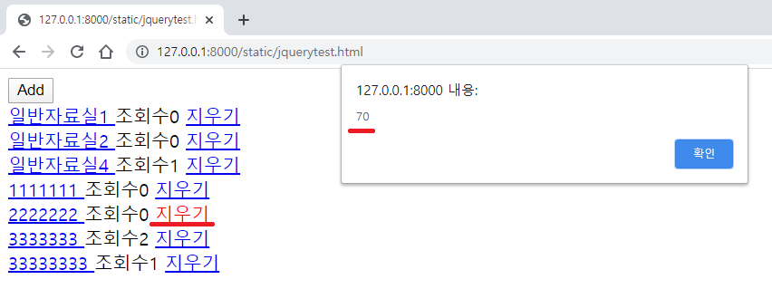


#### 지우기 button 클릭시 게시글 삭제하기

* `function deleteBoard(pk)` 의 `alert` 를 `$.get` 으로 수정한다.
* `/mysite/myboard/views.py`의 `ajaxdel` 함수의 `.delete()` 함수의 주석을 지우면 실제로 db에서는 게시글이 삭제된다.
* 하지만 html 페이지에는 삭제된 게시글이 남아있다.

/mysite/static/jquerytest.html

```html
<head>
  <meta charset="UTF-8">
</head>

<script src="http://code.jquery.com/jquery-1.11.3.min.js"></script>
<script src="http://code.jquery.com/jquery-migrate-1.2.1.min.js"></script>

<button id="btnAdd">Add</button>

<div id="view">
    <div id='item'>
        <a href=list?id=4> <span id="title">제목</span> </a> 
        조회수<span id="cnt">5</span>
        <a id='del' href=javascript:deleteBoard()> 지우기 </a> 
        <br>
    </div>
</div>

<script>
    var page = 1
    $("#item").hide()

    function deleteBoard(pk){
        $.get("/myboard/ajaxdel", {pk:pk}, function(json){
        });
    }
    
    function getPage(page) {
        //json = {"datas": [{"pk": 69, "title": "1111111", "cnt": 0}, {"pk": 70, "title": "2222222", "cnt": 0}, {"pk": 71, "title": "3333333", "cnt": 2}]}

        $.get("http://127.0.0.1:8000/myboard/ajaxget", {page:page}, function(json) {
            console.log(JSON.stringify(json));
            if( json.datas.length == 0) alert("마지막페이지 입니다.");
            for(i = 0; i < json.datas.length; i++){
                item = $("#item").clone()
                $("#del", item).attr("href", "javascript:deleteBoard(" + json.datas[i].pk + ")");
                item.show()
                $("#title", item).html(json.datas[i].title)
                $("#cnt", item).html(json.datas[i].cnt)
                $("#view").append(item)
            }
        });
    }

    $("#btnAdd").click( function(){
        getPage(++page);
    });

    getPage(page);

</script>
```

##### html 에서 게시글 삭제

* `function getPage` 의 for 문에 `item.attr("id", "item_" + json.datas[i].pk);` 를 추가한다.
  * `<div id='item'>` 이 `<div id='item_+pk'>`로 바뀌어 있다.

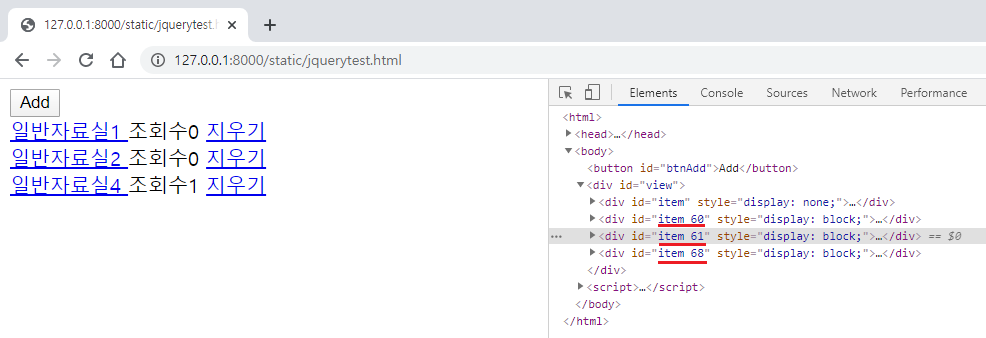

* `function deleteBoard` 의 `$.get` 에 `$("#item_" +pk).remove();` 를 추가한다.
  * `id` 가 `item_pk` 인 요소를 찾아서 html 상에서 삭제하게 된다.
  * `$.get` 함수 안에 추가해야 db에서 게시글이 삭제 된 후에 html 에서 삭제되게 된다.
    * `function deleteBoard` 함수 내에서 `$.get` 함수 외의 공간에 추가하게 되면 오류가 발생해 db에서 삭제가 되지 않았을 때도 html에서 삭제될 수 있다.
  * `function deleteBoard(pk)`함수의 `$.get` 함수에 `console.log(JSON.stringify(json));` 을 추가해 정상적으로 삭제가 이루어 졌을 때 `/mystie/myboard/views.py` 의 `ajaxdel`함수의 return 값을 console 에 출력한다.

/mysite/static/jquerytest.html

```html
<head>
  <meta charset="UTF-8">
</head>

<script src="http://code.jquery.com/jquery-1.11.3.min.js"></script>
<script src="http://code.jquery.com/jquery-migrate-1.2.1.min.js"></script>

<button id="btnAdd">Add</button>

<div id="view">
    <div id='item'>
        <a href=list?id=4> <span id="title">제목</span> </a> 
        조회수<span id="cnt">5</span>
        <a id='del' href=javascript:deleteBoard()> 지우기 </a> 
        <br>
    </div>
</div>

<script>
    var page = 1
    $("#item").hide()

    function deleteBoard(pk){
        $.get("/myboard/ajaxdel", {pk:pk}, function(json){
            $("#item_" +pk).remove();
            console.log(JSON.stringify(json));
        });
    }
    
    function getPage(page) {

        $.get("http://127.0.0.1:8000/myboard/ajaxget", {page:page}, function(json) {
            console.log(JSON.stringify(json));
            if( json.datas.length == 0) alert("마지막페이지 입니다.");
            for(i = 0; i < json.datas.length; i++){
                item = $("#item").clone()
                item.attr("id", "item_" + json.datas[i].pk);
                $("#del", item).attr("href", "javascript:deleteBoard(" + json.datas[i].pk + ")");
                item.show()
                $("#title", item).html(json.datas[i].title)
                $("#cnt", item).html(json.datas[i].cnt)
                $("#view").append(item)
            }
        });
    }

    $("#btnAdd").click( function(){
        getPage(++page);
    });

    getPage(page);

</script>
```

* 실행화면
  * 정상적으로 삭제가 이루어져 console 에 `/mysite/myboard/views.py`의 `ajaxdel`함수의 return 값인 `{"error" : "0"}` 이 console 에 출력된다.

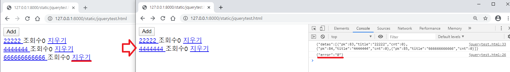


## jupyter notebook 으로 코드 작성 및 검증

* `python manage.py runserver` 로 server 을 연결하지 않아도 `jupyter notebook` 에서 db 내용을 이용해서 코드를 작성하고 검증 할 수 있다.
* 문장 단위로 검사를 할 수 있게 된다.
* `from django.test import RequestFactory` 를 import 해서 이용해야 한다.


`/mysite/myboard/views.py` 의 `ajaxget` 검증해보기

```python
from django.test import RequestFactory
rt = RequestFactory()
```

* server가 연결되있지 않은 상태에서도 실행 가능하다.
  * `url` 는 가짜 url 이다.

```python
url = '/myboard/ajaxget?page=3'
request = rt.get(url)
```

```python
page = request.GET.get("page", 1)
print(page)
```

출력

```
3
```

```python
datas = models.Board.objects.all().filter(category='common')
page = int(page)
print(datas)
```

출력

```
<QuerySet [<Board: 22222>, <Board: 4444444>, <Board: 666666666666>, <Board: 777777777777777>, <Board: 1111111111111>, <Board: 333333333333>, <Board: 88888888888>, <Board: 9999999999999>]>
```

```python
subs = datas[(page-1)*3:(page)*3]
print(subs)
```

출력

```
<QuerySet [<Board: 88888888888>, <Board: 9999999999999>]>
```

```python
datas = {"datas":[{'pk': data.pk, 'title':data.title, 'cnt': data.cnt} for data in subs]}
print(datas)
```

출력

```
{'datas': [{'pk': 89, 'title': '88888888888', 'cnt': 0}, {'pk': 90, 'title': '9999999999999', 'cnt': 0}]}
```

```python
from myboard import views
```

```python
response = views.ajaxget(request)
print(response)
print(response.content.decode())
```

출력

```
<JsonResponse status_code=200, "application/json">
{"datas": [{"pk": 89, "title": "88888888888", "cnt": 0}, {"pk": 90, "title": "9999999999999", "cnt": 0}]}
```


* `jupyter notebook` 에서 실행 화면

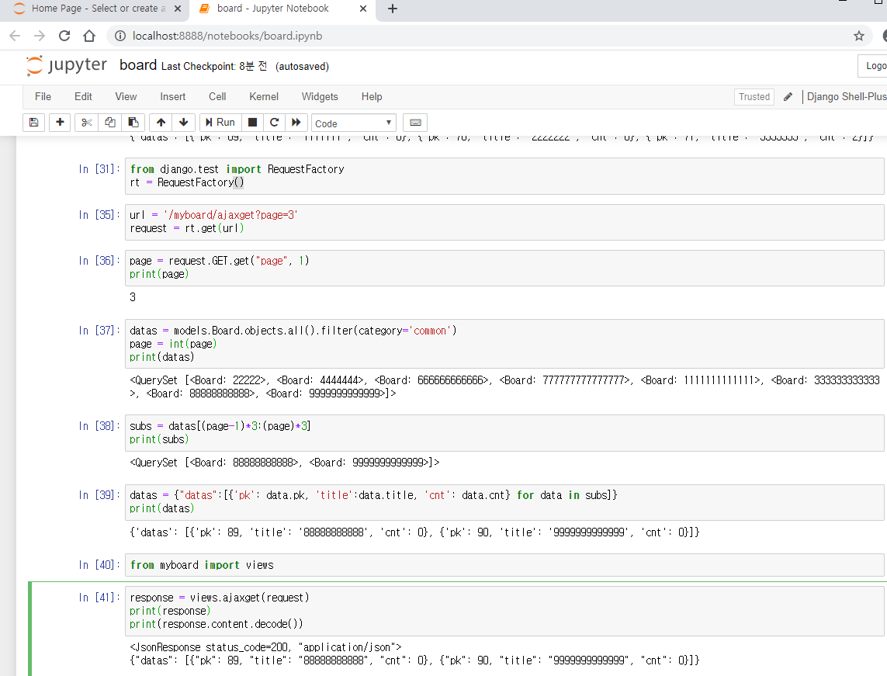


## 전체 코드

* `/mysite/myboard/views.py`

```python
from django.shortcuts import render, get_object_or_404,redirect
from django.http import HttpResponse, JsonResponse
from django.views.generic import View
from django.contrib.auth.models import User
from django.forms import CharField, Textarea, ValidationError
from . import forms
from . import models

from django.core.paginator import Paginator

def page(request):

    datas = [{"id":1, "name":"홍길동1"},
              {"id":2, "name":"홍길동2"},
              {"id":3, "name":"홍길동3"},
              {"id":4, "name":"홍길동4"},
              {"id":5, "name":"홍길동5"},
              {"id":6, "name":"홍길동6"},
              {"id":7, "name":"홍길동7"},]

    # 두번째 파라미터는 한 페이지에 보여줄 데이터 갯수이다.
    p = Paginator(datas, 3)

    #(page-1)*3:page*3
    page = request.GET.get("page", 1)

    # 파라미터에 가져올 페이지 번호 입력한다.
    subs = p.page(page)

    return render(request, "myboard/page.html", {"datas": subs})

def ajaxdel(request):

    pk = request.GET.get("pk")
    board = models.Board.objects.get(pk=pk)
    #board.delete()

    return JsonResponse({"error":'0'})

def ajaxget(request):
    page = request.GET.get("page", 1)

    datas = models.Board.objects.all().filter(category='common')
    page = int(page)
    subs = datas[(page-1)*3:(page)*3]

    #p = Paginator(datas, 3)
    #subs = p.page(page)

    datas = {"datas":[{'pk': data.pk, 'title':data.title, 'cnt': data.cnt} for data in subs]}
    return JsonResponse(datas, json_dumps_params = {"ensure_ascii": False})
    #return JsonResponse(datas)

class BoardView(View) :
    def get(self, request, category, pk, mode):
        
        if mode == 'add':
            form = forms.BoardForm(initial={'category': category})
        elif mode == 'list':
            username = request.session["username"]
            user = User.objects.get(username=username)
            data = models.Board.objects.all().filter(author=user, category=category)

            page = request.GET.get("page", 1)
            p = Paginator(data, 3)
            subs = p.page(page)

            context = {"datas":subs, "username":username, "category":category}
            return render(request, "myboard/list.html", context)
        elif mode == 'detail':
            p = get_object_or_404(models.Board, pk=pk)
            p.cnt += 1
            p.save()
            return render(request, "myboard/detail.html", {"d":p, "category": category})
        elif mode == 'edit' :
            board = get_object_or_404(models.Board, pk=pk)
            form = forms.BoardForm(instance=board)
        elif mode == 'del':
            board = get_object_or_404(models.Board, pk=pk)
            board.delete()
            return redirect("myboard", category, 0, "list")
        else:
            return HttpResponse("error")
        return render(request, "myboard/edit.html", {"form":form})

    def post(self, request, category, pk, mode):

        username = request.session["username"]
        user = User.objects.get(username=username)

        if pk == 0:
            form = forms.BoardForm(request.POST)
        else:
            board = get_object_or_404(models.Board, pk=pk)
            form = forms.BoardForm(request.POST, instance=board)

        if form.is_valid():
            board = form.save(commit=False)
            if pk == 0:
                board.author = user
                board.category = category
            board.save()
            return redirect("myboard", category, 0, "list")
        return render(request, "myboard/edit.html", {"form": form})
```


* `/mysite/static/jquerytest.html`

```html
<head>
  <meta charset="UTF-8">
</head>

<script src="http://code.jquery.com/jquery-1.11.3.min.js"></script>
<script src="http://code.jquery.com/jquery-migrate-1.2.1.min.js"></script>

<button id="btnAdd">Add</button>

<div id="view">
    <div id='item'>
        <a href=list?id=4> <span id="title">제목</span> </a> 
        조회수<span id="cnt">5</span>
        <a id='del' href=javascript:deleteBoard()> 지우기 </a> 
        <br>
    </div>
</div>

<script>
    var page = 1
    $("#item").hide()

    function deleteBoard(pk){
        $.get("/myboard/ajaxdel", {pk:pk}, function(json){
            $("#item_" +pk).remove();
            console.log(JSON.stringify(json));
        });
    }
    
    function getPage(page) {

        $.get("http://127.0.0.1:8000/myboard/ajaxget", {page:page}, function(json) {
            console.log(JSON.stringify(json));
            if( json.datas.length == 0) alert("마지막페이지 입니다.");
            for(i = 0; i < json.datas.length; i++){
                item = $("#item").clone()
                item.attr("id", "item_" + json.datas[i].pk);
                $("#del", item).attr("href", "javascript:deleteBoard(" + json.datas[i].pk + ")");
                item.show()
                $("#title", item).html(json.datas[i].title)
                $("#cnt", item).html(json.datas[i].cnt)
                $("#view").append(item)
            }
        });
    }

    $("#btnAdd").click( function(){
        getPage(++page);
    });

    getPage(page);

</script>
```

